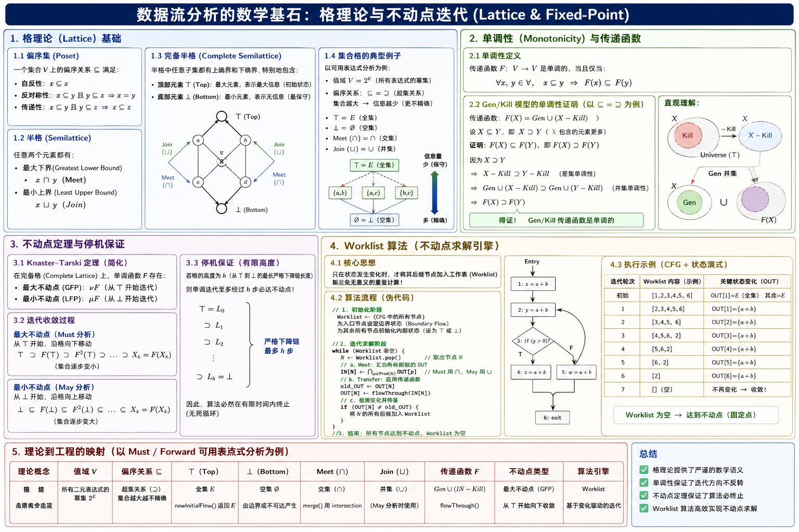
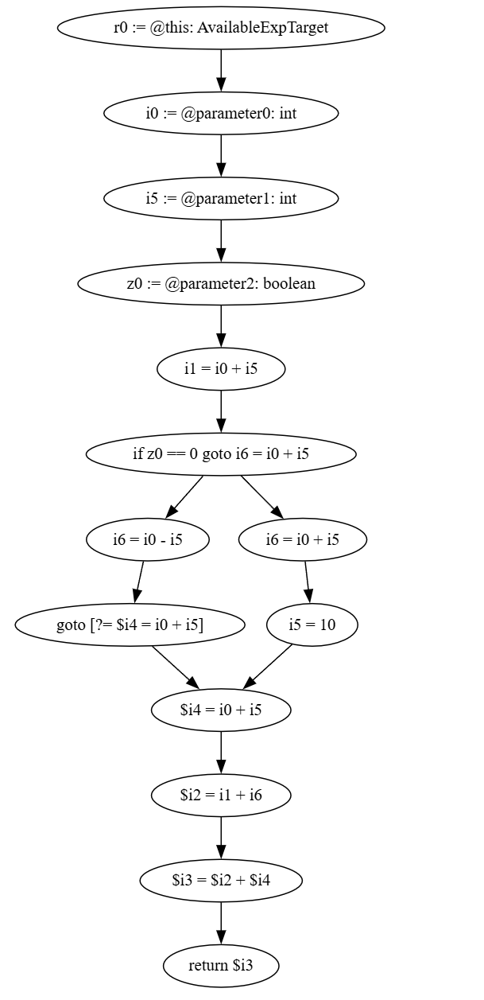

+++
date = '2026-04-28T14:00:00+08:00'
draft = false
title = 'Soot Study 2: 基于控制流图的数据流分析理论与实现基础'
categories = ["static-analysis"]
tags = ["Study", "Data Flow Analysis", "Soot Study 2"]

+++

# Soot Study 2: 基于控制流图的数据流分析理论与实现基础

## 0x00 引言：

从控制流到数据流 在Soot Study 1中，我们通过 Jimple 和 UnitGraph 构建了程序的控制流图 (CFG)。CFG 提供了程序语句的执行顺序和拓扑结构，但无法描述程序运行时的状态变化（如局部变量的赋值、表达式的结果、对象的引用关系）。

为了分析数据在 CFG 路径中的流转与状态，必须引入数据流分析 (Data Flow Analysis)。数据流分析是各类高级静态分析技术的基础：在编译器领域，它被用于公共子表达式消除 (CSE) 和死代码消除；在安全领域，它是污点分析 (Taint Analysis) 和信息流追踪的核心组件。

编写 Soot 数据流分析器不仅需要熟悉相关的 API，更需要准确理解其底层理论模型。本文将系统解析数据流分析中的核心概念，包括正向与反向分析 (Forward/Backward)、必达与可能分析 (Must/May)、格结构 (Lattice) 以及不动点迭代 (Fixed-Point Iteration)，为后续编写具体的分析器奠定理论基础。

------

## 0x01 数据流分析的核心维度：方向与保守性

在控制流图 (CFG) 上进行数据流分析时，所有的分析器都必须回答两个核心问题：**信息往哪个方向流？** 以及 **在分支汇合时如何取舍？** 这构成了数据流分析的两个基本维度。

#### 1. 分析方向：Forward vs Backward

数据流信息的传播方向决定了我们是基于“过去”推导“现在”，还是基于“未来”推导“现在”。

- **正向分析 (Forward Analysis)**
  - **定义**：数据流沿着控制流图的边（执行顺序）顺流而下。节点的 `OUT` 集合由其自身的 `IN` 集合计算得出，而 `IN` 集合则由其前驱节点 (Predecessors) 的 `OUT` 集合推导而来。
  - **适用场景**：想要知道“在到达当前语句之前，程序发生了什么”。
  - **经典案例**：**可用表达式分析 (Available Expressions)**。我们需要知道在执行到 `z = a + b` 时，上面是否已经计算过 `a + b`。
- **反向分析 (Backward Analysis)**
  - **定义**：数据流逆着控制流图的边（执行顺序）逆流而上。节点的 `IN` 集合由其自身的 `OUT` 集合计算得出，而 `OUT` 集合则由其后继节点 (Successors) 的 `IN` 集合推导而来。
  - **适用场景**：想要知道“当前语句产生的数据，在未来是否会被用到”。
  - **经典案例**：**活跃变量分析 (Live Variable Analysis)**。我们在变量赋值时，需要向后看，确认这个变量在后续的路径中是否还会被读取。如果不会，这就是一次死存储 (Dead Store)。

#### 2. 汇合原则：May vs Must (静态分析的保守性)

在 CFG 中，当存在 `if-else` 或 `while` 等分支结构时，会产生汇合点 (Join Node)。如果两条路径传来了不同的数据流，分析器必须根据“保守原则 (Safe Approximation)”进行合并。

- **可能分析 (May Analysis)**
  - **核心逻辑**：只要存在**一条**路径满足条件，我们就认为结果成立。
  - **合并操作 (Meet Operator)**：**并集 ($\cup$)**。
  - **保守性倾向**：宁可错杀（误报 False Positive），绝不漏放（漏报 False Negative）。
  - **工程映射**：在 Soot 的 `merge` 函数中对应 `in1.union(in2, out)`。
  - **经典案例**：活跃变量分析。只要有一条分支在未来读取了变量 $x$，我们在当前节点就必须认为 $x$ 是活跃的（必须保留在寄存器中）。
- **必达分析 (Must Analysis)**
  - **核心逻辑**：必须**所有**路径都满足条件，我们才认为结果成立。
  - **合并操作 (Meet Operator)**：**交集 ($\cap$)**。
  - **保守性倾向**：宁可漏报（False Negative），绝不误报（False Positive）。如果没把握所有路径都成立，宁愿保守地认为不成立。
  - **工程映射**：在 Soot 的 `merge` 函数中对应 `in1.intersection(in2, out)`。
  - **经典案例**：可用表达式分析。如果 `if` 分支计算了 $a+b$，但 `else` 分支没计算，那么在汇合点之后，编译器**绝对不敢**直接复用 $a+b$ 的值。必须两边都计算过，交集才不为空。

#### 3. 经典数据流分析分类矩阵

通过排列组合这两个维度，我们可以对绝大多数基础数据流分析进行归类：

| **分析类型**                           | **方向 (Direction)** | **汇合逻辑 (Must/May)** | **目标**                      |
| -------------------------------------- | -------------------- | ----------------------- | ----------------------------- |
| **活跃变量分析 (Live Variables)**      | 反向 (Backward)      | May (并集 $\cup$)       | 消除死代码，寄存器分配        |
| **可用表达式 (Available Expressions)** | 正向 (Forward)       | Must (交集 $\cap$)      | 公共子表达式消除 (CSE)        |
| **到达定值 (Reaching Definitions)**    | 正向 (Forward)       | May (并集 $\cup$)       | 构建 Def-Use 链，污点分析基础 |

## 0x02 状态转换的引擎：Gen 与 Kill (传递函数)

在搞懂了数据流在 CFG 上是如何“宏观”流动和汇合之后，我们必须把视角缩放到“微观”层面：**当数据流穿过 CFG 上的某一个具体节点（一条 Jimple 语句）时，它的内部状态究竟是如何发生改变的？**

在数据流分析中，这个负责在节点内部进行状态转换的逻辑被称为 **传递函数 (Transfer Function)**。在 Soot 中，它对应着你在编写分析器时必须重写的核心方法：`flowThrough(FlowSet in, Unit unit, FlowSet out)`。

为了将抽象的业务逻辑转化为可计算的集合操作，计算机科学家们抽象出了两个最核心的动作：**生成 (Gen)** 和 **杀死 (Kill)**。

#### 1. 概念拆解：创造与毁灭

任何一条语句对程序状态的影响，都可以归结为“创造了什么新信息”以及“销毁了什么旧信息”。

- **Gen (Generate / 生成集合)**
  - **含义**：当前语句 `Unit` 创造出的新的数据流事实 (Data Flow Fact)。
  - **举例**：在“可用表达式分析”中，遇到语句 `x = a + b`，这行代码计算了 `a + b`。因此，它**生成**了可用表达式 `a + b`。
  - **Soot 视角**：通常通过提取语句的右值 (RightOp) 或 `UseBoxes` 来计算。
- **Kill (杀死集合)**
  - **含义**：当前语句 `Unit` 使得原本存在的某些数据流事实变得无效。
  - **举例**：遇到语句 `a = 1`。因为变量 `a` 被重新赋值了，所以在这之前所有包含 `a` 的表达式（如 `a + b`, `a * c`）都彻底作废了。这行代码**杀死**了这些表达式。
  - **Soot 视角**：通常通过提取语句的被赋值方（左值/ `DefBoxes`），并在当前的 `IN` 集合中寻找受影响的元素进行剔除。

#### 2. 数据流的“万能方程式”

无论是哪种正向分析，其节点内部的状态传递都可以用一个极其优美且通用的集合运算公式来表示：

$$OUT[s] = Gen[s] \cup (IN[s] - Kill[s])$$

**大白话翻译：**

语句 $s$ 带着最新的产出离开 ($OUT$)，这个产出包含了它自己刚刚**生成**的新东西 ($Gen$)，再加上它从上面继承下来 ($IN$)、但**没有被它自己销毁** ($Kill$) 的历史遗产。

*(注：反向分析的公式逻辑相同，只是将 IN 和 OUT 掉个个儿：$IN[s] = Gen[s] \cup (OUT[s] - Kill[s])$)*

#### 3. 避坑指南：Soot 实战中的 Gen 与 Kill 陷阱

在用 Soot 编写 `flowThrough` 时，最容易翻车的地方就是执行 Gen 和 Kill 的**先后顺序**与**精准度**。这里结合实战中最容易踩的两个坑进行深度解析：

**陷阱一：先 Gen 还是先 Kill？**

请看这行极其常见的代码（比如 `while` 循环里的计数器）：

```java
i = i + 1; // Jimple: i0 = i0 + 1
```

在可用表达式分析中，如果你先执行 Gen（把 `i0 + 1` 加入集合），再执行 Kill（把包含 `i0` 的表达式剔除），你的 `i0 + 1` 刚生下来就被自己的 Kill 逻辑杀死了！

**正确法则**：永远是 **先 Kill，再 Gen**。对于 `i = i + 1`，由于语句本身修改了 `i`，导致右侧的表达式在计算完毕后立刻失效，此时这个表达式根本不能算作“可用”，Gen 应该被直接跳过。

**陷阱二：对象相等性判断 (Object Identity Trap)**

在 Soot 中编写 Kill 逻辑时，初学者通常会写出这样的代码：

```java
// 错误示范：依赖默认的 equals 或 contains
if (inSet.contains(expToKill)) {
    inSet.remove(expToKill);
}
```

**后果**：Soot 的 Jimple 对象（如 `BinopExpr`）没有重写 Java 默认的 `equals()` 方法！哪怕 CFG 顶部的 `a + b` 和底部的 `a + b` 看起来一模一样，它们在内存中也是两个不同的对象。这会导致你的 Kill 逻辑永远找不到目标，或者在 `merge`（交集）时把原本存在的表达式误杀成空集。

**正确解法**：必须使用 Soot 提供的语法树比较方法 `equivTo()`，或者通过 `toString()` 序列化后进行精确匹配。

#### 4. Soot API 落地映射

在 Soot 中实现这个万能方程式，代码的基本骨架如下：

```java
@Override
protected void flowThrough(FlowSet<Value> in, Unit unit, FlowSet<Value> out) {
    // 1. 继承历史遗产：创建一个 IN 集合的副本
    FlowSet<Value> next = in.clone();
    
    // 2. 执行 Kill 逻辑：(IN - Kill)
    // 通过 unit.getDefBoxes() 获取当前语句修改了谁
    // 遍历 next 集合，用 equivTo() 判断并移除失效的数据
    kill(next, unit); 
    
    // 3. 执行 Gen 逻辑：Gen U (IN - Kill)
    // 根据当前 unit 的类型（如 AssignStmt），提取新产生的数据加入集合
    gen(next, unit);
    
    // 4. 输出最终状态
    next.copy(out);
}
```

------

到这里，我们已经搞定了数据流分析的“方向/汇合”(0x01) 和 “节点内状态转换”(0x02)。

至此，你的分析器在绝大多数情况下都能跑通了。但是，当控制流图里出现 **循环 (While Loop)** 的时候，数据流会顺着回边 (Back-edge) 往上倒灌，这会导致程序陷入无限死循环吗？它是如何最终停下来的？

## 0x03 数据流分析的数学基石：格理论与不动点迭代 (Lattice & Fixed-Point)



在无环的控制流图（如顺序执行或纯分支结构）中，数据流状态的推导只需按照拓扑排序执行一次遍历。但在包含循环（如 `while` 或 `for`）的控制流图中，回边（Back-edge）的存在导致数据流在节点间产生循环依赖。

为了解决带环图的求解问题，并从数学上证明静态分析算法必然在有限时间内终止（停机问题），数据流分析框架引入了完备半格（Complete Semilattice）与不动点定理（Fixed-Point Theorem）。

#### 1. 形式化定义：偏序集与半格

静态分析本质上是在一个预定义的值域空间内，寻找符合程序语义的保守解。该空间及其操作规则必须满足特定的代数结构。

- **值域域 (Domain, $V$)**：分析目标的数据流事实集合。例如，在可用表达式分析中，域 $V$ 是“程序中所有二元表达式构成的幂集”。

- **偏序关系 ($\sqsubseteq$)**：定义域中元素的保守程度或信息量大小。该关系必须满足自反性、反对称性和传递性。在集合级数据流分析中，$\sqsubseteq$ 通常直接映射为子集关系 ($\subseteq$) 或超集关系 ($\supseteq$)。

- **交与并运算 (Meet & Join)**：

  - **最大下界 (Greatest Lower Bound, $\sqcap$)**：即 Meet 操作，提取两个状态的公共保守部分。
  - **最小上界 (Least Upper Bound, $\sqcup$)**：即 Join 操作，合并两个状态的所有可能性。
  - 在 Soot 的分支汇合逻辑中，Must 分析对应交集运算（$\cap$），May 分析对应并集运算（$\cup$）。

- **完备半格 (Complete Semilattice)**：

  数据流分析依赖的格结构必须具备明确的极值元素：

  - **Top ($\top$)**：表示绝对初始状态（Maximum Information / 无任何计算发生前的假设）。
  - **Bottom ($\bot$)**：表示极限退化状态（No Information / 最保守的兜底解）。

#### 2. 单调性与状态传递

Soot 中的传递函数 `flowThrough` 本质上是一个状态映射函数 $F: V \rightarrow V$。为保证算法收敛，该函数必须满足单调性约束。

**单调性 (Monotonicity) 定义**：

对于域 $V$ 中的任意两个状态 $x$ 和 $y$，若满足 $x \sqsubseteq y$，则必定满足：

$$F(x) \sqsubseteq F(y)$$

**Gen/Kill 模型的单调性证明**：

已知集合运算的基础传递函数为 $F(x) = Gen \cup (x - Kill)$。

假设状态 $x$ 的元素少于 $y$ ($x \subseteq y$)，在进行相同的差集（$- Kill$）和并集（$\cup Gen$）运算后，其结果集合的包含关系不会发生反转，即始终保持 $F(x) \subseteq F(y)$。

因此，基于 Gen/Kill 的数据流传递函数天然满足单调性。这意味着在迭代计算过程中，任何节点的数据流状态只会在格结构中沿单一方向演进，严格排除了状态振荡（Alternation）的可能性。

#### 3. 不动点定理与停机保证

结合半格结构与单调性，依据 Knaster-Tarski 定理的推论，静态分析的终止条件得到数学证明：

> 在一个有限高度（Finite Height）的完备半格上，应用单调函数 $F$，经过有限次迭代后，必然存在一个状态序列收敛至某一点 $X_{k}$，使得 $X_{k} = F(X_{k})$。该状态即为**不动点 (Fixed-Point)**。

- **最大不动点 (Greatest Fixed Point, GFP)**：迭代从 $\top$ 开始，沿格向下移动直至状态不再变化。这是 Must 分析（如可用表达式分析）的求解目标。
- **最小不动点 (Least Fixed Point, LFP)**：迭代从 $\bot$ 开始，沿格向上移动直至状态不再变化。这是 May 分析（如活跃变量分析）的求解目标。

由于程序中的目标元素（如变量总数、语句总数）是有限的，格的高度受限于此有限值。在单调性约束下，状态沿格移动的最大步数恒定，从而彻底排除了死循环。

#### 4. 底层执行引擎：Worklist 算法

Soot 避免了对控制流图进行无差别的全图循环，而是实现了基于不动点理论的工作表算法（Worklist Algorithm）。其核心执行逻辑如下：

```Plaintext
// 1. 初始化阶段
Worklist <- {CFG 中的所有节点}
为入口节点设定边界状态 (Boundary Flow)
为其余所有节点初始化内部状态 (设定为 Top 或 Bottom)

// 2. 迭代求解阶段
while (Worklist 不为空) {
    取出节点 N <- Worklist.pop()
    
    // a. 控制流汇合计算 (Meet 操作)
    IN[N] = merge( OUT[p] 对所有 p 属于 Predecessors(N) )
    
    // b. 节点内状态传递 (Transfer Function)
    old_OUT = OUT[N]
    OUT[N] = flowThrough(IN[N])
    
    // c. 不动点检测与依赖传递
    if (OUT[N] != old_OUT) {
        将节点 N 的所有后继节点 (Successors) 加入 Worklist
    }
}
// 3. 算法结束：全图状态收敛，达到不动点
```

当 `OUT[N]` 不再发生变化时，其后继节点不会被重复加入队列。队列为空标志着全图所有节点均满足 $X = F(X)$。

#### 5. 理论向工程的完全映射：解析可用表达式分析

将上述理论严格映射到具体工程实现（Must / Forward 分析）中，可以解释所有代码层面的配置逻辑：

- **值域 $V$**：程序内所有二元表达式的幂集。
- **偏序关系 $\sqsubseteq$**：定义为超集关系 ($\supseteq$)。集合基数越小，状态越趋近于保守。
- **顶部元素 $\top$**：表达式全集 (Universe)。
  - *工程映射*：`newInitialFlow()` 方法必须返回全集。
- **底部元素 $\bot$**：空集 ($\emptyset$)。
- **Meet 操作 $\sqcap$**：交集运算 ($\cap$)。
  - *工程映射*：`merge` 函数实现为 `in1.intersection(in2)`。
- **分析执行轨迹**：所有非入口节点的初始流被强制设定为 $\top$（全集）。随着算法沿 CFG 正向推进，每遇到一次传递函数的 Kill 逻辑或汇合处的 $\sqcap$ 操作，节点状态集合被剥离部分元素，在半格结构中向下沉降。一旦某个回边的状态合并未能进一步缩减集合，局部达到不动点。当所有局部完成收敛，全局最大不动点（GFP）求出，Worklist 清空，分析输出最终结果。


## 0x04 可用表达式分析 (Available Expressions) 的完整实现

前文系统阐述了数据流分析的理论基石，本节将把这些理论严格映射到 Soot 的 API 中。我们将实现一个经典的**正向必达分析（Forward, Must Analysis）**——**可用表达式分析 (Available Expressions Analysis)**。

该分析的主要目标是：在控制流图的任意一点 $p$，推断出哪些复杂的二元计算表达式已经被计算过，且其涉及的变量自计算后未被修改。这是编译器进行公共子表达式消除 (CSE) 的前置分析。

为了应对 Soot 中常见的对象相等性陷阱（Object Identity Trap）和复杂的语句覆盖逻辑，以下代码实现采用了一系列增强型防御设计。

#### 1. 继承体系与域的初始化 (Domain Initialization)

在 Soot 中编写正向分析，需继承 `ForwardFlowAnalysis<Unit, FlowSet<Value>>`。首先要解决的是构建数据流的定义域 $V$ 与格的顶端元素（Top, $\top$）。

```java
public class AvailableExpsAnalysis extends ForwardFlowAnalysis<Unit, FlowSet<Value>> {

    private final FlowSet<Value> allExps; // 表达式全集 (Universe)，即格的 Top 元素

    public AvailableExpsAnalysis(UnitGraph graph, Body body) {
        super(graph);
        this.allExps = new ArraySparseSet<>();

        // 预扫描：收集并去重所有二元表达式
        for (Unit u : body.getUnits()) {
            for (ValueBox ub : u.getUseBoxes()) {
                if (ub.getValue() instanceof BinopExpr) {
                    Value newExp = ub.getValue();
                    boolean exists = false;
                    for (Value existingExp : allExps) {
                        // 防御性设计：使用 Soot 的 equivTo 进行结构化比较，而非 equals
                        if (existingExp.equivTo(newExp)) {
                            exists = true;
                            break;
                        }
                    }
                    if (!exists) {
                        allExps.add(newExp);
                    }
                }
            }
        }
        doAnalysis(); // 触发不动点迭代
    }
    // ...
```

**实现解析：**

对于 Must 分析，初始状态必须是全集（Universe）。构造函数在传递给迭代引擎前，先对 `Body` 进行了全局预扫描，提取所有的二元表达式 (`BinopExpr`)。

此处的核心在于**强制去重**。由于 Jimple 的表达式对象未重写 Java 的 `equals()`，如果直接调用 `Set.add()`，会导致相同结构的表达式产生多份实例引用。因此，必须通过双重循环调用 `equivTo()` 进行结构等价性判定，保证域中元素的绝对唯一性。

#### 2. 传递函数 (Transfer Function): 严格的 Kill 与 Gen

传递函数决定了语句如何改变状态集合。根据理论，状态转换遵循 $OUT = Gen \cup (IN - Kill)$。在代码实现中，必须严格遵循**先 Kill，再 Gen** 的顺序。

```java
    @Override
    protected void flowThrough(FlowSet<Value> in, Unit unit, FlowSet<Value> out) {
        FlowSet<Value> next = in.clone();

        // 1. 增强版 Kill 操作 (IN - Kill)
        List<Value> toKill = new ArrayList<>();
        for (ValueBox defBox : unit.getDefBoxes()) {
            Value defVal = defBox.getValue();
            if (defVal instanceof Local) {
                for (Value exp : next) {
                    if (exp instanceof BinopExpr) {
                        BinopExpr binop = (BinopExpr) exp;
                        // 只要表达式的任意操作数与被重新赋值的变量等价，该表达式立即失效
                        if (binop.getOp1().equivTo(defVal) || binop.getOp2().equivTo(defVal)) {
                            toKill.add(exp);
                        }
                    }
                }
            }
        }
        for (Value dead : toKill) {
            next.remove(dead);
        }

        // 2. 增强版 Gen 操作 (+ Gen)
        if (unit instanceof AssignStmt) {
            Value right = ((AssignStmt) unit).getRightOp();
            if (right instanceof BinopExpr) {
                boolean isKilledInSameStmt = false;

                // 核心拦截逻辑：防止 a = a + 1 这种自赋值产生的伪可用表达式
                for (ValueBox defBox : unit.getDefBoxes()) {
                    if (right.toString().contains(defBox.getValue().toString())) {
                        isKilledInSameStmt = true; 
                        break;
                    }
                }

                if (!isKilledInSameStmt) {
                    boolean alreadyInSet = false;
                    for (Value v : next) {
                        if (v.equivTo(right)) {
                            alreadyInSet = true;
                            break;
                        }
                    }
                    if (!alreadyInSet) {
                        next.add(right);
                    }
                }
            }
        }
        next.copy(out);
    }
```

**实现解析：**

- **Kill 逻辑**：遍历语句的 `DefBoxes`（左值）。如果被修改的是局部变量，扫描当前流集合中的所有表达式，通过 `equivTo()` 检查其左操作数或右操作数是否被修改。一旦匹配，将其加入待删除列表。
- **Gen 逻辑中的自赋值防御**：当遇到 `x = x + 1` 这种指令时，右侧的 `x + 1` 在计算完毕后立即因 `x` 的重新赋值而失效。因此，在将其加入集合前，必须检查等式右侧是否包含了等式左侧的被定义变量，若包含，则阻断 Gen 过程。

#### 3. 边界与初始流配置 (Lattice Boundaries)

框架的迭代引擎需要明确的起步条件。

```java
    @Override
    protected FlowSet<Value> newInitialFlow() {
        return allExps.clone(); // 普通节点初始化为 Top (全集)
    }

    @Override
    protected FlowSet<Value> entryInitialFlow() {
        return new ArraySparseSet<>(); // 入口节点初始化为 Bottom (空集)
    }
```

**实现解析：**

- `entryInitialFlow()` 对应程序入口的边界状态。由于在程序刚开始执行时没有任何表达式被计算过，入口必须是空集。
- `newInitialFlow()` 为除入口外的其他所有节点分配初始状态。在 Must 分析中，为了使交集能够通过迭代逐步逼近最大不动点（GFP），初始流必须设定为格的最高点 $\top$，即包含所有表达式的拷贝。

#### 4. 汇合操作 (Meet Operator) 的结构化重构

在 CFG 的分支汇合处，引擎会调用 `merge` 整合不同前驱路径的数据流。可用表达式需要执行交集运算。

```java
    @Override
    protected void merge(FlowSet<Value> in1, FlowSet<Value> in2, FlowSet<Value> out) {
        out.clear();
        for (Value v1 : in1) {
            for (Value v2 : in2) {
                // 如果在两条分支中找到了结构等价的表达式，才保留在 OUT 集合中
                if (v1.equivTo(v2)) {
                    out.add(v1);
                    break;
                }
            }
        }
    }

    @Override
    protected void copy(FlowSet<Value> source, FlowSet<Value> dest) {
        source.copy(dest);
    }
```

**实现解析：**

由于前文提及的对象一致性问题，直接调用 Soot 原生的 `in1.intersection(in2)` 会因默认 `equals()` 校验失败而直接将交集置为空。此处重写 `merge`，通过两层循环与 `equivTo()` 进行结构化深度匹配，确保即便两条分支传来的 `BinopExpr` 是不同的内存对象，只要操作数和运算符完全一致，即将其判定为可用并予以保留。

我们分析的被测代码为

```java
public int  foo(int a, int b, boolean flag) {
        // [阶段 1：全局 Gen]
        // 表达式 (a + b) 诞生，顺流而下
        int x = a + b;

        int y, z;

        if (flag) {
            // [阶段 2：分支 A]
            // 这里并没有修改 a 或 b，所以 (a + b) 依然存活
            // 这里产生了一个新表达式 (a - b)
            y = a - b;
        } else {
            // [阶段 3：分支 B]
            // 到达这里时，(a + b) 依然存活，可以直接复用！
            y = a + b;

            // 【致命一击 Kill】
            // 突然修改了 b！
            // 所有包含 b 的表达式 (比如 a + b, a - b) 瞬间全部阵亡
            b = 10;
        }

        // [阶段 4：汇合点大考]
        // 编译器在这里要决定：我还能不能复用第一行的 (a + b)？
        z = a + b;

        return x + y + z;
    }
```

其控制流图为



经过可用表达式分析后，结果为

```
=== 正在运行可用表达式分析 (Available Expressions Analysis) ===
----------------------------------------
Stmt: r0 := @this: AvailableExpTarget
Available Expressions (IN): []
Available Expressions (OUT): []
----------------------------------------
Stmt: i0 := @parameter0: int
Available Expressions (IN): []
Available Expressions (OUT): []
----------------------------------------
Stmt: i5 := @parameter1: int
Available Expressions (IN): []
Available Expressions (OUT): []
----------------------------------------
Stmt: z0 := @parameter2: boolean
Available Expressions (IN): []
Available Expressions (OUT): []
----------------------------------------
Stmt: i1 = i0 + i5
Available Expressions (IN): []
Available Expressions (OUT): [i0 + i5]
----------------------------------------
Stmt: if z0 == 0 goto i6 = i0 + i5
Available Expressions (IN): [i0 + i5]
Available Expressions (OUT): [i0 + i5]
----------------------------------------
Stmt: i6 = i0 - i5
Available Expressions (IN): [i0 + i5]
Available Expressions (OUT): [i0 + i5, i0 - i5]
----------------------------------------
Stmt: goto [?= $i4 = i0 + i5]
Available Expressions (IN): [i0 + i5, i0 - i5]
Available Expressions (OUT): [i0 + i5, i0 - i5]
----------------------------------------
Stmt: i6 = i0 + i5
Available Expressions (IN): [i0 + i5]
Available Expressions (OUT): [i0 + i5]
----------------------------------------
Stmt: i5 = 10
Available Expressions (IN): [i0 + i5]
Available Expressions (OUT): []
----------------------------------------
Stmt: $i4 = i0 + i5
Available Expressions (IN): []
Available Expressions (OUT): [i0 + i5]
----------------------------------------
Stmt: $i2 = i1 + i6
Available Expressions (IN): [i0 + i5]
Available Expressions (OUT): [i0 + i5, i1 + i6]
----------------------------------------
Stmt: $i3 = $i2 + $i4
Available Expressions (IN): [i0 + i5, i1 + i6]
Available Expressions (OUT): [i0 + i5, i1 + i6, $i2 + $i4]
----------------------------------------
Stmt: return $i3
Available Expressions (IN): [i0 + i5, i1 + i6, $i2 + $i4]
Available Expressions (OUT): [i0 + i5, i1 + i6, $i2 + $i4]
```

## 0x05 案例追踪：If-Else 分支与交集运算的实际验证

基于上一节编写的 `AvailableExpsAnalysis` 分析器，我们通过以下控制流输出日志，直接验证数据流分析中 Gen（生成）、Kill（杀死）与 Meet（汇合）三大核心操作在真实 Jimple 指令上的流转逻辑。

此处 `i0` 代表参数 `a`，`i5` 代表参数 `b`，`z0` 代表布尔参数 `flag`。

#### 1. 初始化与首个 Gen 操作

```
Stmt: i1 = i0 + i5
Available Expressions (IN): []
Available Expressions (OUT): [i0 + i5]
```

前序指令为参数绑定（`@parameter`），不产生运算。执行至此语句时，执行了加法运算，触发传递函数的 **Gen** 逻辑。`i0 + i5` 被记录为可用表达式，并在后续指令中顺流而下。

#### 2. 分支 A：平滑继承与新生成

```
Stmt: if z0 == 0 goto i6 = i0 + i5
...
Stmt: i6 = i0 - i5
Available Expressions (IN): [i0 + i5]
Available Expressions (OUT): [i0 + i5, i0 - i5]
```

这是 `if(flag)` 的 True 分支。该语句未修改 `i0` 或 `i5`，因此从 IN 集合完整继承了 `[i0 + i5]`。同时，当前语句计算了减法，触发 Gen 操作生成 `i0 - i5`。

#### 3. 分支 B：致命修改与精确 Kill

```
Stmt: i6 = i0 + i5
Available Expressions (IN): [i0 + i5]
Available Expressions (OUT): [i0 + i5]
----------------------------------------
Stmt: i5 = 10
Available Expressions (IN): [i0 + i5]
Available Expressions (OUT): []
```

这是 Else 分支。首句继承了 `i0 + i5`，证明跨代码块的数据流传递正常。

紧接着执行 `i5 = 10`。此时发生变量覆写，触发传递函数的 **Kill** 逻辑。分析器检测到 IN 集合中的表达式 `i0 + i5` 包含了被修改的变量 `i5`，将其从集合中剔除。OUT 集合瞬间清空变为 `[]`。

#### 4. 汇合点 (Join Point)：Must 分析的保守交集


```
Stmt: $i4 = i0 + i5
Available Expressions (IN): []
Available Expressions (OUT): [i0 + i5]
```

这是分支结束后的第一条汇合指令。此处的 IN 集合为空，是分析器执行 Meet 操作（求交集）的直接结果：

$$IN_{join} = OUT_{BranchA} \cap OUT_{BranchB}$$

$$IN_{join} = [i0 + i5, i0 - i5] \cap [] = []$$

**理论映射**：这完美体现了 Must 分析的保守性原则。即使分支 A 完整保留了 `i0 + i5`，但由于分支 B 对变量进行了污染，分析引擎无法确定运行时究竟走哪条分支，因此必须强制求交集以清空状态。这阻止了编译器复用可能失效的旧值。

随后，由于该语句本身执行了加法运算，触发 Gen 逻辑，使得 OUT 集合中重新出现了新版本的 `[i0 + i5]`。

#### 5. 后续数据流的正常传递

```
Stmt: $i2 = i1 + i6
Available Expressions (IN): [i0 + i5]
Available Expressions (OUT): [i0 + i5, i1 + i6]
```

在汇合点“重生”的 `i0 + i5` 再次顺流而下，并与新产生的表达式不断累加，最终安全抵达 `return` 语句。整个数据流轨迹中没有任何违背单调性或由于对象地址不同导致的误杀，证实了分析器的逻辑完备性。

## 总结

需要明确的是：**该实现仅针对单一方法内部进行数据流追踪，不涉及跨方法的调用链分析。因此，它无法直接用于挖掘复杂的反序列化漏洞（Gadget Chain），因为漏洞检测的核心在于过程间分析（Inter-procedural Analysis）。** 但该例子是掌握 Soot API、Jimple IR 结构以及数据流迭代引擎的最佳实操路径，是后续构建自动化漏洞检测引擎的基础。后续会实现过程间分析，构建出一个程序的调用图。