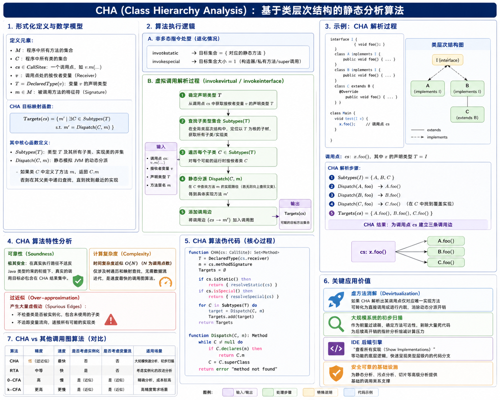
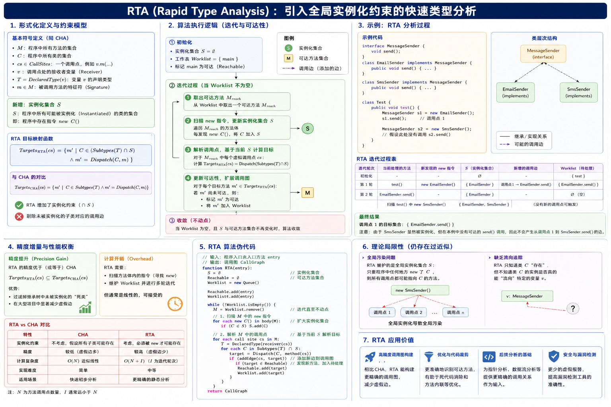
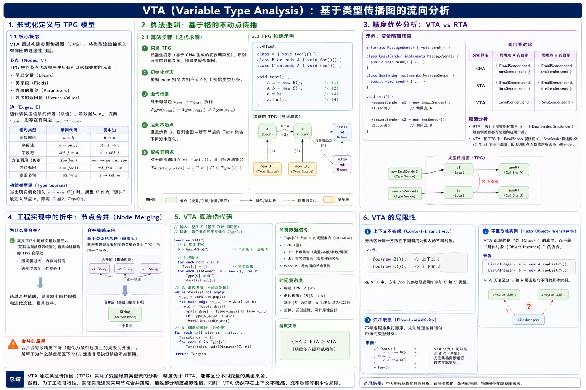
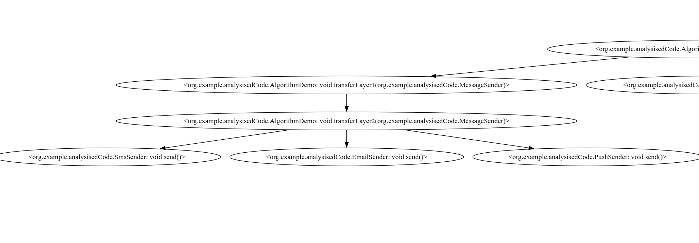
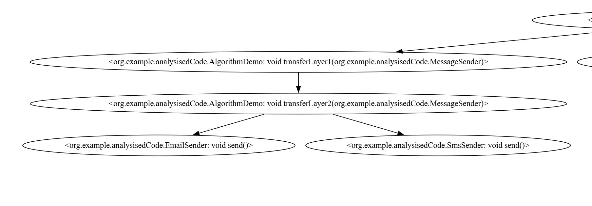
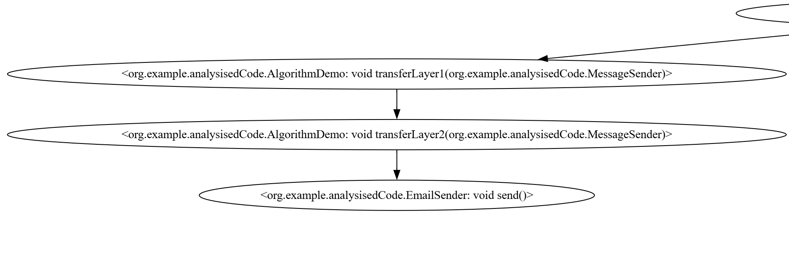
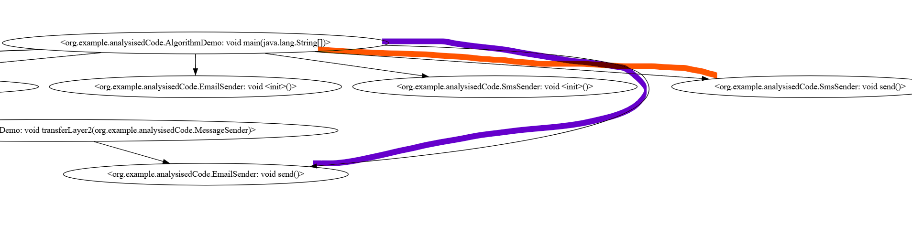

+++
date = '2026-04-28T19:56:27+08:00'
draft = false
title = 'Soot Study 3: 基于过程间分析的调用图构建理论与实现'
categories = ["static-analysis"]
tags = ["Study", "Data Flow Analysis", "Soot Study 2"]

+++

# Soot Study 3: 基于过程间分析的调用图 (Call Graph) 构建理论与实现

## 0x00 引言：从过程内分析到过程间分析

在 `Soot Study 2` 中，我们基于控制流图 (CFG) 探讨了数据流分析的理论，并实现了一个单方法内的可用表达式分析器。这类分析聚焦于局部变量的传递与状态改变，属于**过程内分析（Intra-procedural Analysis）**。

然而，在实际的安全分析任务（如污点追踪或复杂的 Gadget Chain 挖掘）中，目标数据流通常会跨越多个方法与类。当过程内分析在遍历 CFG 遇到跨方法调用（如 `obj.doSomething()`）时，往往无法确定 `obj` 在运行时的实际类型，也无法获知目标方法的内部逻辑，导致分析链路中断。

为了追踪跨越方法边界的数据流，必须引入**过程间分析（Inter-procedural Analysis）**。

而构建一张精确的**调用图（Call Graph, CG）**，是所有过程间分析的先决条件。调用图是有向图，节点代表程序中的方法，边代表方法之间的调用关系。只有获取了全程序的调用图，分析引擎才能顺着边在不同方法之间传递状态。

本文将系统介绍调用图的构建理论与 Soot 中的工程实现，主要内容包括：

1. **构建难点**：Java 语言中的多态特性与动态分派（Dynamic Dispatch）。
2. **核心算法**：四种经典调用图构建算法（CHA、RTA、VTA、Spark 指针分析）的原理与精度差异。
3. **工程实战**：基于 Soot API 编写分析驱动，并导出不同精度下的调用图。

------

### 0x01 构建调用图的核心问题：多态与动态分派

在 Java 等面向对象语言中，构建调用图（Call Graph）的核心难点在于多态（Polymorphism）机制所引发的动态分派（Dynamic Dispatch）。

在分析方法调用时，根据字节码指令的不同，主要分为两种解析情况：

#### 1. 静态绑定（Static Binding）

对于静态方法（`invokestatic`）以及私有方法和构造方法（`invokespecial`），目标方法在编译期即可唯一确定。

```java
Math.max(1, 2); // 编译期锁定目标为 java.lang.Math.max()
```

构建此类调用边是确定的 1 对 1 映射，不存在歧义。

#### 2. 动态绑定（Dynamic Binding）

对于普通的实例方法（`invokevirtual`）和接口方法（`invokeinterface`），目标方法的决议必须推迟到运行期，其具体指向取决于变量所引用的实际对象类型。

参考以下基础业务代码：

```java
interface MessageSender {
    void send();
}

class EmailSender implements MessageSender {
    public void send() { /* 发送邮件 */ }
}

class SmsSender implements MessageSender {
    public void send() { /* 发送短信 */ }
}

public class Business {
    public void process(MessageSender sender) {
        // Call Site（调用点）
        sender.send(); 
    }
}
```

在静态分析阶段，分析器处理 `Business.process` 方法中的调用点 `sender.send()` 时，由于程序并未处于运行状态，无法通过内存上下文确定 `sender` 变量的具体实现类型是 `EmailSender` 还是 `SmsSender`。

#### 3. 保守近似与算法演进

为了保证静态分析的可靠性（Soundness，即不漏掉真实的执行路径），分析引擎必须采用保守近似（Conservative Approximation）策略。即：在无法确定的情况下，将所有潜在的目标方法（Target Methods）均与调用点建立连接。

如何界定这些“潜在目标”的范围，直接决定了调用图的精度（Precision）和构建的时间开销（Overhead）。根据约束条件的不同，静态分析领域发展出四种主流的调用图构建算法：

1. **CHA (Class Hierarchy Analysis)**：基于类层次结构的静态分析。
2. **RTA (Rapid Type Analysis)**：基于全局实例化类型的快速推断。
3. **VTA (Variable Type Analysis)**：基于类型传播图的数据流分析。
4. **PTA (Pointer Analysis / Spark)**：基于内存分配点的指针分析。

## 0x02 CHA (Class Hierarchy Analysis)：基于类层次结构的静态分析



CHA 是静态分析中构建调用图（Call Graph）最基础且效率最高的算法。它完全基于 Java 的类继承体系（Class Hierarchy）进行方法解析，不涉及任何关于程序运行时数据流或对象实例化状态的追踪。

### 1. 形式化定义与数学模型

为了在计算机科学语境下严谨地描述 CHA，我们需要建立一套基于集合论的数学模型：

- **定义元素：**

  - $M$：程序中所有方法的集合。
  - $C$：程序中所有类的集合。
  - $cs \in CallSites$：程序中的一个方法调用点，例如 $v.m(\dots)$。
  - $v$：调用点处的接收者变量（Receiver Variable）。
  - $T = DeclaredType(v)$：变量 $v$ 在编译期确定的**声明类型**（静态类型）。
  - $m \in M$：被调用方法的特征符（Signature），包含方法名、参数类型及返回类型。

- **CHA 目标映射函数：**

  对于任意多态调用点 $cs$，CHA 算法通过以下映射公式计算其可能的**目标方法集合** $Targets(cs)$：

  $$Targets(cs) = \{ m' \mid \exists C \in Subtypes(T) \text{ s.t. } m' = Dispatch(C, m) \}$$

  其中核心函数定义如下：

  - **$Subtypes(T)$**：指代类型 $T$ 及其在类继承树中的所有子类、实现类的并集。
  - **$Dispatch(C, m)$**：静态模拟 JVM 的动态分派过程。其逻辑为：若类 $C$ 中显式定义了方法 $m$，则返回 $C.m$；否则在其直接父类中递归查找，直至找到最近的实现。

### 2. 算法执行逻辑详述

CHA 算法的执行不依赖于方法体内部的赋值指令，它通过维护一张全局的类索引表来实现极速解析。其处理逻辑分为两个维度：

#### A. 非多态指令处理

对于非多态性质的调用指令，CHA 的解析逻辑是退化的：

- **Static Invocation (`invokestatic`)**：直接关联到对应的静态方法。
- **Special Invocation (`invokespecial`)**：针对构造函数（`<init>`）、私有方法或通过 `super` 调用的方法，目标集合基数恒等于 **1**。

#### B. 虚拟调用解析过程

对于多态性质的指令（`invokevirtual` 和 `invokeinterface`），算法执行以下步骤：

1. **确定范围**：根据接收者变量的声明类型 $T$，从全局类层级图中定位以 $T$ 为根的子树。
2. **穷举子类**：遍历该子树中的每一个类节点 $C$。无论该类在实际代码中是否被实例化，算法均假设其可能作为运行时的接收者对象。
3. **解析路径**：对每一个类 $C$ 执行 $Dispatch(C, m)$ 操作，将解析出的所有方法实现 $m'$ 加入调用边集合。

### 3. CHA 的算法特性分析

- **可靠性 (Soundness)**：CHA 提供了极强的安全保证。由于它覆盖了类型系统的所有可能分支，在真实执行路径不违反 Java 类型约束的前提下，真实的调用目标必包含在 CHA 计算的结果集中。
- **计算复杂度 (Complexity)**：CHA 的时间复杂度接近 $O(N)$（其中 $N$ 为方法调用的数量）。由于它仅涉及简单的树遍历和映射查找，不需要进行复杂的数据流迭代，因此它是所有调用图算法中速度最快的一种。
- **过近似 (Over-approximation)**：这是 CHA 的固有缺陷。它产生的调用图通常包含大量的**虚假边（Spurious Edges）**。
  - 由于它不检查类是否被实例化，即使某个子类实现仅存在于类库中却从未被 `new` 出来，CHA 也会建立连接。
  - 由于它不追踪变量流向，即使一个变量在逻辑上只能指向特定的两个实现类，CHA 也会因为该变量的接口声明而连接所有 100 个实现类。

### 4. 关键应用价值

尽管精度较低，但 CHA 在编译器优化和大型静态分析工具中扮演着基础设施的角色：

- **虚方法消解 (Devirtualization)**：如果 CHA 解析出某个接口调用点仅对应唯一的实现方法（单态调用），编译器可以将该调用直接转化为直接调用或进行**内联 (Inlining)**，从而消除动态分派的性能开销。
- **大规模系统的初步扫描**：在处理拥有数百万行代码的大型工业项目时，CHA 常作为前置过滤器。通过 CHA 确定方法的可达性（Reachability），可以剔除大量从未被引用的死代码，从而为后续高开销的指针分析缩减计算压力。
- **IDE 后端引擎**：现代 IDE 在提供“查看所有实现（Show Implementations）”功能时，底层逻辑往往是 CHA 的一种变体，旨在快速为开发者呈现类型层级内的所有代码分支。

### 5. CHA 的局限性总结

CHA 的根本局限源于其**对程序状态的无知性**。它只阅读“户口本”（类定义），而不观察“现实活动”（数据流）。这种对上下文和实例化信息的忽略，使得在复杂的、大量使用多态和设计模式（如工厂模式、策略模式）的代码框架中，CHA 生成的调用图会因极其严重的冗余而失去深度分析的意义。

为了解决这一问题，研究者引入了 **RTA (Rapid Type Analysis)**，通过监控 `new` 关键字来约束 $Subtypes(T)$ 集合的范围。

## 0x03 RTA (Rapid Type Analysis)：引入全局实例化约束



RTA 是对 CHA 的直接演进。CHA 的核心缺陷在于它假设继承树上的所有子类都可能在运行时出现，而忽略了这些类是否真的被程序创建过。RTA 通过引入全局实例化信息（Global Instantiation Information）来缩小搜索范围，从而显著提升调用图的精度。

### 1. 形式化定义与约束模型

RTA 的核心思想是：一个类 $C$ 的方法 $m$ 只有在满足“类型符合”且“类被实例化”两个条件时，才会被视为有效的调用目标。

- **实例化集合 $\mathcal{S}$**：定义 $\mathcal{S}$ 为程序中所有可能被实例化（Instantiated）的类的集合。即程序中存在指令 `new C()`。

- **RTA 目标映射函数**：

  给定调用点 $cs$（接收者变量声明类型为 $T$），其目标方法集合 $Targets_{RTA}(cs)$ 定义为：

  $$Targets_{RTA}(cs) = \{ m' \mid C \in (Subtypes(T) \cap \mathcal{S}) \land m' = Dispatch(C, m) \}$$

  与 CHA 相比，RTA 增加了一个关键的交集运算 $(Subtypes(T) \cap \mathcal{S})$。这意味着即使 $C$ 是 $T$ 的子类，如果 $C$ 不在实例化集合 $\mathcal{S}$ 中，它对应的边也会被剔除。

### 2. 算法的执行逻辑：迭代与可达性

RTA 不仅仅是一个静态的查找过程，它通常表现为一个迭代的不动点求解（Fixed-point Iteration）**过程，并与**可达性分析（Reachability Analysis）紧密结合：

1. **初始化**：

   - 创建一个空的实例化集合 $\mathcal{S} = \emptyset$。
   - 创建一个待处理的工作表（Worklist），初始包含程序的入口方法（如 `main`）。
   - 将入口方法标记为“可达”。

2. **迭代扫描**：

   当 Worklist 不为空时，取出一个可达方法 $M_{reach}$：

   - **扫描 `new` 指令**：遍历 $M_{reach}$ 的方法体。每当发现 `new C()`，将类 $C$ 加入集合 $\mathcal{S}$。
   - **触发重算**：由于 $\mathcal{S}$ 扩大了，之前某些受限于 $C$ 未实例化的调用点现在可能产生新的调用边。
   - **解析调用点**：对于 $M_{reach}$ 中的每一个虚拟调用点 $cs$，根据当前的 $\mathcal{S}$ 计算 $Targets_{RTA}(cs)$。
   - **更新可达性**：如果发现了新的目标方法 $m'$ 且 $m'$ 之前不可达，将其标记为“可达”并放入 Worklist。

3. **收敛**：

   重复上述过程，直到 Worklist 为空，且 $\mathcal{S}$ 与可达方法集合不再变化。此时，分析达到了不动点。

### 3. 精度增量与性能权衡

- **精度提升（Precision Gain）**：

  RTA 的精度严格优于（或等于）CHA。

  $$Targets_{RTA}(cs) \subseteq Targets_{CHA}(cs)$$

  在处理包含大量第三方库或框架的项目时，RTA 能有效过滤掉那些存在于类库中、但在当前业务逻辑中从未被实例化的“死类”。

- **计算开销（Overhead）**：

  RTA 的时间复杂度高于 CHA，因为它需要扫描方法体内的指令（寻找 `new`）并进行多次迭代。但在实际工程实现中，这种开销通常是线性的且可接受的，因为它不需要构建复杂的数据流图。

### 4. RTA 的理论局限性

尽管 RTA 比 CHA 更精确，但它依然是一种流不敏感（Flow-insensitive）**和**上下文不敏感（Context-insensitive）的分析：

- **全局污染问题**：RTA 维护的是一个**全局**的实例化集合 $\mathcal{S}$。这意味着只要程序中任何一个角落 `new` 了一个 `SmsSender`，那么全程序所有的 `MessageSender.send()` 调用点都可能会连向 `SmsSender`。
- **缺乏流向追踪**：它只知道类 $C$ “存在”，但不知道类 $C$ 的实例是否真的能“流向”特定的变量 $v$。

**示例分析：**

```java
public void test() {
    MessageSender s1 = new EmailSender();
    s1.send(); // 调用点 1

    MessageSender s2 = new SmsSender();
    // 假设此处没有调用 s2.send()
}
```

在上述代码中，RTA 会因为 `new SmsSender()` 的存在，认为“调用点 1”可能指向 `SmsSender`。要解决这个“全局污染”问题，必须引入能够追踪变量具体流向的算法，即下一节要讨论的 **VTA（Variable Type Analysis）**。

## 0x04 VTA (Variable Type Analysis)：基于类型传播图的流向分析



VTA 是比 RTA 更高级的算法。RTA 的局限性在于其维护的是一个“全局实例化集合”，只要程序中任何地方创建了对象，就会干扰所有相关的调用点。VTA 通过构建**类型传播图（Type Propagation Graph, TPG）**，将分析粒度从“全程序”细化到了“变量级”，从而实现了对数据流向的追踪。

### 1. 形式化定义与 TPG 模型

VTA 的核心逻辑是将程序中的类型流动抽象为一个有向图的连通性问题。

- **节点 (Nodes, $\mathcal{V}$)**：

  TPG 中的节点代表程序中所有可以承载类型的元素，包括：

  - 局部变量（Locals）
  - 类字段（Fields）
  - 方法的形参（Parameters）
  - 方法的返回值（Return Values）

- **边 (Edges, $\mathcal{E}$)**：

  边代表类型信息的传递（赋值）。若程序中存在数据从 $v_{src}$ 流向 $v_{dest}$ 的逻辑，则存在有向边 $v_{src} \rightarrow v_{dest}$。

  - **直接赋值**：`a = b` $\implies b \rightarrow a$。
  - **方法调用（传参）**：`foo(bar)` $\implies bar \rightarrow parameter_{foo}$。
  - **方法返回**：`x = foo()` $\implies return_{foo} \rightarrow x$。

- **初始类型源 (Type Sources)**：

  对于每一个节点 $v$，定义其关联的类型集合为 $Type(v)$。

  当程序中出现实例化语句 `v = new C()` 时，类型 $C$ 作为“源头”被注入节点 $v$。

### 2. 算法逻辑：基于格的不动点传播

VTA 采用**迭代算法**来求解每个变量最终可能持有的类型。其数学本质是在一个由类型集合构成的格（Lattice）上寻找最小不动点。

1. **构建 TPG**：扫描全程序（通常基于 CHA 生成的初步调用图）来识别所有的赋值关系。

2. **初始化状态**：根据 `new` 指令为相应的节点打上初始类型标签。

3. **迭代传播**：

   对于 TPG 中的每一条边 $v_{src} \rightarrow v_{dest}$，执行以下集合并集运算：

   $$Type(v_{dest}) = Type(v_{dest}) \cup Type(v_{src})$$

4. **达到不动点**：重复步骤 3，直到全图中所有节点的 $Type$ 集合不再发生变化。

5. **解析调用点**：

   对于虚拟调用点 $cs$ ($v.m(\dots)$)，其目标方法集合解析为：

   $$Targets_{VTA}(cs) = \{ C.m \mid C \in Type(v) \}$$

### 3. 精度优势分析

VTA 解决了 RTA 无法处理的“类型隔离（Type Isolation）”问题。

**案例对比：**

Java

```
// 变量隔离场景
MessageSender s1 = new EmailSender();
s1.send(); // 调用点 A

MessageSender s2 = new SmsSender();
s2.send(); // 调用点 B
```

- **RTA**：由于全局存在 `EmailSender` 和 `SmsSender`，RTA 认为调用点 A 和 B 都有 2 条边。
- **VTA**：在 TPG 中，`EmailSender` 仅流向 `s1`，`SmsSender` 仅流向 `s2`。由于 `s1` 和 `s2` 节点不连通，VTA 能精准识别出调用点 A 仅指向 `EmailSender`。

### 4. 工程实现中的折中：节点合并

在 Soot 等工具的实际工程实现中，为了平衡性能与精度，VTA 往往引入了节点合并（Node Merging）策略：

- **基于类型的合并**：VTA 可能会将所有声明类型相同的变量（例如所有声明为 `java.lang.String` 的局部变量）合并为 TPG 中的同一个节点。
- **后果**：这极大地减小了图的规模和迭代次数，但也导致了精度的下降（退化为某种程度上的类级别分析）。这解释了为什么在某些配置下，VTA 的速度异常之快。

### 5. VTA 的局限性

尽管 VTA 追踪了流向，但它依然存在以下瓶颈：

1. **上下文不敏感 (Context-Insensitivity)**：它无法区分同一个方法在不同调用处（Calling Contexts）传入的不同对象。
2. **不区分堆实例**：VTA 追踪的是“类（Class）”的流向，而不是“具体对象（Object Instance）”的流向。
   - 例如：它无法区分两个同为 `ArrayList` 类型但内容不同的实例。


## 0x05 算法精度验证与调用边深度解析

在完成理论建模后，我们通过运行具体的被测代码 `AlgorithmDemo` 来验证不同算法在实际分析中的精度表现。本次验证的核心观测点（Call Site）位于 `transferLayer2` 方法中的虚拟调用指令：`sender2.send()`。

### 1. 被测环境的状态空间分析

在程序运行的全生命周期中，针对 `MessageSender` 接口及其实现类，存在以下三种不同的生存状态：

1. **EmailSender**：执行了 `new` 操作，且其引用通过实参流向了目标调用点的接收者变量 `sender2`。
2. **SmsSender**：执行了 `new` 操作，但其引用仅停留在 `main` 方法的局部变量 `sms` 中，未进入任何下游调用链。
3. **PushSender**：仅存在类定义与方法实现，全程序范围内未执行任何实例化操作。

被测代码如下

```java
package org.example.analysisedCode;

// 1. 定义一个最普通的业务接口
interface MessageSender {
    void send();
}

// 2. 实现类 A：真正被调用的类
class EmailSender implements MessageSender {
    @Override
    public void send() { System.out.println("发送邮件..."); }
}

// 3. 实现类 B：实例化了，但没传进调用链（用来测试 RTA 的误报）
class SmsSender implements MessageSender {
    @Override
    public void send() { System.out.println("发送短信..."); }
}

// 4. 实现类 C：只写了代码，根本没实例化（用来测试 CHA 的误报）
class PushSender implements MessageSender {
    @Override
    public void send() { System.out.println("发送 APP 推送..."); }
}

// 5. 主测试类
public class AlgorithmDemo {

    public static void main(String[] args) {
        // 创建了两个对象
        MessageSender email = new EmailSender();
        MessageSender sms = new SmsSender(); 

        // 但是我们只把 email 传给下游方法
        transferLayer1(email);

    }

    // 第一层传递：单纯为了拉长调用链，防止编译器直接优化掉
    private static void transferLayer1(MessageSender sender1) {
        transferLayer2(sender1);
    }

    // 第二层传递：真正的触发点
    private static void transferLayer2(MessageSender sender2) {
        sender2.send();
    }

}
```


------

### 2. CHA (Class Hierarchy Analysis) 验证逻辑

**解析公式：**

$$Targets_{CHA}(cs) = \{ m' \mid C \in Subtypes(MessageSender) \}$$

**运行结果解析：**

这里只截取我们关注的调用图部分



CHA 生成了 **3** 条调用边，指向 `{EmailSender.send(), SmsSender.send(), PushSender.send()}`。

**技术细节：**

CHA 的解析逻辑具有**完全的静态性**。它仅检索符号表中的类继承关系。由于 `PushSender` 满足接口实现关系，即便它在程序中是“死代码”，CHA 依然会将其标记为潜在的可达目标。这证明了 CHA 在处理具有大量库文件或框架实现的项目时，会导致严重的调用图膨胀（Graph Bloating）。

------

### 3. RTA (Rapid Type Analysis) 验证逻辑

**解析公式：**

$$Targets_{RTA}(cs) = \{ m' \mid C \in (Subtypes(MessageSender) \cap \mathcal{S}) \}$$

其中，全局实例化集合 $\mathcal{S} = \{EmailSender, SmsSender\}$。

**运行结果解析：**



RTA 生成了 **2** 条调用边，指向 `{EmailSender.send(), SmsSender.send()}`。

**技术细节：**

RTA 成功过滤了 `PushSender`，因为它在全程序扫描中未发现该类的实例化指令。然而，RTA 无法剔除 `SmsSender`。这是因为 RTA 维护的是一个**流不敏感（Flow-insensitive）\**的全局集合。只要程序中任何位置出现了 `new SmsSender()`，该类型就会“污染”全局所有相关的调用点。这种现象被称为\**全局类型溢出**，是 RTA 精度进一步提升的主要障碍。

------

### 4. VTA (Variable Type Analysis) 验证逻辑

**解析模型：类型传播图 (TPG) 连通性**

VTA 要求在 TPG 中存在一条从实例化节点 $v_{alloc}$ 到接收者变量节点 $v_{receiver}$ 的有向路径。

**运行结果解析：**



VTA 仅生成了 **1** 条调用边，精准指向 `{EmailSender.send()}`。

**技术细节：**

VTA 的优势在于其具备**流向敏感性**（虽然在 Soot 内部实现中可能是上下文不敏感的，但其对变量间赋值链的追踪极大地提升了分辨率）。

在 TPG 中，赋值链构建如下：

- **有效路径**：`EmailSender` (alloc) $\rightarrow$ `email` (main) $\rightarrow$ `sender1` (layer1) $\rightarrow$ `sender2` (layer2)。
- **隔离路径**：`SmsSender` (alloc) $\rightarrow$ `sms` (main) $\rightarrow$ $\emptyset$。

由于 `sms` 变量没有与 `transferLayer1` 的参数建立连接，TPG 求解器判定 `SmsSender` 类型无法到达 `sender2`。因此，VTA 成功实现了对“已实例化但未流向目标”的干扰项的剔除。

------

### 5. 验证结论汇总

通过执行代码并提取调用图中的边信息，我们可以得出以下定量分析结论：

| **算法** | **解析目标集合**   | **出边数量 (Out-degree)** | **精度判定** | **核心缺陷**                 |
| -------- | ------------------ | ------------------------- | ------------ | ---------------------------- |
| **CHA**  | {Email, Sms, Push} | 3                         | **Low**      | 包含未实例化的类             |
| **RTA**  | {Email, Sms}       | 2                         | **Medium**   | 无法处理已实例化但未流向的类 |
| **VTA**  | {Email}            | 1                         | **High**     | 无法区分同类型下的不同堆对象 |

**深度观察：**

虽然 VTA 在本案例中达到了 100% 的精度，但需要注意，VTA 依然无法处理**同类型不同实例**的区分问题。例如，若我们有两个 `EmailSender` 实例，其中一个带有恶意 payload，另一个是正常的，VTA 会将它们视为相同的“类标签”。

这里的误报，也可以复现一下，这里我们修改一下被测代码

```java
package org.example.analysisedCode;

// 1. 定义一个最普通的业务接口
interface MessageSender {
    void send();
}

// 2. 实现类 A：真正被调用的类
class EmailSender implements MessageSender {
    @Override
    public void send() { System.out.println("发送邮件..."); }
}

// 3. 实现类 B：实例化了，但没传进调用链（用来测试 RTA 的误报）
class SmsSender implements MessageSender {
    @Override
    public void send() { System.out.println("发送短信..."); }
}

// 4. 实现类 C：只写了代码，根本没实例化（用来测试 CHA 的误报）
class PushSender implements MessageSender {
    @Override
    public void send() { System.out.println("发送 APP 推送..."); }
}

// 5. 主测试类
public class AlgorithmDemo {

    public static void main(String[] args) {
        // 创建了两个对象
        MessageSender email = new EmailSender();
        MessageSender sms = new SmsSender(); 

        // 但是我们只把 email 传给下游方法
        transferLayer1(email);

        // 增加代码，我们想办法让两个不同的对象混合到一个方法中，并让方法返回
        MessageSender email1 = transferLayer3(email);
        MessageSender sms1 = transferLayer3(sms);
        // 观察main调用的send方法是谁的send
        email1.send();
    }

    // 第一层传递：单纯为了拉长调用链，防止编译器直接优化掉
    private static void transferLayer1(MessageSender sender1) {
        transferLayer2(sender1);
    }

    // 第二层传递：真正的触发点
    private static void transferLayer2(MessageSender sender2) {
        sender2.send();
    }

    private static MessageSender transferLayer3(MessageSender sender3) {
        return sender3;
    }
}
```

我们再看VTA的调用图



会发现这里产生了sms的误报，说明vta的精度，还是可以该改进

## 0x06 总结

为解决上述问题，则需要引入追踪内存分配点（Allocation Site）的指针分析（Pointer Analysis / Spark）。

这种从“类型系统”到“实例化状态”再到“变量流向”的演进，构成了静态分析中过程间分析的精度阶梯。在后续章节中，我们将探讨在 Soot 中如何通过具体代码配置来开启这些不同级别的分析引擎。