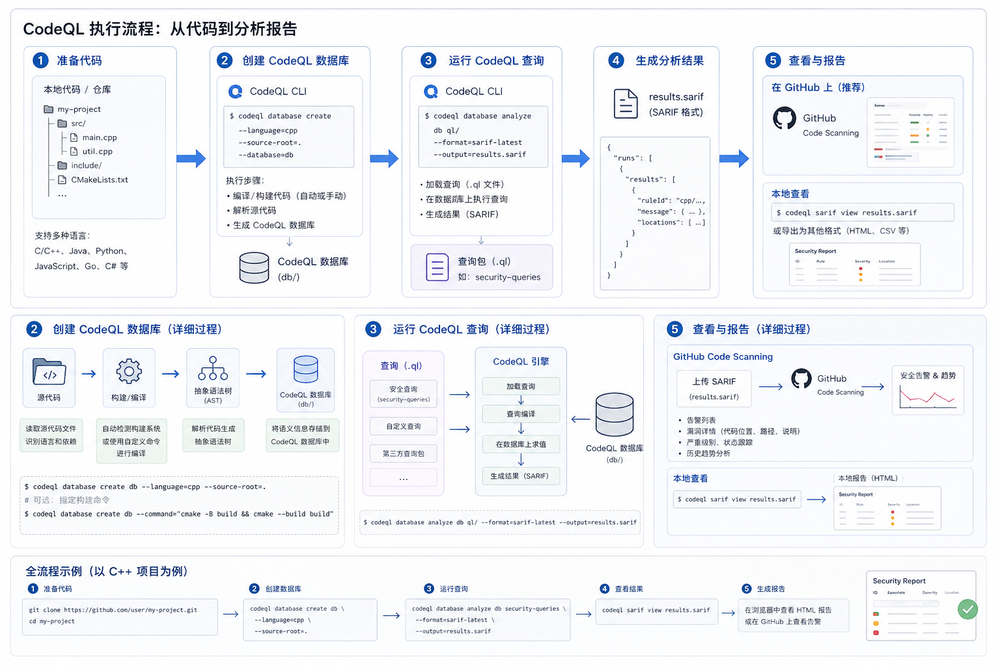
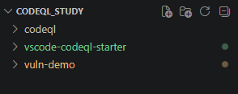
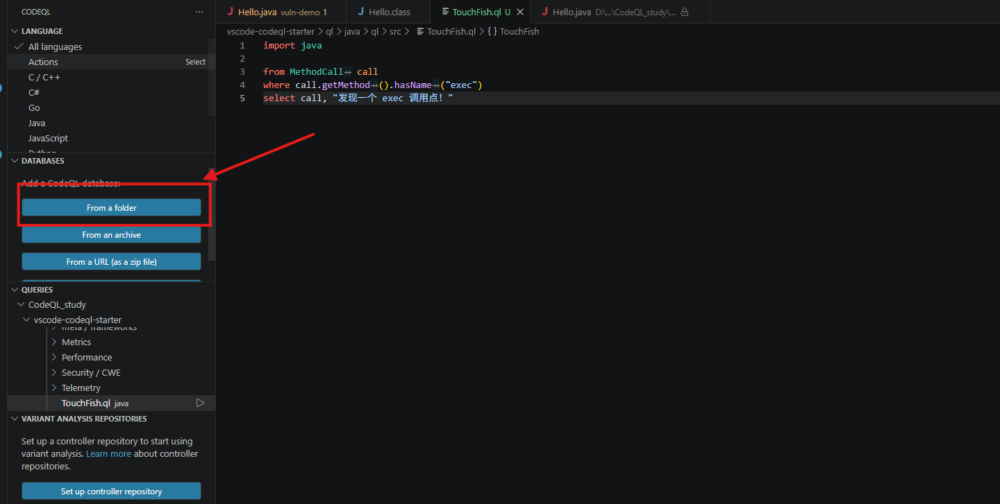
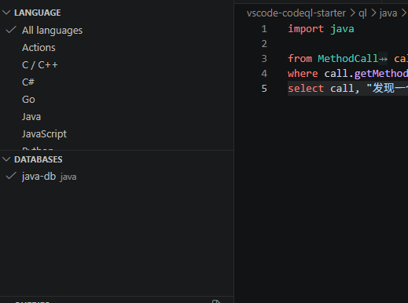
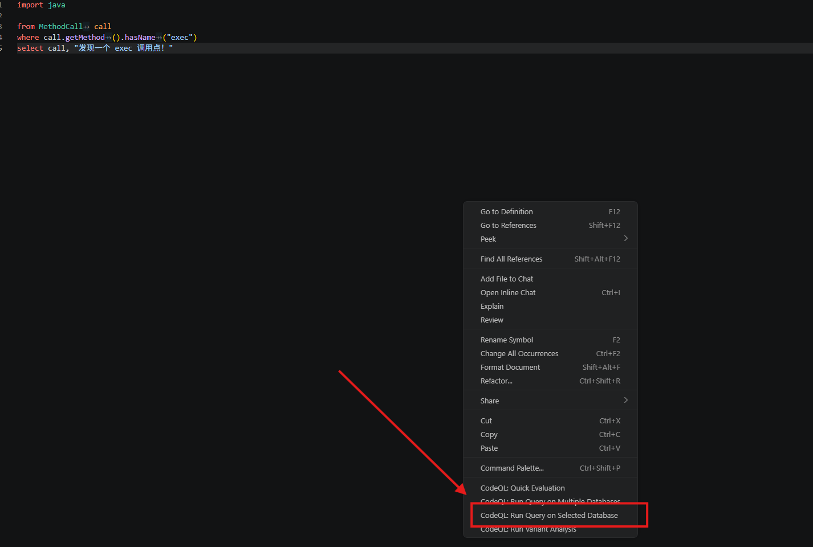
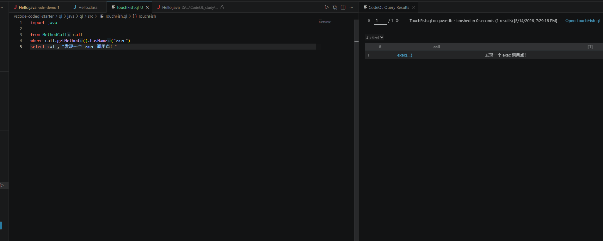
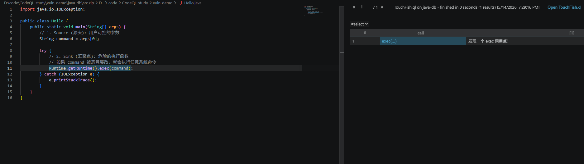

+++
date = '2026-05-14T18:59:46+08:00'
draft = false
title = 'CodeQL introduction'

math = true

categories = ["static-analysis"]
tags = ["Study", "deserialization", "CodeQL introduction"]

+++


# CodeQL Study 1

## 0x00 引言：从 Soot 到 CodeQL 的范式转移
在掌握了 Soot 的中间表示（Jimple）和图论分析后，我们面临一个新的挑战：如何在大规模代码库中快速建模已知漏洞？Soot 擅长底层微观分析，但其开发成本较高。而 CodeQL 提出了一个革命性的观点——**代码即数据（Code as Data）**。本文作为系列首篇，将完成从代码编译、数据库构建到首条 QL 查询的完整全过程，直击 CodeQL 核心逻辑。

---

## 0x01 CodeQL 核心原理：代码的“数据库化”
CodeQL 的核心价值在于它并不直接扫描文本，而是将源代码通过编译器的“旁路监听”，转化成一个包含抽象语法树（AST）、数据流图和控制流图的关系型数据库。先给一个整体的流程图



### 1. 转换流程 (The Extraction Process)

*   **Source Code**: 原始的 Java/C++/Python 等代码。
*   **Extractor**: CodeQL 提取器。在编译过程中（如 `javac`），Extractor 会捕捉所有的编译信息。
*   **TRAP Files**: 中间生成的 TRAP 文件，记录了代码的各种关系。
*   **Database**: 最终生成的文件夹，它是 QL 语言查询的唯一对象。

### 2. QL 语言：声明式查询
不同于 Soot 需要编写 Java 代码来遍历图，CodeQL 使用一种类似 SQL 的 **逻辑编程语言 (QL)**。
*   **非过程式**：你只需要描述“漏洞长什么样”（特征），而不是告诉工具“怎么去走路径”。
*   **面向对象**：QL 支持类、继承和谓词（Predicates），可以极大提高逻辑复用。

---

## 0x02 环境搭建与配置
CodeQL 的高效运行依赖于三个组件的协同：
1.  **CodeQL CLI**：执行引擎，负责创建数据库和解析查询。
2.  **VS Code 插件**：可视化交互界面，是观察漏洞路径的神器。
3.  **vscode-codeql-starter**：官方标准查询库。它提供了封装好的 `TaintTracking` 和各种语言的 `.qll` 类库，没有它你将寸步难行。

---

## 0x03 CodeQL的拉取

### 1. 克隆 `vscode-codeql-starter`

一定要加上 **`--recursive`** 参数，否则那些关键的 Java 标准库（`.qll` 文件）是拉不下来的。

```bash
git clone --recursive --depth 1 --shallow-submodules https://github.com/github/vscode-codeql-starter.git
```

------

### 2. 下载 CodeQL CLI Release

这是 CodeQL 的核心引擎。你需要根据你的系统（Windows/Linux/Mac）下载对应的压缩包。

- **官方下载地址**：[GitHub CodeQL CLI Releases](https://github.com/github/codeql-cli-binaries/releases)

**下载建议**：

- 进入页面后，找最新的 **Latest** 版本。
- Windows 用户下载 `codeql-win64.zip`。
- 下载后解压到你之前说的 `CodeQL_study/codeql` 文件夹下。
- 记得把解压出的 `codeql` 文件夹路径（包含 `codeql.exe` 的那个路径）添加到系统环境变量 **PATH** 中。

------

### 3. 环境自测

配好环境变量后，在你的 PowerShell 或终端里输入这个命令确认一下：

```bash
codeql --version
```

如果弹出了版本号和版权信息，说明成功。

后续可以把codeql放入环境变量中，便于使用

## 0x04 数据库构建实战：解决 Windows 编码暗坑

在构建 Java 数据库时，最常见的失败源于编译器的字符集冲突。

### 1. 创建数据库的核心命令
根目录为 `CodeQL_study`，源码位于 `vuln-demo`：



源码文件为Hello.java

```java
import java.io.IOException;

public class Hello {
    public static void main(String[] args) {
        // 1. Source (源头): 用户可控的参数
        String command = args[0]; 

        try {
            // 2. Sink (汇聚点): 危险的执行函数
            // 如果 command 被恶意篡改，就会执行任意系统命令
            Runtime.getRuntime().exec(command); 
        } catch (IOException e) {
            e.printStackTrace();                                                                                                                                                                                                                                                                                                                                                                                                                                                                                                                                                                                                                                                                                                                                                                                                                                                                                                                                                                                                                                                                                                                                      
        }
    }
}
```

接下来，我们可以构建codeql的数据库

```bash
codeql database create vuln-demo/java-db --language=java --source-root=./vuln-demo --command="javac -encoding UTF-8 Hello.java" --overwrite
```

### 2. 核心参数详解

#### 1. `vuln-demo/java-db` (目标路径)

- **含义**：指定生成的 CodeQL 数据库存放的位置。
- **解释**：这里你指定在 `vuln-demo` 文件夹下创建一个名为 `java-db` 的文件夹。
- **注意**：这个路径不需要提前创建，CodeQL 会自动为你生成。它不是一个文件，而是一个包含了代码快照和关系索引的**目录**。

#### 2. `--language=java`

- **含义**：指定分析的编程语言。
- **解释**：告诉 CodeQL 提取器（Extractor）使用 Java 规则来解析代码。
- **扩展**：CodeQL 支持 `java` (包括 Kotlin), `python`, `cpp`, `javascript` (包括 TypeScript), `go`, `ruby`, `csharp`, `swift`。

#### 3. `--source-root=./vuln-demo`

- **含义**：指定源代码的根目录。
- **解释**：
  1. 它是 CodeQL 扫描文件的起始点。
  2. 它会改变后续 `--command` 执行时的 **工作目录**。
- **关键点**：因为你设置了这里，所以后面的 `javac` 才能在 `vuln-demo` 文件夹里直接找到 `Hello.java`。

#### 4. `--command="javac -encoding UTF-8 Hello.java"`

- **含义**：指定构建（编译）命令。
- **解释**：这是创建数据库的“灵魂”。
  - **原理**：对于 Java 这种编译型语言，CodeQL 不直接读源码，而是通过“观察”编译过程来提取信息。
  - **`-encoding UTF-8`**：这是你针对 Windows 乱码坑增加的关键参数。它强制编译器按照 UTF-8 编码读取代码，防止因为中文注释导致编译失败。
- **核心规则**：只要这个命令能让你的代码编译通过（退出码为 0），CodeQL 就能成功提取数据库。如果是 Maven 项目，这里通常会写成 `"mvn clean compile"`。

#### 5. `--overwrite`

- **含义**：强制覆盖。
- **解释**：如果 `vuln-demo/java-db` 已经存在，CodeQL 默认会因为怕删错数据而报错停止。加上这个参数后，它会先删除旧的数据库，再创建一个全新的。
- **建议**：在调试查询脚本或频繁修改 Demo 代码阶段，这个参数非常实用。

------

## 0x05 CodeQL 对象模型与首条查询

在 VS Code 中导入生成的 `demo-db` 后，我们可以开始编写查询。

在 VS Code 的左侧文件浏览器中，展开 **`vscode-codeql-starter`** 文件夹。 为了确保环境依赖正确，请进入： `ql` -> `java` -> `ql` -> `src`

### 1. QL 基础结构：Select 语句

类似于 SQL，QL 的基本结构是 `from...where...select`：

在src中新建一个新文件`TouchFish.ql`

```java
import java

from MethodCall call
where call.getMethod().hasName("exec")
select call, "发现一个 exec 调用点！"
```

**from**：定义查询的**范围**。这里声明了一个 `MethodCall` 类型的变量 `call`，代表数据库中所有的函数调用动作。

**where**：定义查询的**约束条件**。通过逻辑谓词过滤出我们真正关心的节点。

**select**：定义查询的**输出结果**。第一个参数通常是源码节点（用于跳转），第二个参数是自定义的描述信息。

### 2. 对象映射关系

**MethodCall**：对应 AST 中的**方法调用节点**（即代码中出现 `obj.func()` 的位置）。

**Method**：对应**方法的声明**（即函数定义本身）。

**getDeclaringType()**：获取该方法**所属的类**。这在过滤特定 API（如 JDK 内置的高危类 `java.lang.Runtime`）时非常有用。

**hasName(string)**：最基础的**名称匹配**。用于检查方法名、类名或变量名是否与预期的字符串一致。

**hasQualifiedName(package, class)**：**全限定名匹配**。比 `hasName` 更精确，能同时验证包名和类名，防止因为同名类导致的误报。

**getArgument(n)**：获取方法调用中的**第 $n$ 个参数**。在确定漏洞汇聚点（Sink）时，用于精准锁定受污染数据流入的具体参数位。

**Expr**：**表达式基类**。代码中所有能产生“值”的单元（如变量引用、常量、计算式）都是 `Expr`，它是污点追踪中最常操作的原子。

### 3. 下载codeql插件

在插件中，选择你要分析的源码数据库所在文件夹



引入数据库，展示如下即可



然后回到我们写的ql文件中，右键选择`CodeQL: Run Query on Selected Database`

等待其运行结束后没有变会出现，query results



我们可以点击exec`(...)`，从而看到源码的真实调用点



------

## 0x06 总结

作为 CodeQL 学习系列的第一站，我们理解了：

1. **数据库是核心**：分析的不是代码，而是编译后的关系模型。
2. **编译命令是门槛**：确保编译成功是构建数据库的前提，尤其要注意编码冲突。
3. **声明式思维**：从 Soot 的“如何分析”转向 CodeQL 的“如何描述”。