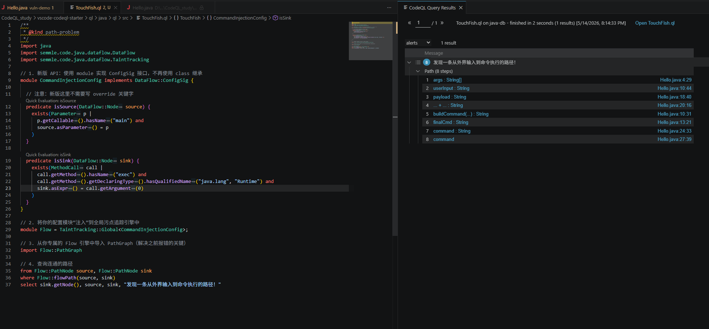
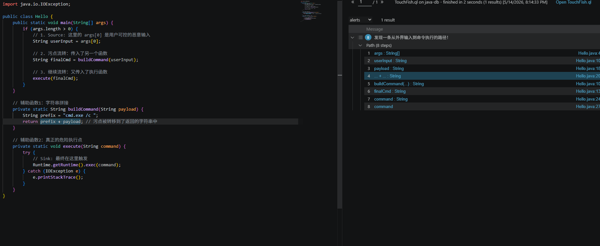

+++
date = '2026-05-14T20:12:24+08:00'
draft = false
title = 'CodeQL Study 2: 突破静态匹配——用污点追踪 (Taint Tracking) 还原完整攻击链路'

math = true

categories = ["static-analysis"]
tags = ["Study", "deserialization", "CodeQL Taint Analysis"]

+++
# CodeQL Study 2: 突破静态匹配——用污点追踪 (Taint Tracking) 还原完整攻击链路

## 前言：为什么我们需要污点分析？

在上一篇《CodeQL Study 1》中，我们学会了用 `where call.getMethod().hasName("exec")` 这样的 AST 查询来寻找代码中的危险函数调用。

这固然比传统的“Ctrl+F”或正则表达式强得多，但在真实的漏洞挖掘中，这种做法存在一个致命缺陷：**它只能找到“凶器”，却找不到“凶手”。**

真实项目里可能散落着成百上千个 `exec`、`readObject` 或是 `query` 调用，其中 99% 都是安全的内部调用。**我们真正关心的，是那些参数可以被外部用户（黑客）控制的调用。**

这就引出了静态程序分析的核心杀器——**污点分析（Taint Analysis）**。

简单来说，污点分析就是**追踪不可信数据**的过程。我们可以把外部输入想象成一滴“带有毒药的红墨水（污点）”。这滴墨水滴入程序后，会随着变量赋值、函数调用、字符串拼接在代码的“水管”里四处流淌。污点分析的目的，就是顺藤摸瓜，看看这滴红墨水最终有没有流进危险的执行核心（如 `Runtime.exec`）。

------

## 0x01 污点分析的三大核心要素

在 CodeQL 中构建一个污点追踪模型，本质上就是定义三个要素：

1. **Source（污点源）**：红墨水滴入的地方。通常是外部输入，比如 Web 请求的 `HttpServletRequest`、命令行的 `args` 数组、或是 RPC 接口的参数。
2. **Sink（汇聚点）**：不设防的敏感操作。比如执行系统命令的 `exec`、反序列化入口 `readObject` 等。
3. **Sanitizer（净化器 / 清洗点）**：开发者的防御机制。比如一段严密的正则表达式过滤，或是强制的类型转换。经过这里的红墨水会被“净化”，不再具有危害。

只要 CodeQL 找到一条从 **Source** 到 **Sink** 的连通图，且中间没有经过 **Sanitizer**，一个漏洞（Path）就成立了。

------

## 0x02 实战演练：一个“狡猾”的命令注入靶场

为了见证 CodeQL 跨函数追踪的威力，我们先准备一个带有“伪装”的漏洞代码 `Hello.java`。

在这个代码里，用户的输入 `args[0]` 并没有直接丢给 `exec`，而是经过了变量赋值、字符串拼接、以及多次跨函数传递：

```java
import java.io.IOException;

public class Hello {
    public static void main(String[] args) {
        if (args.length > 0) {
            // 1. Source: 这里的 args[0] 是用户可控的恶意输入
            String userInput = args[0]; 
            
            // 2. 污点流转：传入了另一个辅助函数
            String finalCmd = buildCommand(userInput); 
            
            // 3. 继续流转：又传入了真正的执行函数
            execute(finalCmd); 
        }
    }

    // 辅助函数1：字符串拼接
    private static String buildCommand(String payload) {
        String prefix = "cmd.exe /c ";
        return prefix + payload; // 污点被转移到了返回的字符串中
    }

    // 辅助函数2：真正的危险执行点
    private static void execute(String command) {
        try {
            // Sink: 最终在这里触发漏洞
            Runtime.getRuntime().exec(command);
        } catch (IOException e) {
            e.printStackTrace();
        }
    }
}
```

传统的静态扫描工具遇到这种跨越三个函数的调用链路，大概率会跟丢。但这对 CodeQL 的数据流引擎来说，只是热身。

------

## 0x03 高能避坑：新旧 API 的版本撕裂

在写查询之前，必须插入一个极其重要的**避坑指南**。

如果你现在去网上搜 CodeQL 的中文教程，90% 的文章都会让你写这样一个类： `class MyConfig extends TaintTracking::Configuration`。

**千万别照抄！这是已经被 GitHub 官方废弃的旧版 API。** 如果你在最新版的 `vscode-codeql-starter` 中运行旧版代码，会直接喜提 `could not resolve module DataFlow::PathGraph` 报错。

新版 API 放弃了沉重的 Class 继承模式，全面转向了 **Module（模块）** 化的配置。下面是适配最新版 CodeQL 引擎的标准污点追踪模板：

```ql
/**
 * @name 命令注入漏洞检测
 * @kind path-problem
 * @id java/command-injection-demo
 */

import java
import semmle.code.java.dataflow.DataFlow
import semmle.code.java.dataflow.TaintTracking

// 1. 新版写法：使用 module 实现 ConfigSig 接口
module CommandInjectionConfig implements DataFlow::ConfigSig {
  
  // 2. 填空题：定义什么是 Source？（这里锁定 main 函数的参数）
  predicate isSource(DataFlow::Node source) {
    exists(Parameter p | 
      p.getCallable().hasName("main") and 
      source.asParameter() = p
    )
  }

  // 3. 填空题：定义什么是 Sink？（这里锁定 Runtime.exec 的第一个参数）
  predicate isSink(DataFlow::Node sink) {
    exists(MethodCall call |
      call.getMethod().hasName("exec") and
      call.getMethod().getDeclaringType().hasQualifiedName("java.lang", "Runtime") and
      sink.asExpr() = call.getArgument(0)
    )
  }
}

// 4. 将配置注入全局污点追踪引擎
module Flow = TaintTracking::Global<CommandInjectionConfig>;
import Flow::PathGraph // 从引擎中导出连线图

// 5. 格式严格的 Select 语句
from Flow::PathNode source, Flow::PathNode sink
where Flow::flowPath(source, sink)
select sink.getNode(), source, sink, "发现一条从外界输入到命令执行的路径！"
```

> **注意**：文件最顶部的 `/** @kind path-problem */` 注释绝对不能漏掉，且必须在第一行。这是告诉 VS Code 开启路径可视化渲染的“魔法指令”。

以下是对代码各部分的逐块解析：

### 1. 元数据与依赖导入

```
/**
 * @kind path-problem
 */
import java
import semmle.code.java.dataflow.DataFlow
import semmle.code.java.dataflow.TaintTracking
```

- `@kind path-problem`：强制声明查询类型为路径问题。指示 CodeQL 引擎提取节点间的流转边（Edges）生成路径图（Path Graph），并在客户端提供 `Show Paths` 可视化功能。
- `import ...`：引入 Java 基础库以及最新版数据流与污点追踪模块。

### 2. 定义污点规则配置 (Module Config)

代码段

```
module CommandInjectionConfig implements DataFlow::ConfigSig { ... }
```

使用 `module` 实现 `DataFlow::ConfigSig` 接口，替代了旧版的类继承（`extends TaintTracking::Configuration`）模式。必须实现两个核心谓词（`predicate`）：

**定义 Source（污点源）**

```
predicate isSource(DataFlow::Node source) {
  exists(Parameter p | 
    p.getCallable().hasName("main") and 
    source.asParameter() = p
  )
}
```

- `exists(Parameter p | ...)`：在 AST 语法树中匹配类型为 `Parameter` 的节点。
- 条件：提取方法名为 `main` 的参数节点。
- `source.asParameter() = p`：将 AST 中的参数节点映射为 `DataFlow::Node` 数据流节点，标记为污染扩散的源头。

**定义 Sink（汇聚点）**

```
predicate isSink(DataFlow::Node sink) {
  exists(MethodCall call |
    call.getMethod().hasName("exec") and
    call.getMethod().getDeclaringType().hasQualifiedName("java.lang", "Runtime") and
    sink.asExpr() = call.getArgument(0)
  )
}
```

- 在 AST 中寻找方法调用（`MethodCall`）。
- 条件：方法名为 `exec` 且声明该方法的类为 `java.lang.Runtime`。
- `sink.asExpr() = call.getArgument(0)`：锁定该方法调用的第 0 个参数（即第一入参），将其所在的表达式（`Expr`）映射为数据流节点，标记为危险执行终点。

### 3. 实例化全局追踪引擎

```
module Flow = TaintTracking::Global<CommandInjectionConfig>;
import Flow::PathGraph
```

- 利用泛型 `<CommandInjectionConfig>` 将自定义规则注入 CodeQL 官方提供的全局污点追踪引擎，实例化为当前作用域内的 `Flow` 模块。
- 显式导入 `Flow::PathGraph`：将具体路径生成图的数据结构引入当前上下文，解决 `PathGraph` 找不到的报错问题。

### 4. 路径查询与强制输出格式

```
from Flow::PathNode source, Flow::PathNode sink
where Flow::flowPath(source, sink)
select sink.getNode(), source, sink, "发现一条从外界输入到命令执行的路径！"
```

- `from`：声明起点与终点必须是包含路径上下文的 `PathNode` 类型。
- `where Flow::flowPath(source, sink)`：核心驱动逻辑。触发引擎计算从 `source` 到 `sink` 之间是否存在物理连通且未被净化的数据流路径。
- `select`：针对 `@kind path-problem` 约束的定式输出，必须严格按顺序提供四个参数：
  1. `sink.getNode()`：告警触发的目标代码位置（IDE 中高亮该行）。
  2. `source`：路径图的起点节点。
  3. `sink`：路径图的终点节点。
  4. 告警描述字符串。

------

## 0x04 见证奇迹：Show Paths 链路追踪

生成数据库并运行上述 QL 脚本后，在 VS Code 的 Results 面板中，你会看到一个极具成就感的选项：**Show Paths**。

点开它，CodeQL 会像顶级黑客的思维导图一样，把流淌的每一个节点清晰地列出来：

1. `args` (源头侵入)
2. `userInput` (变量赋值)
3. `payload` (参数传递)
4. `prefix + payload` (字符串拼接)
5. `command` (参数传递)
6. `Runtime.getRuntime().exec(command)` (最终引爆！)



每点击列表中的一步，左侧的 Java 源码就会精准高亮对应的那一行。面对这种上帝视角的链路分析，无论是多么深藏不露的 Gadget Chain，都会无所遁形。



## 总结

从简单的 AST 节点匹配，到基于 DataFlow 的全局污点路径追踪，我们正式完成了静态程序分析思维的进阶。

静态分析不再是简单的“找关键字”，而是在代码的图谱中“推演数据的流动”。掌握了 `TaintTracking` 模块，你就拥有了构建自动化漏洞挖掘工具（比如检测反序列化 Gadget Chain）的基石。

