# 类的动态加载

# 前言

本文主要讲一下类的动态加载机制以及漏洞利用相关问题

---


# 一、双亲委派

双亲委派机制是 Java 类加载器的一个核心工作规则：当一个类加载器需要加载某个类时，它不会自己立刻去加载，而是先把请求向上交给父类加载器，逐级向上直到最顶层的启动类加载器（Bootstrap ClassLoader），只有当父加载器确认无法加载该类时，子加载器才会尝试自己去加载。这样设计的好处是保证核心类库（如 java.lang.*）不会被重复加载或被用户自定义类“篡改”，从而提升安全性和一致性，同时也避免类的重复加载导致冲突。

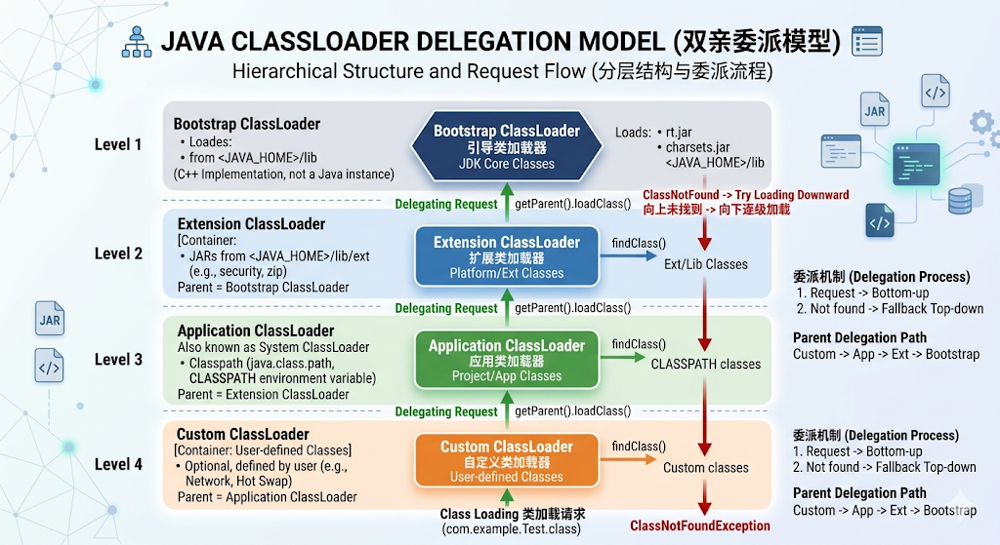


双亲委派机制是 JVM 的类加载规则：类加载请求先交给父加载器处理，保证核心类由 JVM 统一加载，从而避免类重复定义和核心类被覆盖。

```java
public static void main(String[] args) throws ClassNotFoundException {
        Class<?> strClass = String.class;
        System.out.println("String ClassLoader = " + strClass.getClassLoader());

        Person demo = new Person();
        System.out.println("Demo ClassLoader = " + demo.getClass().getClassLoader());

        ClassLoader systemLoader = ClassLoader.getSystemClassLoader();
        Class<?> c = systemLoader.loadClass("java.lang.String");
        System.out.println("manual load String ClassLoader = " + c.getClassLoader());
    }
```
其运行结果为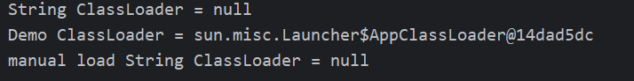
`String ClassLoader = null`表示类加载器是使用的`Bootstrap ClassLoader`加载的
`Demo ClassLoader = sun.misc.Launcher$AppClassLoader@14dad5dc`表示使用的类加载器是`AppClassLoader`加载的
而第三行，我们使用了`AppClassLoader`来加载String类，但是最终输出还是null，说明其类的加载还是被`Bootstrap ClassLoader`加载
类加载请求会优先交给父加载器处理，导致核心类（如 String)始终由 Bootstrap ClassLoader 加载，而用户类由 AppClassLoader 加载，从而避免类冲突和核心类被覆盖

# 二、具体类加载的过程
接下来Debug一下具有类加载的过程
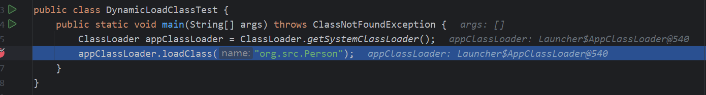
在此处下断点，有一些小伙伴点击Step Into程序直接结束，我们需要强制步入，按`alt + shift+ F7`
首先我们会进入`ClassLoader`类中，其调用了两个参数的`loadClass`方法
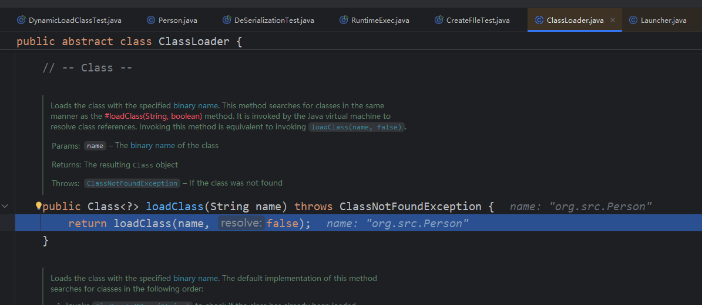
再次步入后我们会进入`AppCLassLoader`的`loadClass`方法
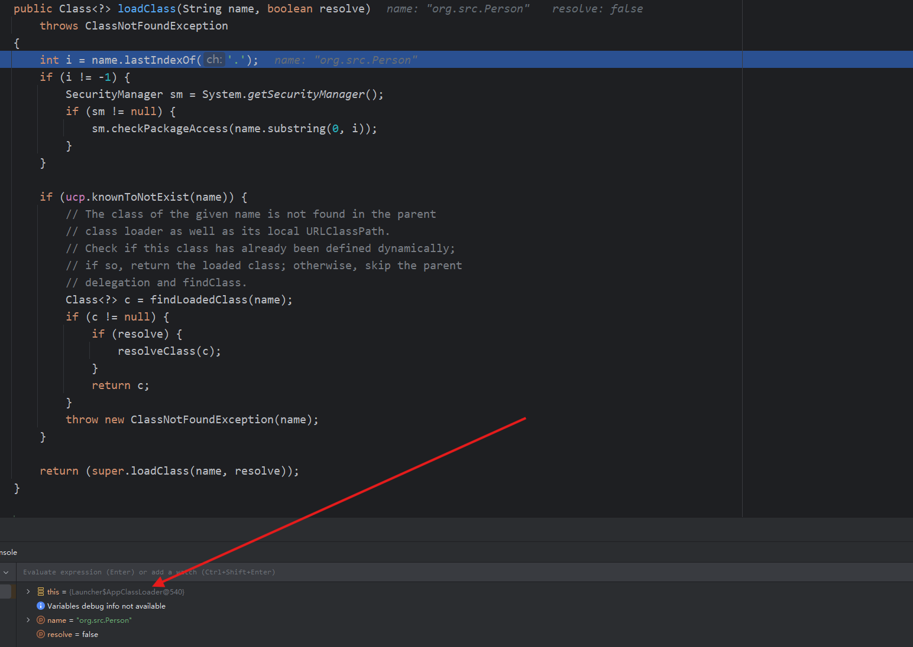
继续跟踪，前面是一些安全检查，我们直接跟到`super.loadClass(name, resolve)`这里并步入
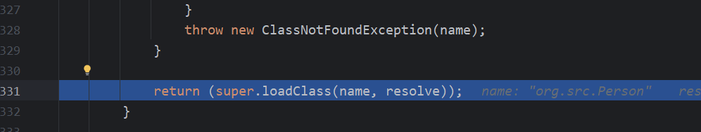
注意，这里又回到了`ClassLoader`的`loadClass`方法中，且类加载器为`AppClassLoader`
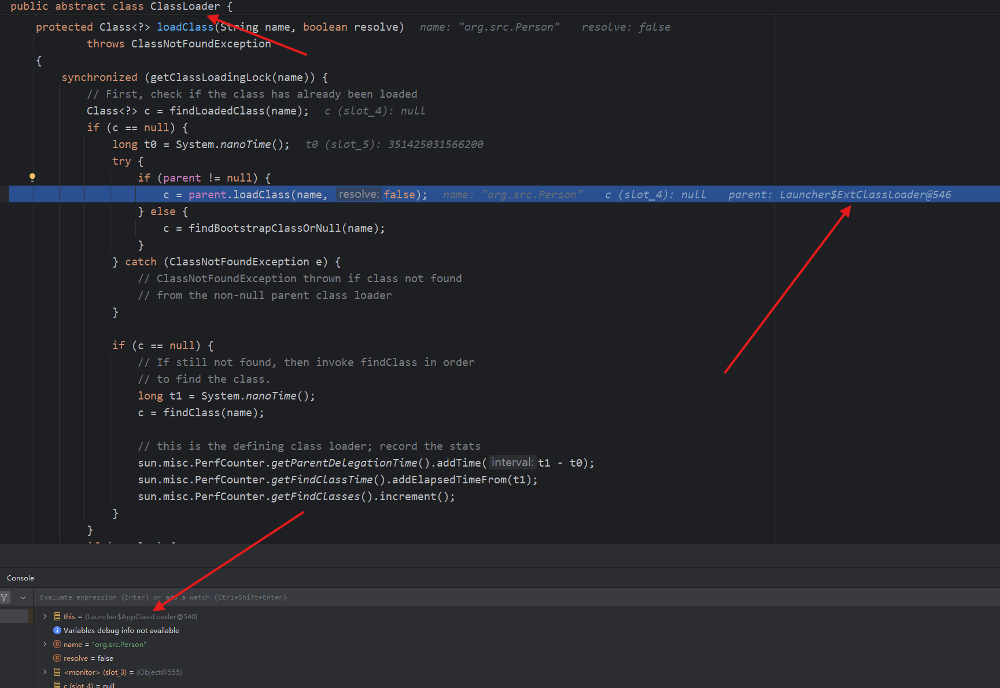
在这里就步入了双亲委派机制了，该`loadClass`方法会首先判断其有没有父类（**这里其实父属性**），若有父类，则调用其父类的类加载器，而`AppClassLoader`的父类就是`ExtClassLoader`，我们继续步入
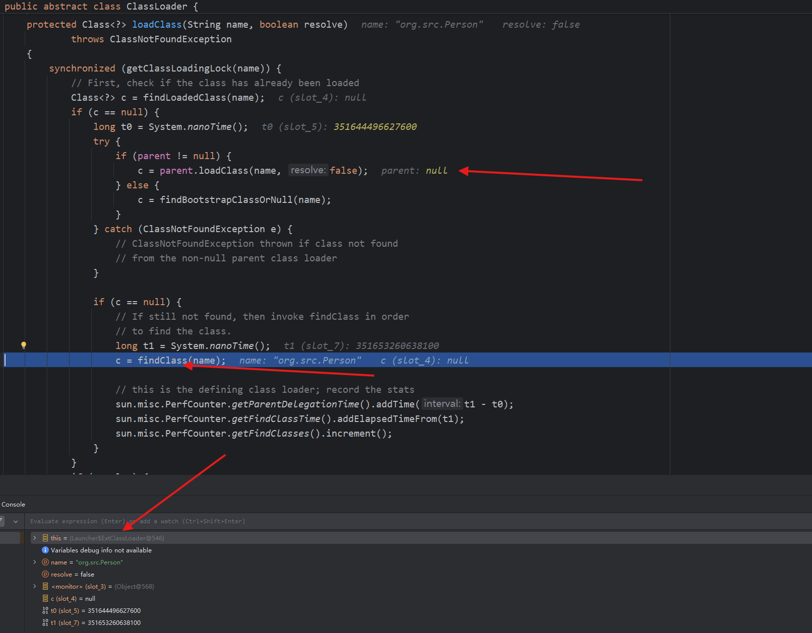
步入到`ExtClassLoader`的`loadClass`方法，其父类为null，但他的父类其实是`Bootstrap ClassLoader`但他是native的，就显示null了，继续跟，跑到`findClass`方法，我们跟进去
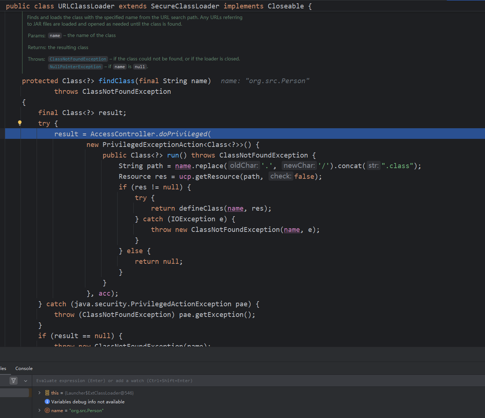
发现跟到了`URLClassLoader`的`findClass`方法，有小伙伴会好奇，怎么突然出来一个`URLClassLoader`，其实是ExtClassLoader和AppClassLoader的父类是URLClassLoader，这俩没有findClass方法，所以调用了父类的方法
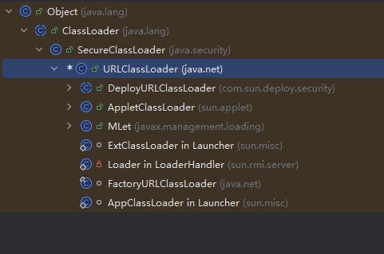

这里就开始进行类加载了，首先在`ExtClassLoader`的类加载器中寻找Person方法，但其实是找不到的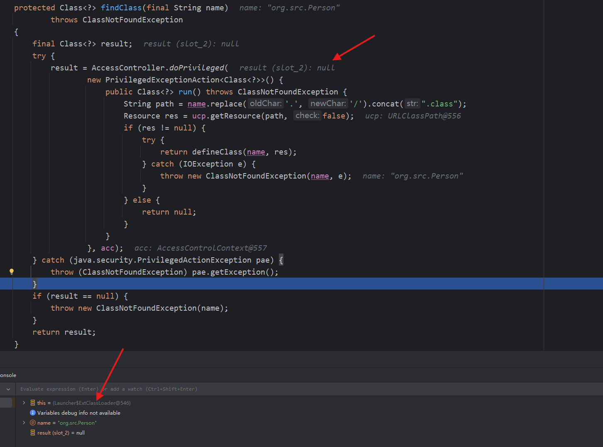
继续跟代码，我们会退回到`AppClassLoader`的`loadClass`方法
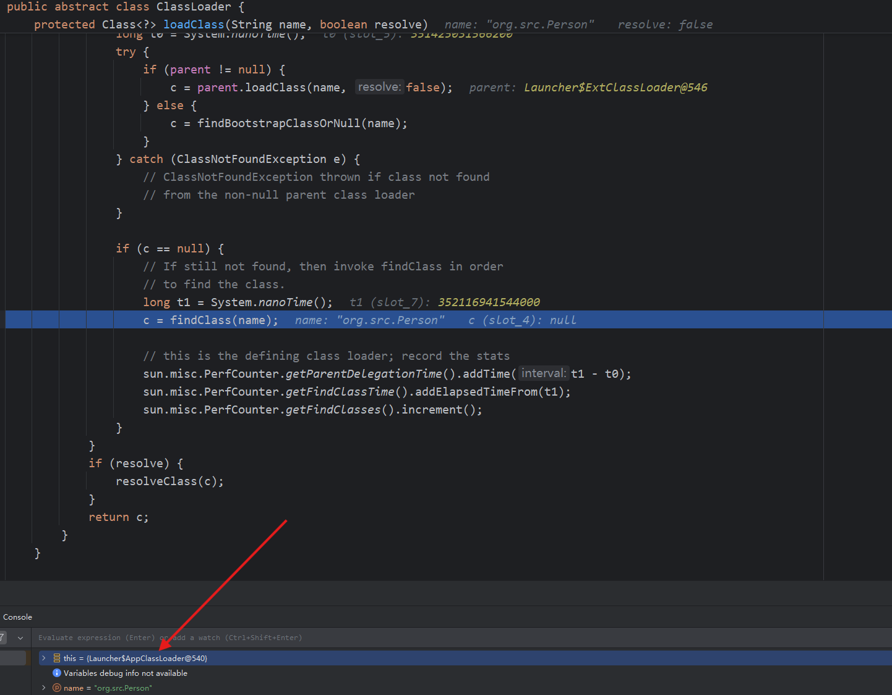
和上面一样，会调用`URLCLassLoader`的`findClass`方法
这里就会成功找到`Person`的path，最终在defineClass方法中完成类加载，我们再跟一下，这里需要强制步入
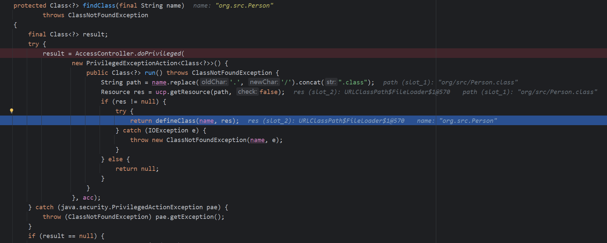
会进入`URLClassLoader`的`defineClass`方法完成类的加载
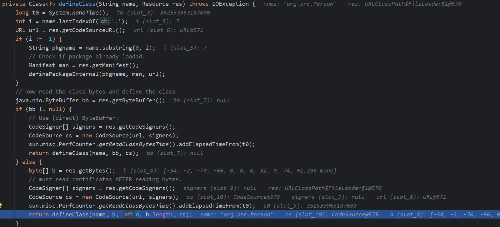
我们在跟入，会先调用SecureClassLoader的defineClass，再回到ClassLoader的defineClass完成类的加载
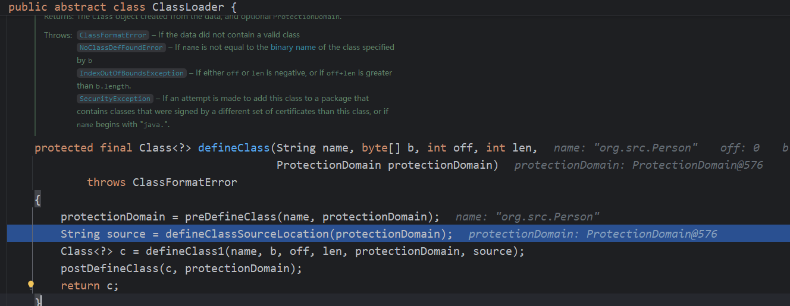
这里可以画一个图总结一下类加载的过程
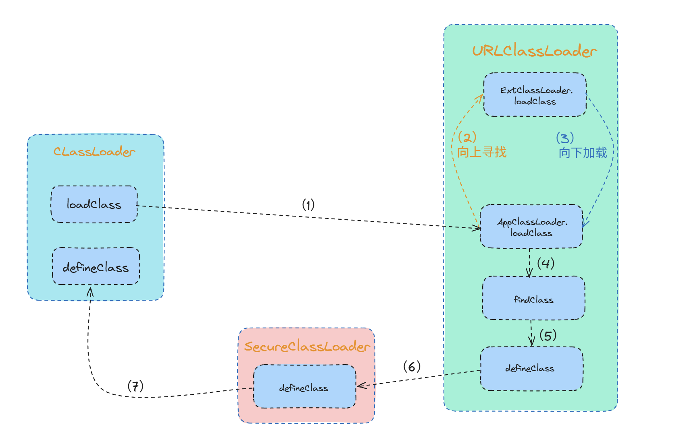

# 漏洞利用
作为攻击者，我们就有两个点可以作为我们漏洞利用的地方
首先就是URLClassLoader.loadClass，我们可以注入URL，使得攻击者访问我们的恶意代码，从而实现攻击

```java
public static void main(String[] args) throws ClassNotFoundException, MalformedURLException, InstantiationException, IllegalAccessException {
        URLClassLoader urlClassLoader = new URLClassLoader(new URL[]{new URL("file:D:\\evilCode\\")});
        Class<?> c = urlClassLoader.loadClass("org.src.Test");
        c.newInstance();
    }
```
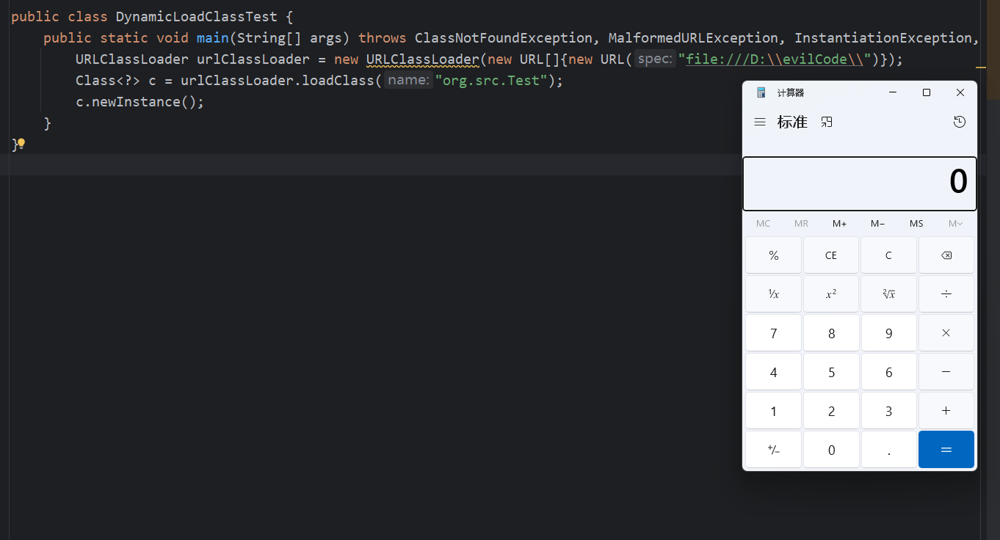
另一种就是使用defineClass的反射调用来实现任意类加载

```java
Class c = ClassLoader.class;
        Method method = c.getDeclaredMethod("defineClass", String.class, byte[].class, int.class, int.class);
        method.setAccessible(true);
        byte[] code = Files.readAllBytes(Paths.get("D:\\evilCode\\Test.class"));
        Class aClass = (Class) method.invoke(ClassLoader.getSystemClassLoader(), "org.src.Test", code, 0, code.length);
        aClass.newInstance();
```
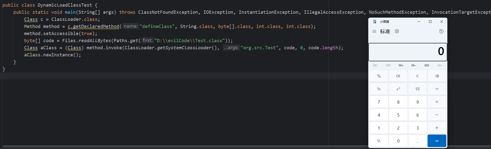
但是这里的defineClass是protected的，在真实漏洞利用的情况下，使用反射并不是一种好手段

关于后续动态类加载的漏洞利用再补充