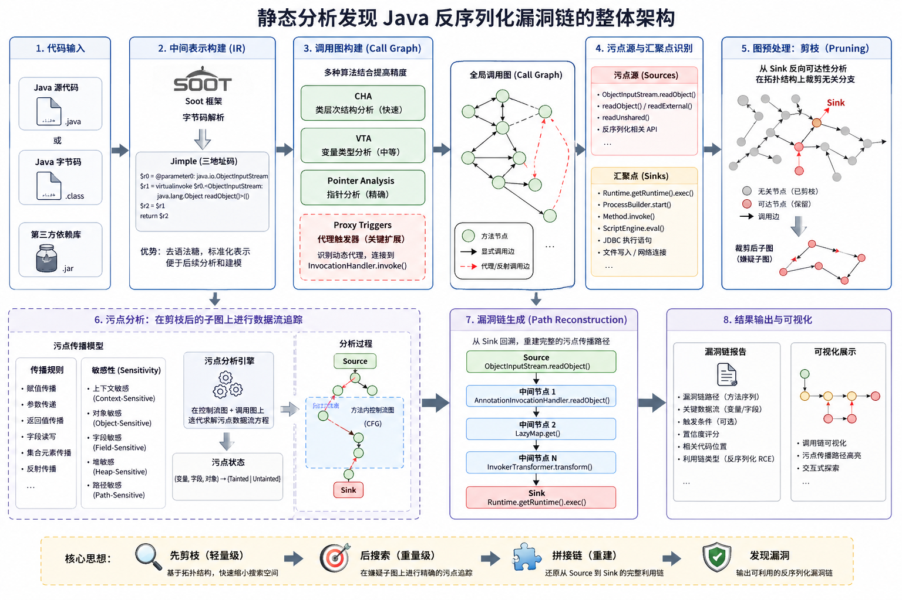

+++
date = '2026-04-27T15:09:26+08:00'
draft = false
title = 'Introduction to Static Analysis'
categories = ["static-analysis"]
tags = ["introduction", "deserialization", "Introduction to Static Analysis"]

+++

# 静态分析入门指北：从基础理论到 Java 反序列化漏洞检测实战

## 0x00 引言：从 Gadget Chain 的“拼图游戏”说起

在近期的研究中，我们详细拆解了 Commons Collections 系列（从 CC1 到 CC7）的反序列化利用链。如果亲自跟进过这些 Gadget Chain 的底层调试过程，想必都会产生一种强烈的体会：**挖掘出一条全新的反序列化利用链，本质上是在进行一场盲人摸象式的海量拼图游戏。**

对于安全研究人员而言，找到漏洞的“头”和“尾”往往是最简单的。当我们在某个类的 `readObject()` 或 `readExternal()` 方法中找到了一个完全由外部字节流控制的入口（Source），随后又在代码的某个偏僻角落（比如某个 Transformer 或 Comparator 中）发现了一个刺眼的 `Runtime.getRuntime().exec()` 或 `Method.invoke()`（Sink），真正的噩梦才刚刚开始。

我们面对的核心考题是：**如何在这两者之间，跨越成百上千个类、成千上万个方法，找到一条逻辑严密、条件完美契合的数据流转路径？**

在现代 Java 应用程序和庞大的第三方依赖库面前，传统的、基于人工代码审计和 IDE 交叉引用的安全审计手段，正面临着难以逾越的瓶颈。

## 0x01 手工审计的痛点与迷局

面对企业级 Java 代码或复杂的中间件，单纯依靠安全研究员的直觉和文本搜索（例如 IDE 中的 `Find Usages` 或 `Call Hierarchy`），往往会迅速陷入以下几个维度的困境：

### 1. 状态空间爆炸与控制流迷宫
现代 Java 软件工程极度推崇面向接口编程和高度的组件化、解耦设计。这意味着，数据从一个方法流向下一个方法时，往往不会是直来直去的线性调用。 以 CC 链为例，从入口到最终的命令执行，中间通常会穿插着各类装饰器（Decorator）、工厂模式（Factory）和集合包装类。一条真正能够触发 RCE 的路径，可能需要经过七八次乃至十几次的方法跳转。人脑能够维护的调用栈深度是极度有限的。当繁杂的分支结构（If-Else/Switch）和异常处理机制交织在一起时，审计者很快就会在庞大的调用图中迷失方向，遭遇认知层面的“状态空间爆炸”。

### 2. 多态、反射与动态特性的“黑盒”
Java 的面向对象特性给人工追踪调用流带来了极大的阻碍。当你跟踪一条可疑的数据流，看到代码写着 `map.put(key, value)` 或 `comparator.compare(obj1, obj2)` 时，你的静态追踪往往会在这里被迫中断。 因为 `map` 或 `comparator` 仅仅是一个接口。在缺乏运行时上下文的情况下，你无法立刻确定这里究竟调用了哪个具体实现类的方法。如果是 `TreeMap`，它会触发键值的比较；如果是 `LazyMap`，它可能会触发对象的实例化。审计者不得不手动遍历该接口的所有实现类，逐一排查，这种工作量是呈指数级增长的。

### 3. 隐蔽的桥梁：动态代理与反射机制的“黑盒”
在高级的反序列化利用链中，**动态代理（Dynamic Proxy）** 和 **反射（Reflection）** 是两把最锋利的武器，但也正是它们，彻底切断了常规审计的线索。 回想一下我们在复现 CC1 或 CC7 时的场景：利用链的关键转折点往往依赖于动态代理的触发。比如，通过代理劫持某个 `Map` 或 `Annotation` 的方法调用，当代理对象的任意方法被调用时，程序逻辑会被强行引导至 `InvocationHandler.invoke()` 方法中。 在源代码的字面意义上，这种调用关系是完全不可见的。动态代理就像是一座隐形的桥梁，IDE 的静态分析工具在这里会彻底失效。如果审计者没有敏锐地意识到“这里可以通过代理对象触发目标类的 invoke”，整条 Gadget Chain 的挖掘就会在这里宣告断裂。

### 4. 污点数据的隐式状态变迁

漏洞产生的核心，在于“外部不可信数据（Taint Data）”未经过滤地流向了“危险操作（Sink）”。但在实际的代码执行中，数据的流转并非总是直接的参数传递（如 `foo(taint_data)`）。 在反序列化场景中，恶意输入通常会被静静地赋值给一个类的成员变量（Field）。随后，程序在执行另一个看似毫无关联的方法（例如 `hashCode()`、`equals()` 或 `toString()`）时，才将这个被污染的成员变量取出来，送入危险函数中。这种数据流与控制流分离的隐式状态变迁，使得手工追踪污点的生命周期变得极其艰难——你不仅要看函数怎么调，还要时刻在大脑中维护每一个对象内部属性的污染状态。

## 0x02 传统破局手段的无力感

面对这些迷局，我们或许会尝试退一步：既然看代码太难，那把程序跑起来，用动态调试（Dynamic Debugging）来找呢？

动态调试确实能让我们看到运行时最真实的变量状态，但它在漏洞挖掘的早期（即“找链”阶段）同样面临着无法回避的悖论：

- **先有鸡还是先有蛋的困境：** 动态分析严重依赖于“触发”。你必须提前构造好极其精确的 Payload，并且程序需要正好走到那个特定的分支，才能观察到数据流转。这意味着，动态调试只能用来“验证已知的猜想（比如别人已经公布的 CC 链）”，却极难凭空发现“未知的隐蔽路径（0day）”。
- **高昂的环境构造与复现成本：** 要将一个包含错综复杂依赖的 Java 系统完美地跑起来，并满足特定的触发条件，往往需要耗费大量精力去规避各种前置校验。对于大规模的组件批量审计来说，这种方式的效率不具备任何可扩展性。

## 0x03 破局：引入静态分析的必然

至此，我们不得不承认：依赖人脑和传统工具去硬刚庞杂的 Java 字节码海洋，已经不具备工程上的可行性。

如果人脑无法穷尽所有的调用图分支，如果肉眼无法穿透多态和动态代理的迷雾，如果手动追踪变量赋值太容易跟丢……我们就必须跳出手工作坊式的审计模式。我们需要一种机制，能够站在“全局视角”，在不实际运行程序的前提下，通过严谨的数学模型和算法逻辑，对庞大的代码进行系统化的降维打击。

为了解决上述的痛点，我们不得不将目光转向程序分析领域的深水区。而这，也就是我们接下来必须跨越的技术门槛——**自动化静态分析（Static Analysis）**。

## 0x04 拨云见日：静态分析的“降维”哲学与核心原理

如果说手工审计是在迷宫中举着火把探路，那么静态分析就是直接掀开迷宫的顶棚，基于建筑图纸进行全局的数学推演。

静态分析（Static Analysis）的本质，是在不实际执行程序的前提下，通过解析代码的结构和语义，去**近似地推断**程序在运行时的所有可能状态。为了对抗现代 Java 庞大的复杂性，静态分析引入了一套极为严密的“降维打击”理论体系。它主要通过以下几个核心支柱来瓦解我们在手工审计中遇到的迷局：

### 1. 中间表示（IR）：褪去语法糖，重塑代码骨架

直接分析 `.java` 源码或复杂的 `.class` 栈式字节码是极其痛苦的。Java 字节码是为了 JVM 执行而设计的，它是基于操作数栈（Operand Stack）的指令集，充满了隐含的压栈（`aload`）、出栈（`astore`）操作。如果直接在字节码层面追踪数据流，相当于在分析机器语言，极易迷失。

静态分析的第一步是“翻译”。业界标杆级的框架 **Soot**，会将 Java 字节码转换为一种基于寄存器的三地址码中间表示——**Jimple**。 在 Jimple 层面，所有的 `for-each` 循环、复杂的级联调用（如 `a().b().c()`）以及匿名内部类，都会被打碎，还原成最原始的赋值、跳转和基础调用。更重要的是，Jimple 隐式具备了类似 **SSA（Static Single Assignment，静态单赋值）** 的特性，为每个中间状态分配了明确的局部变量（如 `$r1`, `$r2`）。 这完成了第一步降维：**将工程级别的、为人类阅读或机器执行而生的代码，转化为极其适合算法推演和图论计算的数学表达。**

### 2. 调用图构建（Call Graph）：破除多态与“隐式调用”的迷雾

为了追踪跨方法的漏洞传播，静态分析必须构建一张全局的调用图（Call Graph, CG）。图的节点是方法，边代表调用关系。 面对 `map.put()` 这样的多态调用，人脑会卡壳，而静态分析引擎则会运用不同精度的算法来推导可能的实际调用目标：

- **CHA（类层次结构分析, Class Hierarchy Analysis）：** 一种快速但粗糙的算法。它会简单粗暴地查找所有实现了该 `Map` 接口的子类，并将它们的 `put` 方法全连上。这速度极快，但会导致大量的“假边”（False Positives）。
- **VTA（变量类型分析, Variable Type Analysis）与指针分析（Pointer Analysis）：** 这是更为高阶的武器。通过分析变量在整个程序中的传递，引擎能够精确知道运行到此处时，`map` 变量到底指向的是 `HashMap` 还是 `LazyMap`。

**实战中的致命断链与修复（Proxy Triggers）：** 在反序列化实战（特别是复现类似 CC7 这样依赖复杂哈希碰撞和动态代理的利用链）中，我们会发现标准的 Call Graph 算法会彻底失效。 因为 CC7 的核心转折点在于：通过 `Hashtable` 的内部操作去碰撞一个被动态代理封装的 `Map` 对象。当代理对象的方法被调用时，JVM 底层会将其强行路由到 `InvocationHandler.invoke()`。这种**隐式控制流**在静态字节码中是完全不存在的！ 因此，一个成熟的自动化漏洞检测引擎，必须在构建 Call Graph 的底层逻辑中注入“代理触发器（Proxy Triggers）”的先验知识：一旦推导分析出某个变量可能是 `java.lang.reflect.Proxy` 的实例，引擎必须人为地将边连接到其 Handler 的 `invoke` 方法上。只有这样，才能在静态层面真正“缝合”那些在手工审计中极易断裂的幽灵链路。

### 3. 污点分析（Taint Analysis）：追踪不可信数据

解决了控制流的问题，接下来就是追踪“数据是如何隐式传递的”。 在静态分析中，我们将外部不可信的输入（如反序列化入口 `readObject` 中读取的流）称为**污点源（Source）**，将能够执行系统命令的危险函数称为**汇聚点（Sink）**。污点分析的核心，就是在程序的控制流图和调用图上，应用一套严密的数据流传播方程。

为了不产生满屏的误报，现代污点分析不能仅仅是“A 传给 B”，它必须具备极高的**敏感性（Sensitivity）**：

- **上下文敏感（Context-Sensitivity）：** 区分同一个方法在不同调用位置的行为。函数 `foo()` 被入口 A 调用和被入口 B 调用时，其内部的污点状态必须是隔离的，绝不能相互污染。
- **对象敏感与字段敏感（Object/Field-Sensitivity）：** 在反序列化中，恶意输入通常会被赋值给对象的成员变量（如 `this.transformer = taint`）。分析引擎必须精准区分 `objA.transformer` 和 `objB.transformer`，像给血液注射显影剂一样，追踪被污染对象在内存堆中的每一次状态变迁，直至其触及 Sink 点。

### 4. 破局的核心算法法则：先剪枝，后搜索

理论构建得很完美，但在真实世界中，由于 JDK 基础库和第三方依赖（如 Spring、Commons 系列）的庞大体积，构建出的 Call Graph 往往包含数以百万计的节点，并且充斥着极其复杂的递归调用与环路。

如果直接在这张巨型图上使用深度优先搜索（DFS）去盲目寻找从 Source 到 Sink 的路径，一定会遭遇毁灭性的**状态空间爆炸**，导致内存耗尽（OOM）或计算陷入死循环。

因此，在设计任何漏洞自动化检测算法时，**必须坚守一个铁律：必须先剪枝（Pruning），后搜索（Searching）。这是一个不可逆的技术序列。**

- **剪枝阶段（轻量级缩表）：** 在开始昂贵且复杂的污点追踪之前，先通过极轻量级的图可达性分析，对全局 Call Graph 进行大刀阔斧的裁剪。通常是从 Sink 点开始进行反向图遍历（Backwards Reachability）。如果在图的拓扑结构上，某个方法及其子分支绝对不可能到达任何一个危险函数，那就毫不留情地将其整条分支从分析目标中砍掉。
- **搜索阶段（重量级追踪）：** 经过剪枝后，原本浩如烟海的调用图将被压缩成一个体积极小的“嫌疑子图”。只有在这个清除了大量噪音的沙盒里，我们才会启动高昂的、上下文敏感的污点数据流搜索，去精雕细琢地拼接和验证每一条 Gadget Chain 的连贯性。

## 0x05 理论的妥协：Soundness 与 Completeness 的博弈

在结束理论篇之前，有必要提及程序分析界的一个核心定理：**Rice 定理决定了，没有任何静态分析工具能够完美地判断一个非平凡程序的运行时行为。**

这就引出了静态分析中永恒的博弈：

- **Soundness（可靠性 / 无漏报）：** 理论上涵盖了所有可能的运行路径。代价是会产生大量的**误报（False Positives）**。
- **Completeness（完备性 / 无误报）：** 报告出来的问题 100% 都是真实的漏洞。代价是会产生**漏报（False Negatives）**。

在安全审计和 0day 挖掘的场景下，我们通常倾向于牺牲一部分 Completeness（容忍一定程度的误报），以换取更高的 Soundness（宁可错杀一千，不可放过一个潜在的调用链）。因为对于安全研究员而言，从工具筛选出的 100 条疑似链中人工排查出 1 条真链，远比面对上百万行代码无从下手要高效得多。

## 0x06 从理论走向实战

明白了静态分析是如何在理论层面对漏洞挖掘进行降维打击的，接下来的问题就是工程实践了。 在下一篇文章中，我们将离开纯理论的探讨，正式进入代码实战阶段。我们将探讨如何引入 Soot 框架，如何利用 Jimple 构建自己的分析逻辑，以及如何用代码真正落地上述的“剪枝与搜索”算法，最终从零开始，打造出一个专属的 Java 反序列化利用链自动检测工具。