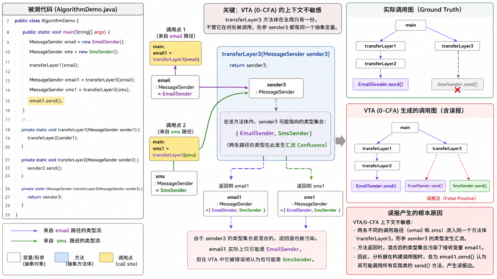
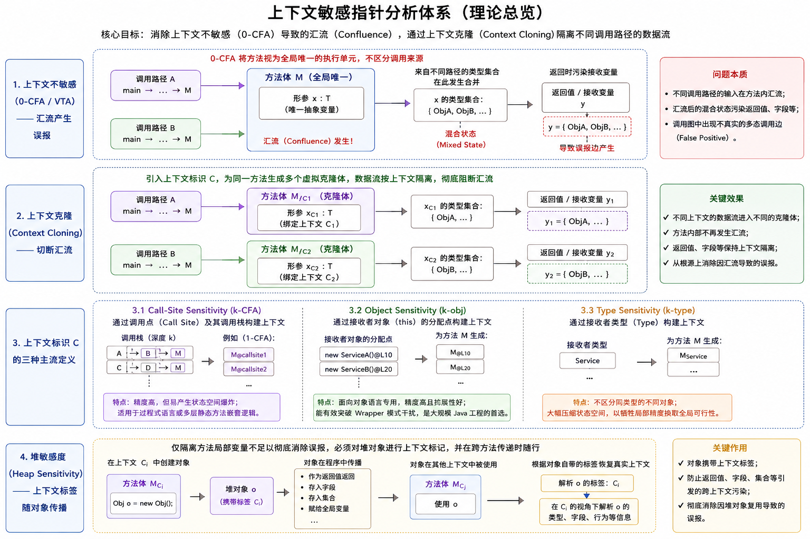
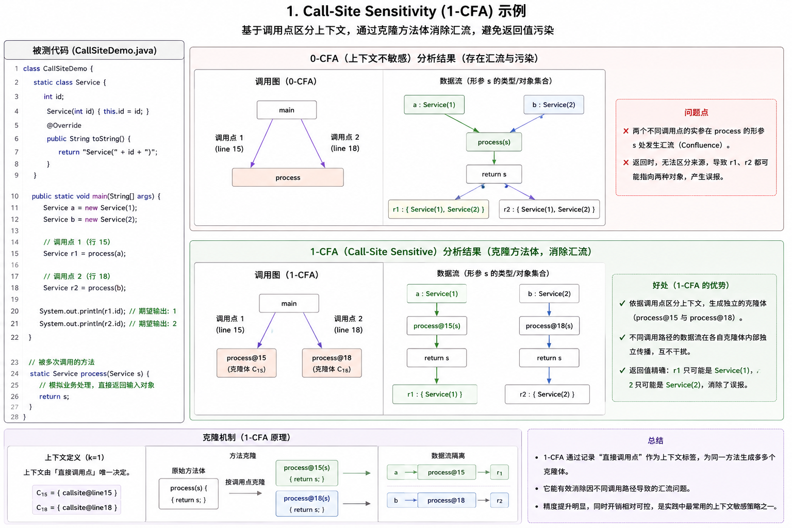
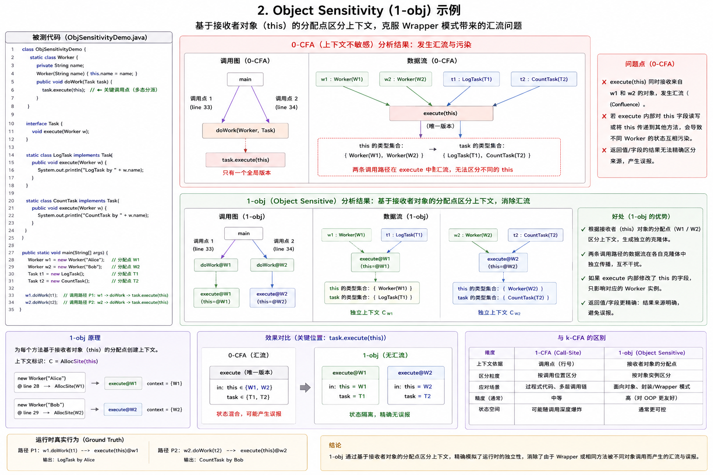
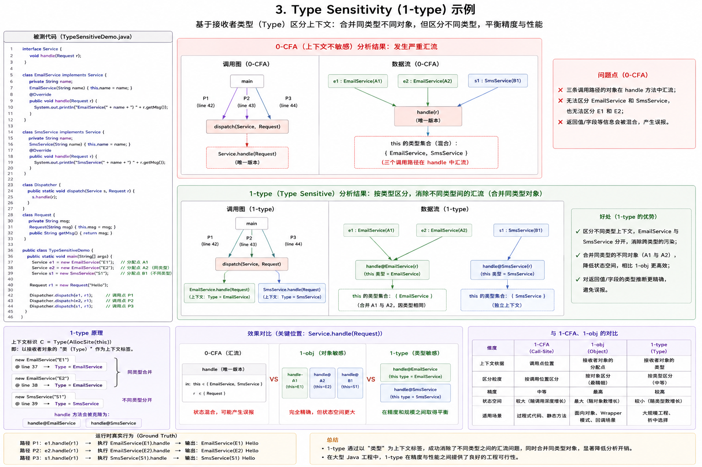

+++
date = '2026-05-10T12:15:02+08:00'
draft = false
title = 'Soot Study 4: 基于指针分析与上下文敏感的调用图构建理论与实现'
categories = ["static-analysis"]
tags = ["Study", "Point Analysis", "Soot Study 4"]

+++

# Soot Study 4: 基于指针分析与上下文敏感的调用图构建理论与实现

## 0x00 引言：上下文不敏感的精度陷阱

在 Soot Study 3 的末尾，我们通过修改被测代码暴露了 VTA 算法的精度缺陷。当 `EmailSender` 和 `SmsSender` 两个不同的实例同时作为参数传入同一个方法 `transferLayer3` 时，VTA 产生的调用图在中，`main`方法不仅指向了`email1.send()` 而且还指向了 `SmsSender.send()`，但我们可以看到，实际上`main`方法中只调用了`email1.send()`，而`SmsSender.send()`是一条误报边。

产生该误报的根本原因在于 VTA 以及默认的 Spark 引擎均属于上下文不敏感（Context-Insensitive，即 0-CFA）分析。在 0-CFA 模型中，分析引擎将方法体视为静态的、全局唯一的执行单元。无论 `transferLayer3` 在何处被调用，其形参 `sender3` 被抽象为唯一的节点。`email` 和 `sms` 的类型数据在该节点发生汇流（Confluence）。方法返回时，汇流后的混合状态污染了接收变量 `email1`。



其调用图构建如上，因为是gpt生成的，有一点错误，是在右边的误报边的标记中，其实是应该是`main`直接指向`SmsSender.send()`和`email1.send()`，而不是经过`transferLayer3`,后续可以看指针分析跑出的实际调用图，但是其产生误报的原因是正确的，可以有一个宏观的了解

要阻断这种跨方法调用的数据流污染，必须跨越静态分析的精度分水岭，引入上下文敏感（Context Sensitivity）的指针分析（Pointer Analysis）。

## 0x01 指针分析与上下文敏感度理论

静态分析的核心是数据流抽象。VTA 算法将数据抽象为类（Class），这种抽象存在精度瓶颈。程序运行时，同一类定义会通过 new 指令实例化出大量彼此独立的堆内存对象（Heap Object）。若不同堆对象携带不同状态（如恶意输入与安全数据），基于类的分析无法将其区分。



指针分析（Pointer Analysis / PTA）计算程序中变量或表达式在运行时可能指向的具体内存分配点（Allocation Site）。分析粒度从类层级下沉至对象实体。代码中每处实例化指令均被静态标记为唯一的分配点。指针分析追踪这些分配点在赋值语句、方法传参之间的物理流向，彻底消除同类型不同实例引发的数据流污染。

在指针分析的跨方法追踪中，核心技术壁垒是汇流（Confluence）阻断，必须引入上下文敏感（Context Sensitivity）约束。

上下文敏感的核心处理方法是上下文克隆（Context Cloning）或标签分配（Context Tagging）。

分析引擎不将目标方法视为单一全局节点。引擎依据特定的上下文标识 $C$，为同一个方法 $M$ 在内存中生成多个独立的虚拟克隆体 $M_{C1}, M_{C2}, \dots, M_{Cn}$。处理数据流时，引擎严格校验输入参数与克隆体标识的匹配度。不同调用路径的数据被路由至平行的虚拟节点，物理切断汇流路径。

上下文标识 $C$ 的定义规则衍生出三种主流处理模型：

### **Call-Site Sensitivity (k-CFA)**



通过记录方法被调用的代码位置（调用点）构建上下文。

$k$ 代表限制回溯的调用栈深度。

1-CFA 记录直接调用点。方法 $M$ 在行号10和行号20被调用，引擎分别生成 $M_{10}$ 和 $M_{20}$ 两个克隆体。数据流严格按行号隔离。

2-CFA 记录调用点及其父级调用点。上下文标识扩展为调用栈链表。

特征：极易产生状态空间爆炸。适用于过程式语言或多层静态方法嵌套逻辑。

### **Object Sensitivity (k-obj)**



面向对象语言专用的处理模型。通过记录接收者对象（Receiver Object，即 this 指针）的内存分配点构建上下文。

Java 程序高度依赖多态与封装，大量业务逻辑由不同实例对象调用相同的底层框架方法触发。k-obj 放弃追踪外层调用栈，直接基于实例化指令 new 所在的位置区分上下文。

特征：突破面向对象特有的 Wrapper 模式干扰。在分析大型 Java 工程时，k-obj 在精度与性能的综合表现上压倒性优于 k-CFA。

### **Type Sensitivity (k-type)**



Object Sensitivity 的粗粒度妥协方案。

不记录具体的对象分配点，仅记录分配点所在的类声明（Type）。引擎将同一类中所有 new 指令产生的上下文进行合并。

特征：大幅压缩状态空间，降低内存消耗，牺牲局部精度换取全程序分析的工程可行性。

### **堆敏感度（Heap Sensitivity）扩展**

仅隔离方法内部局部变量不足以彻底消除误报。针对方法返回值与类成员字段，必须同步实施堆敏感处理。

引擎为堆内存中动态创建的对象分配上下文标签。方法体内执行实例化操作时，生成的新对象强制继承当前方法的上下文标识。对象在跨方法传递、装入集合或赋给全局字段时，标签随行。此机制确保对象被调用方读取时，解析器能依据对象自带的标签追溯其真实作用域，防止返回值污染调用方环境。


## 0x02 GeomPTA 算法工程实现

基于 Soot 原生 API，我们通过配置 Spark 引擎的底层参数来激活 GeomPTA 分析。以下为驱动程序的完整实现。

```java
package org.example.interProceduralAnalysis;

import soot.*;
import soot.jimple.toolkits.callgraph.CallGraph;
import soot.jimple.toolkits.callgraph.Edge;
import soot.options.Options;
import soot.util.dot.DotGraph;

import java.util.Collections;

public class CSCallGraphDriver {
    public static void main(String[] args) {
        G.reset();
        String targetPackage = "org.example.analysisedCode";
        String processDir = "target/classes";

        Options.v().set_prepend_classpath(true);
        Options.v().set_allow_phantom_refs(true);
        Options.v().set_process_dir(Collections.singletonList(processDir));
        Options.v().set_whole_program(true);

        // 1. 启动 Spark 引擎基础模块
        Options.v().setPhaseOption("cg.spark", "enabled:true");
        
        // 2. 显式关闭 VTA 和 RTA 模式
        Options.v().setPhaseOption("cg.spark", "vta:false");
        Options.v().setPhaseOption("cg.spark", "rta:false");

        // 3. 开启 on-the-fly 动态调用图构建
        // 上下文敏感分析强烈依赖于动态调用图构建，一边推导指针一边解析多态
        Options.v().setPhaseOption("cg.spark", "on-fly-cg:true");

        // 4. 激活 GeomPTA 及其上下文敏感配置
        Options.v().setPhaseOption("cg.spark", "geom-pta:true");         // 核心开关：开启几何上下文敏感分析 
        Options.v().setPhaseOption("cg.spark", "geom-encoding:Geom");    // 设定编码策略为 Geom，平衡速度和精度 
        Options.v().setPhaseOption("cg.spark", "geom-worklist:PQ");      // 可选优化：使用优先队列（Priority Queue）提升求解效率 
        Options.v().setPhaseOption("cg.spark", "geom-blocking:true");    // 可选优化：开启针对递归调用的上下文阻塞策略，提升分析精度 

        SootClass sc = Scene.v().loadClassAndSupport(targetPackage + ".AlgorithmDemo");
        sc.setApplicationClass();
        Scene.v().setMainClass(sc);
        Scene.v().loadNecessaryClasses();

        System.out.println("开始分析: Context-Sensitive (GeomPTA)...");
        long startTime = System.currentTimeMillis();

        PackManager.v().runPacks();

        long endTime = System.currentTimeMillis();
        System.out.println("上下文敏感分析完成，耗时: " + (endTime - startTime) + " ms");

        CallGraph cg = Scene.v().getCallGraph();
        DotGraph dot = new DotGraph("Context Sensitive CallGraph");

        System.out.println("=== 正在导出 Context-Sensitive 调用边 ===");
        for (Edge edge : cg) {
            SootMethod src = edge.src();
            SootMethod tgt = edge.tgt();
            if (src.getDeclaringClass().getName().contains(targetPackage) &&
                    tgt.getDeclaringClass().getName().contains(targetPackage)) {
                System.out.println(src.getSignature() + " -> " + tgt.getSignature());
                dot.drawEdge(src.getSignature(), tgt.getSignature());
            }
        }

        dot.plot("./cs_callgraph.dot");
        System.out.println("Context-Sensitive 调用图已导出。");
    }
}
```

## 0x03 结果验证与算法行为解析

执行上述分析驱动，提取生成的 `cs_callgraph.dot` 数据。针对 `AlgorithmDemo` 中 `email1.send()` 这一多态调用点，引擎行为发生本质变化。


1. 精度提升表现

   输出的调用边集中，`main` 方法针对 `send()` 仅保留了一条精确的边：

   `<AlgorithmDemo: main(...) void> -> <EmailSender: send() void>`

   指向 `SmsSender.send()` 的虚假边被成功剔除。

2. 算法底层机制分析

   GeomPTA 处理该逻辑时，利用上下文标识符（Context Identifier）分离了数据流。

   调用点 A：`transferLayer3(email)` 关联上下文标识 $C_1$。

   调用点 B：`transferLayer3(sms)` 关联上下文标识 $C_2$。

   当执行返回语句 `return sender3;` 时，引擎强制检查接收变量的上下文。`email1` 处于调用点 A 的延续流中，匹配标识 $C_1$。引擎从形参 `sender3` 的指向集中严格过滤出带有 $C_1$ 标识的对象，即 `EmailSender` 实例。`SmsSender` 实例因绑定 $C_2$ 标识被阻断。

## 0x04 总结

通过引入上下文敏感的指针分析（GeomPTA），我们解决了局部变量传递过程中的类型混淆问题。

至此，Soot Study 系列完成了静态分析精度阶梯的完整实践。从基于纯类型系统的 CHA，到过滤实例的 RTA，再到单向流追踪的 VTA，最终抵达上下文隔离的高精度 PTA。在实际的安全审计与漏洞挖掘工程中，分析精度的选择需严格根据待测框架的规模与复杂程度进行动态调整。

