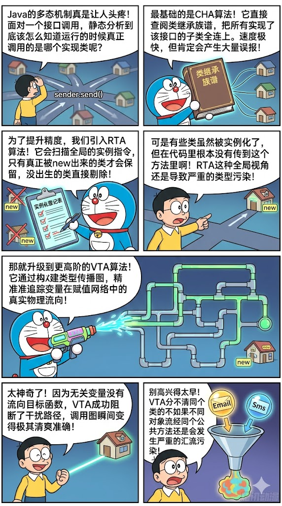
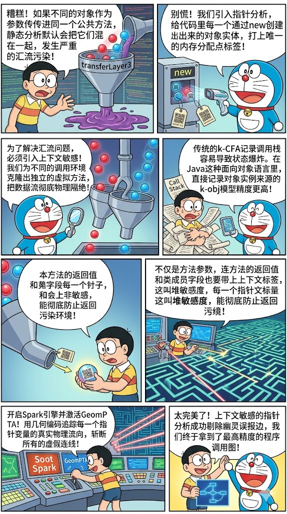

+++
date = '2026-05-13T20:05:02+08:00'
draft = false

math = true

title = 'Soot Summary'
categories = ["static-analysis"]
tags = ["Summary", "Point Analysis", "Soot Summary"]
+++

最近看到哆啦A梦讲408，觉得很有意思，于是把我之前的写的关于静态分析的内容，喂给ai，让他帮忙生成小漫画，看起来效果还不错

