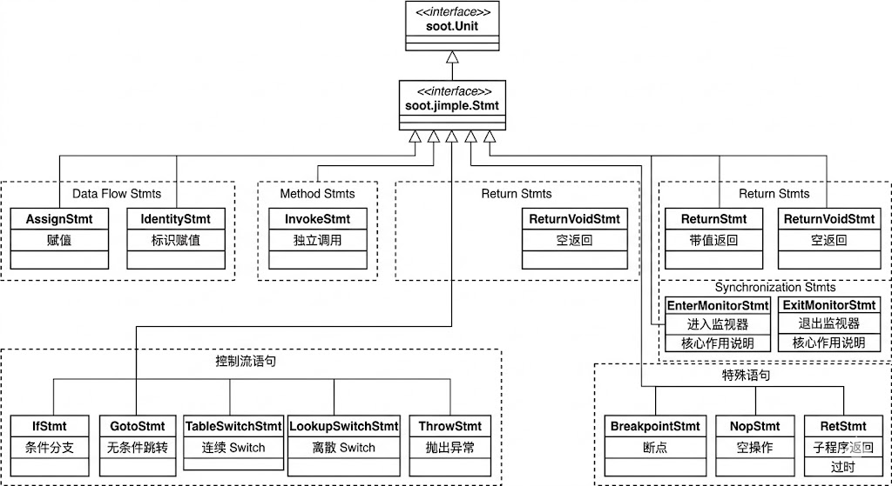
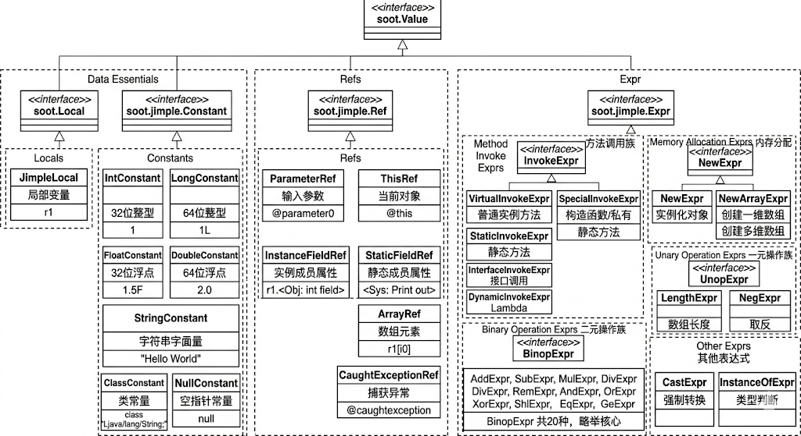
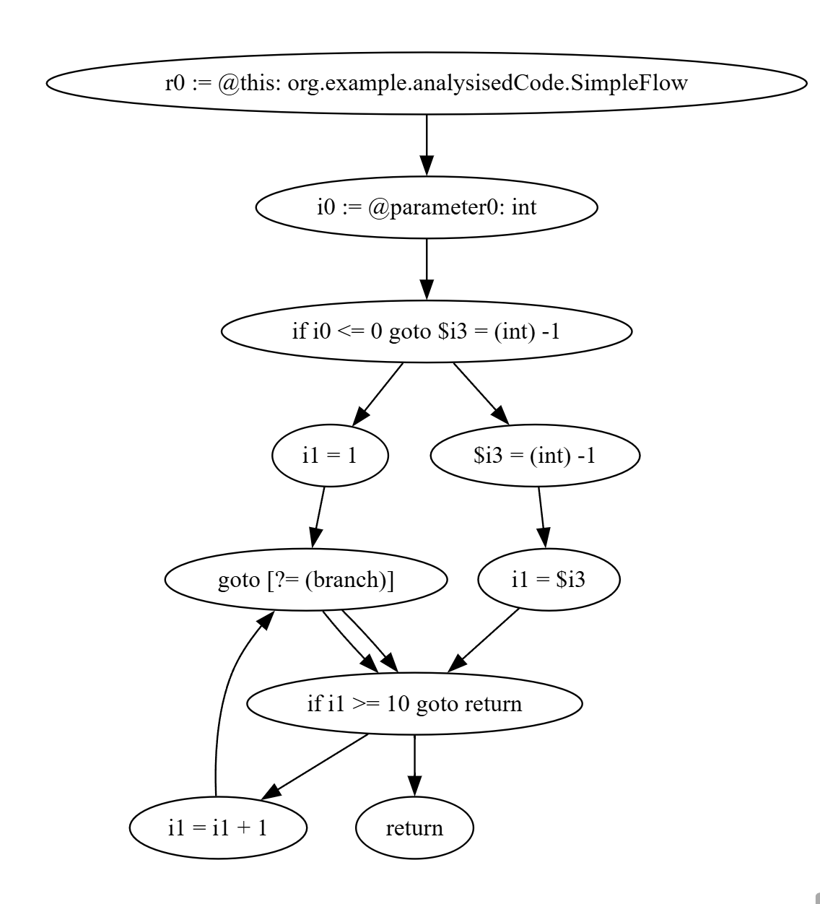

+++
date = '2026-04-28T13:36:46+08:00'
draft = false
title = 'Soot Study 1'
categories = ["static-analysis"]
tags = ["Study", "deserialization", "Soot Study 1"]

+++

# Soot Study 1

## 0x00 引言：现有soot文档的不足

在学习soot的时候，关于一些api，复杂的配置，莫名其妙的编译报错，都会导致静态分析的失败，而没有一个详细的文档或技术博客，对这种经典程序分析框架有一个详尽的解释，本文面向初学者，对soot的配置，使用做了基础性的解释，旨在让读者在使用soot的时候，可以快速上手，构建自己的分析器

## 0x01 Soot 核心原理与 IR 转换流程

Soot 的核心价值在于其提供的**中间表示（Intermediate Representation, IR）**。它并不直接对 Java 源代码或字节码进行分析，而是通过一系列转换，将它们转化为更易于计算和处理的中间形态。

### 1. 转换流水线 (Transformation Pipeline)

Soot 的处理流程可以概括为：**输入（Frontend） -> 中间表示转换（IR Transformation） -> 静态分析（Analysis） -> 输出（Backend）**。

- **前端输入**：Soot 支持 `.java` 源码（基于 Polyglot/JastAdd 编译器前端）和 `.class` 字节码（基于 ASM/Jasmin）作为输入。在安全研究中，由于经常需要处理第三方 Jar 包，字节码输入是最常见的场景。
- **多层级 IR**：Soot 内部定义了四种主要的中间表示，每种 IR 针对不同的分析目标：
  - **Baf**：基于栈的中间表示，与字节码高度相似。
  - **Jimple**：最重要的 IR，一种基于寄存器的三地址码。
  - **Shimple**：Jimple 的 SSA（静态单赋值）变体，常用于更高级的数据流分析。
  - **Grimp**：保留了类似 Java 源代码的聚合表达式，适合反编译和代码审计。

------

### 2. 从字节码到 Jimple 的转变

Java 字节码是基于操作数栈（Operand Stack）的。这种设计方便了 JVM 在不同硬件上运行，但对静态分析极度不友好。例如，一个简单的加法 `a = b + c` 在字节码中会被拆分为多次入栈和出栈操作，逻辑极其破碎。

**Jimple 的核心改进：**

1. **三地址码化 (Three-Address Code)**：每条语句最多只包含三个操作数（通常是：结果变量 = 操作数1 [操作符] 操作数2）。
2. **局部变量化**：将原本隐含在栈中的操作转化为显式的局部变量赋值。
3. **语法糖剥离**：将 `for`、`while`、`switch` 等高级语法统一还原为 `if` 和 `goto` 跳转逻辑。

#### 对比示例

**原始 Java 代码：**

Java

```
public int add(int a, int b) {
    return a + b;
}
```

**对应的 Jimple 表示：**

代码段

```
public int add(int, int)
{
    org.example.Main r0;
    int i0, i1, $i2;

    r0 := @this: org.example.Main; // 显式处理 this 引用
    i0 := @parameter0: int;       // 显式处理参数 0
    i1 := @parameter1: int;       // 显式处理参数 1
    $i2 = i0 + i1;                // 三地址码加法
    return $i2;                   // 返回语句
}
```

------

### 3. 为什么 Jimple 对安全分析至关重要？

在挖掘反序列化利用链（Gadget Chain）时，我们需要追踪污点（Taint）在方法间的传递。

- **数据流追踪**：在 Jimple 中，所有的变量传递都是显式的赋值语句（如 `$i2 = i0 + i1`）。分析引擎可以非常容易地构建 **定义-使用链（Def-Use Chain）**，从而知道某个受控的输入参数最终流向了哪个危险函数（Sink）。
- **控制流分析**：由于所有的循环和条件分支都被简化为 `if` 和 `goto`，构建控制流图（CFG）变得异常简单。这对分析代码是否可达、是否存在逻辑绕过至关重要。
- **类型精确度**：Jimple 保留了所有变量的类型信息，这为后续进行多态分析和指针分析（识别接口调用到底指向哪个具体实现类）提供了必要的基础。

总结来说，Soot 的原理就是将非线性的、隐式的字节码栈操作，“拉平”成线性的、显式的 Jimple 逻辑指令，从而将程序分析问题转化为图论和数学推导问题。

## 0x02 Soot 核心配置参数解析

Soot 的配置主要通过 `soot.options.Options` 类完成。在进行 Java 安全分析（如 Gadget Chain 挖掘）时，配置的准确性直接影响类加载的完整性与分析精度。

以下是实现基础分析环境的关键配置项：

------

### 1. 环境初始化：`G.reset()`

Soot 内部采用单例模式管理全局状态。

- **作用**：重置 Soot 的所有全局变量、缓存和配置。
- **必要性**：在同一个 JVM 进程中多次运行分析任务（如在单元测试或循环处理多个 Jar 包）时，必须调用此方法以防止上一次分析的状态污染当前环境。

### 2. 类路径填充：`set_prepend_classpath(true)`

Soot 需要依赖基础类库（如 `java.lang.Object`）来构建继承体系。

- **作用**：将当前操作系统的 `CLASSPATH` 环境变量自动添加到 Soot 的搜索路径中。
- **效果**：省去手动指定 JDK 核心库路径（如 `rt.jar`）的繁琐操作，确保基础类型可被正确解析。

### 3. 依赖容错：`set_allow_phantom_refs(true)`

这是处理复杂反序列化环境（如存在大量第三方依赖）时的核心开关。

- **作用**：允许幻影类（Phantom Classes）。
- **原理**：当 Soot 在指定的路径中找不到某个类（例如缺失的第三方库）时，若此项为 `true`，Soot 会创建一个仅含类名的空壳类，而非抛出 `RuntimeException` 中断分析。
- **安全研究视角**：在审计 Gadget Chain 时，我们通常只需关注关键链路上的类。开启此项可避免因环境依赖缺失导致的分析崩溃。

### 4. 中间表示选型：`set_output_format(int)`

决定 Soot 将字节码转换为何种中间表示 (IR)。

- **推荐值**：`Options.output_format_jimple`。
- **理由**：Jimple 是一种基于寄存器的三地址码（Three-address code），它褪去了 Java 的语法糖，将所有操作简化为基础的赋值、跳转和函数调用。它是进行污点分析和路径搜索的最佳粒度。

### 5. 确定分析目标：`set_process_dir(List<String>)`

- **作用**：指定 Soot 应当“处理”的目录或 Jar 包路径。
- **特性**：位于此路径下的所有类默认将被视为待分析的源。

### 6. 类加载触发：`Scene.v().loadNecessaryClasses()`

- **作用**：根据之前的配置（`process_dir`、`classpath` 等），正式将类信息加载到 `Scene` 容器中。
- **注意**：在调用此方法前，必须确保所有的 `Options` 已经设置完毕。

### 7. 应用类标记：`sc.setApplicationClass()`

Soot 将加载的类分为 **Library Class**（仅提供类签名，不分析实现）和 **Application Class**（全文解构）。

- **作用**：将获取到的 `SootClass` 对象标记为应用类。
- **关键点**：**只有被标记为 Application 的类，Soot 才会为其生成 `Body`（方法体内容）**。在挖掘漏洞时，如果无法获取某个方法的 Jimple 语句，通常是因为没有执行这一步。

### 代码示例

首先给出要被soot分析的代码

```java
package org.example;

public class Main {
    public static void main(String[] args) {

        System.out.printf("Hello and welcome!");

        for (int i = 1; i <= 5; i++) {
            System.out.println("i = " + i);
        }
    }
}
```

这段代码需要被编译为class文件，然后才能让soot分析

分析代码如下

```java
package org.example;

import soot.*;
import soot.options.Options;
import java.util.Collections;
import soot.jimple.InvokeExpr;
import soot.jimple.Stmt;

public class SootHello {
    public static void main(String[] args) {
        // 1. 初始化设置
        G.reset(); // 重置 Soot 环境
        
        // 2. 配置参数
        Options.v().set_prepend_classpath(true); // 自动填充 classpath
        Options.v().set_allow_phantom_refs(true); // 允许存在找不到定义的类
        Options.v().set_output_format(Options.output_format_jimple); // 设置输出格式为 Jimple
        
        // 设置要分析的路径（通常是你的 target/classes 目录或某个 jar）
        String processDir = "target/classes"; 
        Options.v().set_process_dir(Collections.singletonList(processDir));
        
        // 3. 加载类
        // 强制让 Soot 编译并加载指定的类
        Scene.v().loadNecessaryClasses();
        
        // 4. 获取要分析的类
        SootClass sc = Scene.v().getSootClass("org.example.Main");
        sc.setApplicationClass(); // 将其设置为“应用类”，Soot 才会对其进行详细分析
        
        // 5. 遍历并打印方法体
        for (SootMethod sm : sc.getMethods()) {
            if (sm.isConcrete()) { // 如果是有具体实现的方法
                Body body = sm.retrieveActiveBody();
                System.out.println("Method: " + sm.getSignature());
                System.out.println(body.toString());
            }
        }
    }
}
```

这里会用到我们说的soot的配置，但是这只是基础的配置，随着后续的分析的增加，所需要配置项也会越来越多，等用到我们后续再补充

我们可以运行一下这段代码，分析一下输出

```
Method: <org.example.Main: void <init>()>
    public void <init>()
    {
        org.example.Main r0;

        r0 := @this: org.example.Main;

        specialinvoke r0.<java.lang.Object: void <init>()>();

        return;
    }

Method: <org.example.Main: void main(java.lang.String[])>
    public static void main(java.lang.String[])
    {
        java.io.PrintStream $r1, $r3;
        java.lang.Object[] $r0;
        java.lang.String[] r7;
        int i0;
        java.lang.StringBuilder $r2, $r4, $r5;
        java.lang.String $r6;

        r7 := @parameter0: java.lang.String[];

        $r1 = <java.lang.System: java.io.PrintStream out>;

        $r0 = newarray (java.lang.Object)[0];

        virtualinvoke $r1.<java.io.PrintStream: java.io.PrintStream printf(java.lang.String,java.lang.Object[])>("Hello and welcome!", $r0);

        i0 = 1;

     label1:
        if i0 > 5 goto label2;

        $r3 = <java.lang.System: java.io.PrintStream out>;

        $r2 = new java.lang.StringBuilder;

        specialinvoke $r2.<java.lang.StringBuilder: void <init>()>();

        $r4 = virtualinvoke $r2.<java.lang.StringBuilder: java.lang.StringBuilder append(java.lang.String)>("i = ");

        $r5 = virtualinvoke $r4.<java.lang.StringBuilder: java.lang.StringBuilder append(int)>(i0);

        $r6 = virtualinvoke $r5.<java.lang.StringBuilder: java.lang.String toString()>();

        virtualinvoke $r3.<java.io.PrintStream: void println(java.lang.String)>($r6);

        i0 = i0 + 1;

        goto label1;

     label2:
        return;
    }
```

首先看他分析到的类`org.example.Main`竟然有两个方法

**Java 编译器（javac）自动为你生成了一个默认构造函数。**

------

#### 1. 消失的构造函数：`<init>`

在 Java 中，如果你没有显式地为类写构造方法，编译器会默认帮你加上一个无参构造函数。

- **在源码层**：它是隐形的，你不需要写。
- **在字节码/Jimple 层**：它必须存在，并被命名为 **`<init>`**。

我们可以看一下 Soot 生成的这段代码：

代码段

```
public void <init>()
{
    org.example.Main r0;
    r0 := @this: org.example.Main;
    // 调用父类（Object）的构造函数
    specialinvoke r0.<java.lang.Object: void <init>()>();
    return;
}
```

**它的逻辑只有两步：**

1. 拿到当前对象的引用（`this`）。
2. 调用父类 `java.lang.Object` 的初始化方法。这是 Java 对象的强制规范：每一个子类在初始化时，必须先调用父类的构造方法。

------

#### 2. 你写的逻辑：`main` 方法

第二个方法才是你真正写在 `Main.java` 里的逻辑。但在 Jimple 表现形式下，你会发现一些有趣的细节：

- **隐式操作显式化**：你在 Java 里写 `i++`，Jimple 里变成了 `i0 = i0 + 1`；你在 Java 里写 `"i = " + i`，Jimple 里变成了创建 `StringBuilder` 并连续调用 `append` 方法。
- **控制流平坦化**：你的 `for` 循环被拆解成了 `label1`（循环开始条件检查）、`goto label1`（跳回循环头）和 `label2`（退出循环）。

------

#### 3. 为什么 Soot 要把这两个都给你？

Soot 的分析目标通常是 **`.class` 文件**。

静态分析追求的是**完整性 (Soundness)**。对于分析引擎来说，构造函数非常重要，因为：

1. **成员变量初始化**：如果你的类有成员变量赋初值的操作，这些代码其实是藏在 `<init>` 里的。
2. **调用图完整性**：如果没有构造函数的记录，分析引擎就无法追踪这个对象是如何被实例化的。

------

#### 总结

- **`<init>`**：这是编译器生成的**默认构造函数**。
- **`main`**：这是你定义的**静态入口方法**。

即便你在源码里什么都不写（一个空的 `class Main {}`），Soot 依然会分析出一个 `<init>` 方法。这是理解 Java 字节码结构的第一步：**源码中的简洁往往意味着编译器在背后做了大量填充。**


## 0x03 Soot 核心对象模型与层级结构

Soot 的 API 设计遵循严格的层级抽象模型。理解这些核心对象及其相互关系，是编写静态分析算法的基础。

### 1. Scene：全局单例容器

`Scene` 是 Soot 的全局环境类（通过 `Scene.v()` 获取），负责管理当前分析任务的所有状态。

- **功能**：存储加载的所有 `SootClass`、全程序调用图（CallGraph）、指针分析结果以及类层次结构信息。
- **应用**：通过 `Scene` 获取特定类、设置活跃的方法入口点或访问全局分析结果。

### 2. SootClass：类级表示

`SootClass` 对应 Java 语言中的类（Class）或接口（Interface）。

- **分类**：
  - **Application Class**：被指定为分析目标的类，Soot 会解析其方法体。
  - **Library Class**：仅提供方法签名和继承关系信息，不解析具体实现逻辑。
  - **Phantom Class**：当依赖缺失且配置允许时，Soot 虚构的占位类。
- **组成**：包含 `SootField`（字段）列表和 `SootMethod`（方法）列表。

### 3. SootMethod：方法级表示

`SootMethod` 对应类中的一个具体方法定义。

- **标识符**：使用方法签名（Signature）唯一标识，例如：`<org.example.Main: void main(java.lang.String[])>`。
- **关联**：通过 `sm.retrieveActiveBody()` 方法可以获取该方法的具体中间表示。

### 4. Body：方法实现容器

`Body` 存储了方法内的具体逻辑。一个 Body 对象包含三个核心链（Chain）：

- **Units 链**：方法中所有的指令语句。
- **Locals 链**：方法中声明的所有局部变量。
- **Traps 链**：方法中的异常捕获逻辑（try-catch 块）。

### 5. Unit：原子语句指令

`Unit` 是 Jimple 指令流中的最小单位。在 Jimple 语境下，`Unit` 的实现接口通常为 `Stmt` (Statement)。

- **常见类型**：
  - `AssignStmt`：赋值操作（如 `$r1 = <java.lang.System: java.io.PrintStream out>`）。
  - `InvokeStmt`：独立的函数调用。
  - `IfStmt`：包含条件判断的跳转指令。
  - `IdentityStmt`：用于将参数或 `this` 引用赋值给局部变量的特殊语句。

### 6. Value：操作数与表达式

`Value` 是组成 `Unit` 的最小元素，代表了数据或计算逻辑。

- **核心实现**：
  - **Local**：局部变量引用。
  - **Constant**：字面量值（如整数 1、字符串 "i = "）。
  - **Expr**：计算表达式。例如 `AssignStmt` 语句 `a = b + c` 中，`b + c` 是一个 `AddExpr`。

------

### 核心对象层级汇总表

| **对象层级**   | **对应实体** | **主要职责**                                 |
| -------------- | ------------ | -------------------------------------------- |
| **Scene**      | 分析环境     | 维护类信息、继承树及全程序分析结果。         |
| **SootClass**  | 类/接口      | 管理字段定义与方法集合。                     |
| **SootMethod** | 方法定义     | 提供方法签名、访问修饰符及所属类。           |
| **Body**       | 方法体       | 存储局部变量表、指令链及异常表。             |
| **Unit**       | Jimple 语句  | 静态分析的操作指令，通常转换为控制流图节点。 |
| **Value**      | 操作数       | 构成指令的数据元素，包括变量、常量及表达式。 |

#### unit的各种类型的继承图



#### value的各种类型的继承图



上面两个图我们会发现，有很多的类型，这些不需要全部了解，只需要根据我们的需要，来选择我们使用的类，对他进行操作即可

### 示例代码

```java
package org.example;

import soot.*;
import soot.options.Options;

import java.util.Collections;

public class SootStudyUnitAndValue {
    public static void main(String[] args) {
        // 1. 初始化设置
        G.reset(); // 重置 Soot 环境

        // 2. 配置参数
        Options.v().set_prepend_classpath(true); // 自动填充 classpath
        Options.v().set_allow_phantom_refs(true); // 允许存在找不到定义的类
        Options.v().set_output_format(Options.output_format_jimple); // 设置输出格式为 Jimple

        // 设置要分析的路径（通常是你的 target/classes 目录或某个 jar）
        String processDir = "target/classes";
        Options.v().set_process_dir(Collections.singletonList(processDir));

        // 3. 加载类
        // 强制让 Soot 编译并加载指定的类
        Scene.v().loadNecessaryClasses();

        // 4. 获取要分析的类
        SootClass sc = Scene.v().getSootClass("org.example.Main");
        sc.setApplicationClass(); // 将其设置为“应用类”，Soot 才会对其进行详细分析

        SootMethod sm = sc.getMethodByName("main");               // 获取方法级表示
        Body body = sm.retrieveActiveBody();                     // 获取方法体实现
        Unit firstUnit = body.getUnits().getFirst();             // 获取首条指令语句
        System.out.println(sc);
        System.out.println(sm);
        System.out.println(firstUnit.toString());
        for (ValueBox useBox : firstUnit.getUseBoxes()) {
            Value value = useBox.getValue(); // 从 Box 中提取真正的 Value
            System.out.println("使用到的值: " + value + " 类型: " + value.getClass().getSimpleName());
        }
    }
}

```

我们只看输出
```
org.example.Main
<org.example.Main: void main(java.lang.String[])>
r7 := @parameter0: java.lang.String[]
使用到的值: @parameter0: java.lang.String[] 类型: ParameterRef
```

我们可以通过`Scene.v().getSootClass("org.example.Main");`获取到类

`sc.getMethodByName("main");`获取想要的方法

`sm.retrieveActiveBody();`通过sootMethod获取方法的body

`body.getUnits().getFirst();`通过body获得unit（语句）

`firstUnit.getUseBoxes()`再通过unit可以获得value


## 0x04 控制流图 (Control Flow Graph) 理论与构建

在静态分析中，单纯依靠线性遍历 `Body` 中的 `Units` 链表无法处理复杂的逻辑分支。为了模拟程序运行时的真实跳转路径，我们需要将线性的指令序列转化为**控制流图 (Control Flow Graph, CFG)**。

### 1. CFG 的基本定义

控制流图是一个有向图 $G = (V, E)$，用于表示程序执行期间所有可能的路径：

- **节点 (Nodes, $V$)**：在 Soot 中，每一个节点对应一个 `Unit`（Jimple 语句）。
- **有向边 (Edges, $E$)**：如果语句 $A$ 执行后，下一条可能执行的语句是 $B$，则存在一条从 $A$ 指向 $B$ 的有向边。

### 2. 控制流的拓扑特征

代码中的逻辑结构在 CFG 中表现为特定的拓扑形态：

- **分歧 (Split)**：对应 `if` 或 `switch` 语句，该节点拥有多个后继节点 (Successors)。
- **汇合 (Join)**：多个分支跳转到同一条语句（如 `if-else` 结束后的下一条指令），该节点拥有多个前驱节点 (Predecessors)。
- **循环 (Loop)**：存在指向拓扑序上游节点的边（Back-edge），在图中形成环路。

### 3. Soot 中的图模型表示：UnitGraph

Soot 通过 `soot.toolkits.graph.UnitGraph` 接口及其实现类来构建 CFG。根据对异常处理（Exception Handling）的建模精度，常用的实现类分为两种：

#### BriefUnitGraph

- **特性**：仅考虑显式的控制流跳转（如 `if`、`goto`、`switch`、`return`）。
- **局限**：忽略了异常处理逻辑。如果某条语句抛出异常导致跳转到 `catch` 块，该图无法表示此路径。

#### ExceptionalUnitGraph

- **特性**：**安全分析的首选模型**。
- **原理**：除了显式跳转，它还会构建“隐式控制流边”。如果某条语句（如方法调用、除法运算）可能抛出异常，Soot 会在图中增加一条从该语句指向对应异常处理块（Trap/Catch）的边。

### 4. 核心 API 与构建示例

构建 CFG 后，可以通过 `UnitGraph` 提供的接口在代码逻辑中进行导航。

#### 基础构建代码

```java
// 假设已获取 SootMethod sm 并 retrieveActiveBody
Body body = sm.retrieveActiveBody();

// 构造异常控制流图
UnitGraph graph = new ExceptionalUnitGraph(body);
```

#### 关键导航方法

| **方法**        | **返回值**   | **作用说明**                                          |
| --------------- | ------------ | ----------------------------------------------------- |
| `getHeads()`    | `List<Unit>` | 获取方法的入口点（通常为首条语句）。                  |
| `getTails()`    | `List<Unit>` | 获取方法的所有出口点（`return` 或未捕获的 `throw`）。 |
| `getSuccsOf(u)` | `List<Unit>` | 获取指定语句的所有后继节点（正向分析）。              |
| `getPredsOf(u)` | `List<Unit>` | 获取指向指定语句的所有前驱节点（逆向分析）。          |

### 5. CFG 在安全扫描中的作用

建立 CFG 是实现过程内分析（Intra-procedural Analysis）的基础：

1. **可达性分析 (Reachability)**：判断从 Source 点出发，在图论意义上是否存在路径可以到达 Sink 点。
2. **支配关系 (Dominance)**：判断是否所有的攻击路径都必须经过某个防御节点（如过滤函数）。
3. **数据流迭代**：作为数据流分析框架（Data-flow Analysis Framework）的输入，驱动污点在节点之间按照正确的逻辑顺序进行传播。

### 代码示例

首先给出被测代码

```java
package org.example.analysisedCode;

public class SimpleFlow {
    public void test(int x) {
        // 分支结构
        if (x > 0) {
            x = 1;
        } else {
            x = -1;
        }

        // 循环结构
        while (x < 10) {
            x++;
        }
    }
}
```

构建cfg

```java
package org.example.analysis;

import soot.*;
import soot.options.Options;
import soot.toolkits.graph.BriefUnitGraph;
import soot.toolkits.graph.UnitGraph;
import soot.util.dot.DotGraph;

import java.util.Collections;
import java.util.List;

public class CFGBuilder {
    public static void main(String[] args) {
        // 1. 基础环境配置
        G.reset();
        Options.v().set_prepend_classpath(true);
        Options.v().set_allow_phantom_refs(true);
        Options.v().set_process_dir(Collections.singletonList("target/classes"));
        Scene.v().loadNecessaryClasses();

        // 2. 获取目标方法并提取 Body
        SootClass sc = Scene.v().getSootClass("org.example.analysisedCode.SimpleFlow");
        sc.setApplicationClass();
        SootMethod sm = sc.getMethodByName("test");
        Body body = sm.retrieveActiveBody();

        // 3. 构造控制流图 (CFG)
        // BriefUnitGraph 是 UnitGraph 的基础实现，负责构建节点间的边
        UnitGraph graph = new BriefUnitGraph(body);

        DotGraph dot = new DotGraph("CFG of " + sm.getName());

        // 2. 遍历 UnitGraph 并手动添加边
        for (Unit u : graph) {
            // 为每个节点创建一个唯一的 ID（通常直接用 toString）
            String src = u.toString();

            // 获取后继节点并连线
            for (Unit succ : graph.getSuccsOf(u)) {
                String target = succ.toString();
                dot.drawEdge(src, target);
            }
        }

        // 3. 输出为 .dot 文件
        String fileName = "./cfg_output.dot";
        dot.plot(fileName);
        System.out.println("CFG 已成功导出至: " + fileName);

        // 4. 遍历图结构
        System.out.println("方法签名: " + sm.getSignature());

        // 遍历图中所有的节点 (Unit)
        for (Unit u : graph) {
            System.out.println("\n----------------------------------------");
            System.out.println("当前指令: " + u);

            // 获取当前指令的所有后继节点 (下一跳可能去哪)
            List<Unit> successors = graph.getSuccsOf(u);
            System.out.println("  [Succs ->]: " + successors);

            // 获取当前指令的所有前驱节点 (谁能跳到我这)
            List<Unit> predecessors = graph.getPredsOf(u);
            System.out.println("  [Preds <-]: " + predecessors);

            // 逻辑识别
            if (successors.size() > 1) {
                System.out.println("  >> 检测到逻辑分叉点 (Branch)");
            }
            if (predecessors.size() > 1) {
                System.out.println("  >> 检测到逻辑汇合点 (Join)");
            }
        }
    }
}
```

这里可以讲生成的dot文件复制到[ [Graphviz Online]](https://dreampuf.github.io/GraphvizOnline/?engine=dot#digraph%20G%20%7B%0A%0A%20%20subgraph%20cluster_0%20%7B%0A%20%20%20%20style%3Dfilled%3B%0A%20%20%20%20color%3Dlightgrey%3B%0A%20%20%20%20node%20%5Bstyle%3Dfilled%2Ccolor%3Dwhite%5D%3B%0A%20%20%20%20a0%20-%3E%20a1%20-%3E%20a2%20-%3E%20a3%3B%0A%20%20%20%20label%20%3D%20%22process%20%231%22%3B%0A%20%20%7D%0A%0A%20%20subgraph%20cluster_1%20%7B%0A%20%20%20%20node%20%5Bstyle%3Dfilled%5D%3B%0A%20%20%20%20b0%20-%3E%20b1%20-%3E%20b2%20-%3E%20b3%3B%0A%20%20%20%20label%20%3D%20%22process%20%232%22%3B%0A%20%20%20%20color%3Dblue%0A%20%20%7D%0A%20%20start%20-%3E%20a0%3B%0A%20%20start%20-%3E%20b0%3B%0A%20%20a1%20-%3E%20b3%3B%0A%20%20b2%20-%3E%20a3%3B%0A%20%20a3%20-%3E%20a0%3B%0A%20%20a3%20-%3E%20end%3B%0A%20%20b3%20-%3E%20end%3B%0A%0A%20%20start%20%5Bshape%3DMdiamond%5D%3B%0A%20%20end%20%5Bshape%3DMsquare%5D%3B%0A%7D)



可以生成对应的cfg

也可以采用for循环来遍历图结构

## 0x05 总结

作为 Soot 学习系列的第一站，我们完成了从“环境搭建”到“逻辑可视化”的跨越。通过这一章的学习，你应该已经建立起了一套完整的静态分析直觉：

- **Jimple 是核心枢纽**：所有的 Java 源码或字节码最终都要“脱胎换骨”变成三地址码形式的 Jimple。理解了 Jimple，就理解了 Soot 观察程序运行的上帝视角。
- **层级导航是基本功**：Scene -> SootClass -> SootMethod -> Body -> Unit -> Value。这套层级结构是你编写任何分析脚本时的“地图”，熟练掌握各种 `Box` 和 `Value` 的获取是后续深入的前提。
- **图论是分析的灵魂**：不要再试图用线性循环去处理复杂的代码。通过 `UnitGraph` 构建出的控制流图，让我们能够像在迷宫中穿梭一样，清晰地看到每一条分支、每一个循环和每一个异常跳转。