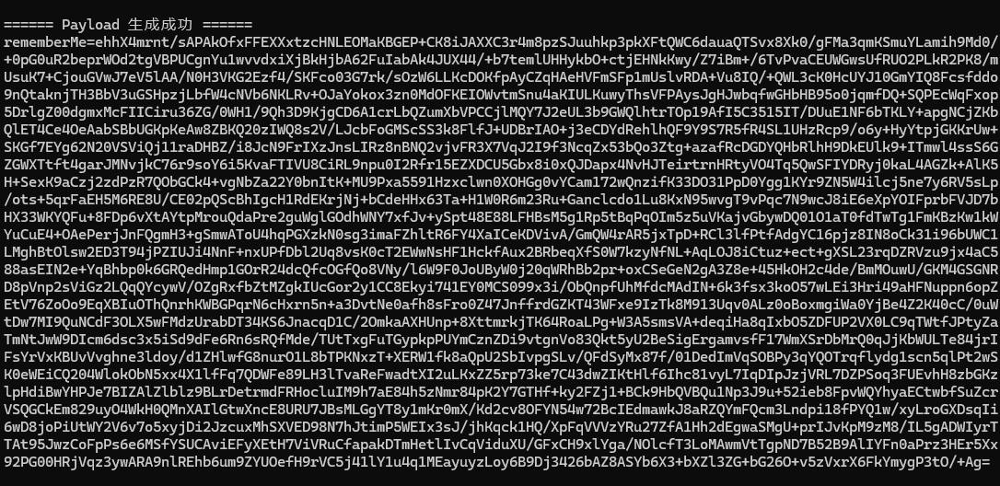
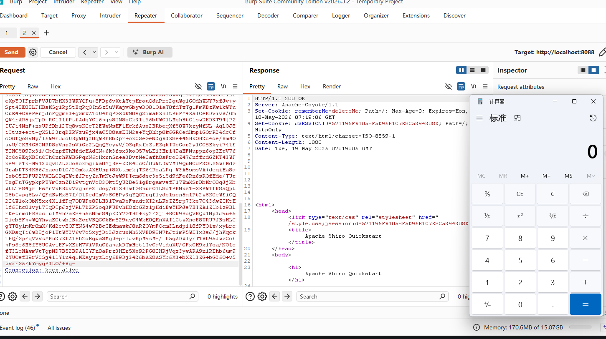

+++
date = '2026-05-19T14:45:00+08:00'
draft = false
title = 'Shiro-550 漏洞研究（二）：Shiro 与 Commons-Beanutils 漏洞链的成因与互操作性分析'

math = false

categories = ["java"]
tags = ["java-security", "deserialization", "Commons-Beanutils"]
+++

# Shiro-550 漏洞研究（二）：Shiro 与 Commons-Beanutils 漏洞链的成因与互操作性分析

## 0x00 引言

在利用 URLDNS 链完成对 Shiro-550 反序列化漏洞入口的带外（OOB）验证后，安全审计的下一步骤在于评估该缺陷实现远程代码执行（RCE）的技术可行性。由于 URLDNS 链仅能触发 `java.net.URL` 的 DNS 解析行为，无法执行系统命令，因此需要寻找具备代码执行能力的 Gadget 链。

通过分析 Apache Shiro 1.2.4 的依赖配置（`pom.xml`），可以确认该框架在核心组件中直接引入了第三方依赖库 `commons-beanutils`：

```XML
<dependency>
    <groupId>commons-beanutils</groupId>
    <artifactId>commons-beanutils</artifactId>
    <version>1.8.3</version>
</dependency>
```

这一依赖特征决定了 Commons-Beanutils 链（以下简称 CB 链）在 Shiro 漏洞利用中的特殊地位：**攻击者无需依赖目标 Web 应用额外搭载的其他第三方组件，仅凭 Shiro 自带的 Classpath 环境即可实现完整的代码执行链路。**

从静态程序分析与数据流的角度来看，Shiro 提供了反序列化触发点（Sink），而 `commons-beanutils` 1.8.3 则提供了利用反射机制动态调用 Java Bean 属性的执行流（Gadget Base）。本文将针对这两者的结合原理、依赖关系以及利用链的生成逻辑进行系统性分析。

## 0x01 Commons-Beanutils 组件核心机制与动态调用原理

### 1. Java Bean 规范与属性访问约定

Java Bean 是 Java 语言中一种特定的标准组件架构。根据其官方规范，一个标准的 Java Bean 必须具备以下特征：

- 属性私有化（Private Fields）。
- 提供公共的无参构造方法。
- 通过符合特定命名约定的公共方法（Getter/Setter）暴露私有属性的读写接口。

按照标准约定，若存在私有属性 `name`，则对应的读取方法必须命名为 `getName()`，写入方法必须命名为 `setName(String name)`。

在常规开发中，访问 Java Bean 的属性需要显式调用这些方法（如 `object.getName()`）。然而，当面对动态的业务场景（如将 HTTP 表单参数自动填充至业务对象，或在运行时动态提取未知对象的属性）时，传统的硬编码硬调用无法满足业务灵活性需求。

### 2. Commons-Beanutils 的动态调用实现原理

Apache Commons-Beanutils 组件的设计初衷，正是为了解决上述动态访问 Java Bean 属性的问题。该组件提供了一套高度封装的反射 API，允许程序通过传入**字符串形式的属性名**，在运行时动态定位并执行对应的 Getter/Setter 方法。

其核心逻辑主要依托于 `org.apache.commons.beanutils.PropertyUtils` 类，核心调用接口为 `PropertyUtils.getProperty(Object bean, String name)`。其底层的动态调用机制可梳理为以下步骤：

```
[传入参数: 对象 bean, 属性名 "xyz"]
              │
              ▼
[提取字符串并进行首字母大写转换: "Xyz"]
              │
              ▼
[依据规范拼接目标方法名: "getXyz"]
              │
              ▼
[调用 java.lang.reflect 内核解析 Method 实例]
              │
              ▼
[执行反射调用: Method.invoke(bean)]
```

### 3. 自动化方法触发与反序列化风险点

Commons-Beanutils 的这一特性导致了隐式方法触发的风险。当外部程序调用 `PropertyUtils.getProperty(bean, "propertyName")` 时，即使代码字面上并没有显式编写调用 Getter 的语句，Beanutils 也会在底层通过反射强制执行 `bean.getPropertyName()` 方法。

这种“通过解析字符串隐式触发特定方法执行”的互操作特性，在常规开发中是极具价值的便利工具；但在反序列化安全边界被击穿的场景下，它直接演变为了攻击者控制程序流转的关键跳板。如果攻击者能够控制传入的 `bean` 对象以及目标属性名 `name`，就能迫使 JVM 执行任意指定类的 Getter 方法。

## 0x02 Shiro 环境下 CB 链构造与原理分析

结合 Commons-Beanutils 动态调用机制与 Java 原生反序列化流程，可构造针对 Shiro 环境的完整利用链。由于生产环境中的 Shiro 通常不包含 Commons-Collections（CC）依赖，标准利用链需要进行结构性重构。

以下为生成端（Payload Generator）的 Java 代码实现：

```java
import com.sun.org.apache.xalan.internal.xsltc.trax.TemplatesImpl;
import org.apache.commons.beanutils.BeanComparator;
import org.apache.commons.collections.comparators.TransformingComparator;
import org.apache.commons.collections.functors.ConstantTransformer;
import java.lang.reflect.Field;
import java.nio.file.Files;
import java.nio.file.Paths;
import java.util.PriorityQueue;

// 1. 构造 TemplatesImpl 字节码执行载体
TemplatesImpl templates = new TemplatesImpl();
Class tc = templates.getClass();
Field nameField = tc.getDeclaredField("_name");
nameField.setAccessible(true);
nameField.set(templates, "aaa");

Field declaredField = tc.getDeclaredField("_bytecodes");
declaredField.setAccessible(true);
byte[] code = Files.readAllBytes(Paths.get("D:\\evilCode\\Test.class"));
byte[][] codes = {code};
declaredField.set(templates, codes);

// 2. 实例化 BeanComparator 并剥离隐式依赖
BeanComparator beanComparator = new BeanComparator("outputProperties", new AttrCompare());

// 3. 初始化 PriorityQueue 容器并实现本地执行防御
PriorityQueue priorityQueue = new PriorityQueue<>(new TransformingComparator(new ConstantTransformer(1)));
priorityQueue.add(templates);
priorityQueue.add(new Integer(2));

// 4. 反射替换比较器
Class c = priorityQueue.getClass();
Field f = c.getDeclaredField("comparator");
f.setAccessible(true);
f.set(priorityQueue, beanComparator);

serialize(priorityQueue);
```

代码逻辑包含三个主要模块：控制流载体构造、比较器依赖剥离、容器序列化封装。以下分别对核心设计原理进行展开分析。

### 1. TemplatesImpl 载体机制

代码第一阶段利用 `com.sun.org.apache.xalan.internal.xsltc.trax.TemplatesImpl` 类作为恶意字节码的执行载体。该类包含一个名为 `_outputProperties` 的私有属性，并对外提供了公共方法 `getOutputProperties()`。

当 `getOutputProperties()` 被调用时，其底层执行流为：`getOutputProperties()` -> `newTransformer()` -> `getTransletInstance()` -> `defineTransletClasses()`。在 `defineTransletClasses()` 方法中，Java 底层将提取 `_bytecodes` 数组中的字节码数据，通过类加载器实例化对象，进而触发恶意类的静态代码块或构造函数，完成任意代码执行。

### 2. 剥离 Commons-Collections 隐式依赖的原理

代码第二阶段实例化 `BeanComparator` 时，使用了双参构造方法 `new BeanComparator("outputProperties", new AttrCompare())`。该设计的目的在于处理 Shiro 依赖环境下的类加载异常问题。

查阅 `commons-beanutils` 库中 `BeanComparator` 的源码，其单参构造方法的实现如下：

```java
public BeanComparator( String property ) {
    this( property, ComparableComparator.getInstance() );
}
```

默认情况下，单参构造方法会隐式实例化 `ComparableComparator`，该类属于 Apache Commons-Collections 组件。在 Shiro 的 `pom.xml` 中，Commons-Collections 的 `<scope>` 被定义为 `test`。这意味着在实际生产环境（非测试环境）的运行期 Classpath 中，不存在该组件。如果直接序列化含有 `ComparableComparator` 实例的对象，目标服务器在执行 `ObjectInputStream.readObject()` 时将抛出 `java.lang.ClassNotFoundException`，导致反序列化流程中断。

为了切断该隐式依赖，代码必须调用双参构造方法，显式传入一个目标环境中必定存在的替代比较器（如代码示例中的 `AttrCompare`，或 JDK 原生的 `String.CASE_INSENSITIVE_ORDER`）。替代比较器必须同时满足以下两个条件：

1. **实现 `java.util.Comparator` 接口**：满足 `BeanComparator` 构造方法的类型约束。
2. **实现 `java.io.Serializable` 接口**：满足反序列化引擎的序列化约束。若不实现此接口，在执行 `serialize()` 时本地将抛出 `NotSerializableException`。

### 3. 规避本地触发的反射替换机制

代码第三阶段在初始化 `PriorityQueue` 容器时，引入了 CC 组件的缓冲比较器 `new TransformingComparator(new ConstantTransformer(1))`，随后在第四阶段利用反射机制将其实际的 `comparator` 字段替换为 `BeanComparator`。该设计不仅是为了防止 Payload 在本地生成阶段发生自我引爆，还涉及构造环境与目标执行环境的解耦逻辑。

首先，针对本地防误触机制。`PriorityQueue` 底层基于二叉堆结构实现。当调用 `priorityQueue.add()` 插入元素时，为维护堆结构的有序性，底层会触发 `siftUp` 排序逻辑：

```java
// PriorityQueue 底层源码片段
private void siftUp(int k, E x) {
    if (comparator != null)
        siftUpUsingComparator(k, x);
    else
        siftUpComparable(k, x);
}

private void siftUpUsingComparator(int k, E x) {
    while (k > 0) {
        int parent = (k - 1) >>> 1;
        Object e = queue[parent];
        if (comparator.compare(x, (E) e) >= 0) // 触发比较器的 compare 方法
            break;
        queue[k] = e;
        k = parent;
    }
    queue[k] = x;
}
```

若在初始化 `PriorityQueue` 时直接传入组装好的 `BeanComparator`，执行 `priorityQueue.add(templates)` 操作时，本地 JVM 将执行以下调用链： `PriorityQueue.add()` -> `siftUpUsingComparator()` -> `BeanComparator.compare(templates, ...)` -> `PropertyUtils.getProperty(templates, "outputProperties")` -> `TemplatesImpl.getOutputProperties()`。

该流程会导致恶意字节码在本地 Payload 生成端被直接执行。为阻断本地执行流，代码首先传入 `ConstantTransformer` 包装的代理比较器。该代理比较器在 `compare()` 调用时仅返回常数 `1`，使得 `add()` 操作能够安全完成数据在物理数组中的装填。数据装填完毕后，利用 Java 反射机制修改 `PriorityQueue` 实例的 `comparator` 属性，将其指向真实的 `beanComparator`。

其次，针对引入 CC 组件的合理性疑问：既然明确了目标 Shiro 运行环境中未引入 Commons-Collections (CC) 依赖，为何在生成端代码中仍可实例化并使用 CC 组件？

其底层逻辑在于，**本地构造环境与目标反序列化环境是完全解耦的**。Payload 的生成端可自由引入任意辅助组件来构建对象的前置状态，只需确保最终传递给 `ObjectOutputStream.writeObject()` 的序列化对象图（Object Graph）中，所包含的类在目标 Shiro 环境的 Classpath 中全部可达即可。

在此代码中，CC 库组件仅作为规避本地触发的临时“脚手架”。当 `PriorityQueue` 利用该脚手架完成无害的数据装填后，反射机制将该临时比较器从对象的属性图中彻底剥离。由于 Java 序列化过程仅遍历和记录对象当前的最终状态，因此最终输出的物理字节流中被完全剥离了 CC 组件的类描述信息，仅存留 `PriorityQueue`、`BeanComparator` 与 `TemplatesImpl` 等目标环境支持的合法类。目标服务器进行反序列化重组时，自然不会抛出 `ClassNotFoundException`。

## 0x03 开打



注意这里生成的base64字符串很长，以为我们把要加载的字节码写入，会很长，我们直接复制到burp重放



攻击成功

以下是为你撰写的博客总结部分。行文继续保持了客观、严谨的学术化风格，对整个漏洞的成因与利用链进行了高度概括，并升华了安全防御维度的思考，可以直接追加到你的 `0x03` 章节之后。

## 0x04 总结与防御启示

本文通过深度剖析 Shiro 1.2.4 的核心依赖与 Java 原生反序列化机制，成功构建并验证了基于 Commons-Beanutils 的无依赖（无外部 CC 库）利用链。在目标服务器完全剥离第三方风险组件的纯净环境下，依然能够通过精心重构的 `PriorityQueue` 与 `BeanComparator` 对象图，精准劫持 JVM 控制流，实现完整的远程代码执行（RCE）。

这一攻击链路的成功打通，深刻揭示了 Shiro-550 漏洞的复合型危害本质以及 Java 历史生态体系中的潜藏风险。该漏洞并非单一的逻辑缺陷，而是两道安全防线同时崩溃的产物：

1. **密码学边界的溃散（CWE-798）**：硬编码的 AES 对称密钥使加密机制形同虚设，赋予了攻击者伪造合法凭据、将恶意数据合法“护送”入系统核心的能力。
2. **底层信任边界的缺失（CWE-502）**：原生 `ObjectInputStream.readObject()` 缺乏对传入数据的类型约束，导致攻击者能够利用 `commons-beanutils` 的反射动态调用特性作为跳板，将静态的字节流无缝转化为具有破坏性的动态方法执行流。

在防御层面，修复此类高危缺陷不仅需要彻底根除硬编码凭证（如 Shiro 1.2.5 及后续版本强制要求采用 `SecureRandom` 动态生成 AES 密钥，阻断密文伪造），更需要从底层重塑对反序列化数据的处理逻辑。仅依赖清理特定的第三方组件（如移除 Commons-Collections）已被证实无法阻挡基于内置组件的 Gadget 链重组。

现代 Java 安全实践表明，引入严格的反序列化过滤机制（如 JDK 层面引入的 JEP 290 规范），在对象实例化之前实施精准的类白名单（Look-ahead Object Input Validation）校验，彻底阻断不可信数据的对象化过程，方能从根源上遏制此类反序列化漏洞的衍生与扩散。